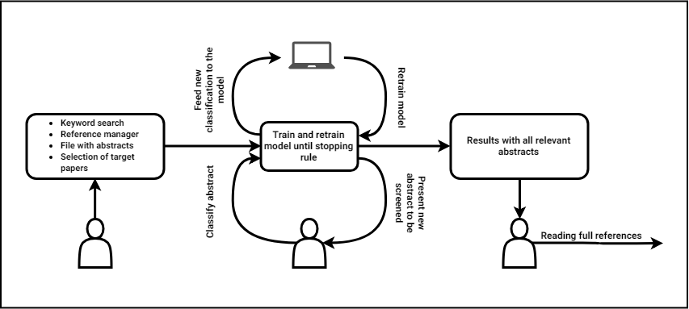

# Automated Systematic Review

[](https://travis-ci.com/msdslab/automated-systematic-review)

--- 

*This project is work in progress and **not** production ready.*

---

Systematic Reviews are “top of the bill” in research. The number of systematic
reviews published by researchers increases year after year. But performing a
sound systematic review is a time-consuming and sometimes boring task. Our
software is designed to accelerate the step of screening abstracts and titles
with a minimum of papers to be read by a human with no or very few false negatives.

Our Automated Systematic Review (ASR) software implements an oracle and a
simulation mode.

- **Oracle** The oracle modus is used to perform a systematic review with
  interaction by the reviewer (the 'oracle' in literature on active learning).
  The software presents papers to the reviewer, whereafter the reviewer classifies them.
- **Simulate** The simulation modus is used to measure the performance of our
  software on existing systematic reviews. The software shows how many
  papers you could have potentially skipped during the systematic review.

This Automatic Systematic Review software is being developed as part of a
research project. This research project consists of multiple repositories. The
following respositories are (or will become) publicly available:

- [automated-systematic-review-datasets](https://github.com/msdslab/automated-systematic-review-datasets) A project for collection, preprocessing and publication of systematic review datasets. The project describes the  data storage format used by the software.
- [automated-systematic-review-simulations](https://github.com/msdslab/automated-systematic-review-simulations) A repository with scripts for a simulation study and scripts for the aggregation and visualisation of the results.
- [automated-systematic-review-benchmarks](https://github.com/msdslab/automated-systematic-review-benchmarks) A repository that is used to compare and benchmark software on systematic reviews.

## Table of Contents

* [Table of Contents](#table-of-contents)
* [Active Learning for reviewing papers](#active-learning-for-reviewing-papers)
* [Installation](#installation)
* [Quick start](#quick-start)
* [Tech](#tech)
* [Datasets](#datasets)
* [Systematic Review (oracle mode)](#systematic-review-oracle-mode)
   * [Command Line Interface (oracle mode)](#command-line-interface-oracle-mode)
   * [Python API (oracle mode)](#python-api-oracle-mode)
* [Systematic Review (simulation mode)](#systematic-review-simulation-mode)
   * [Command Line Interface (simulation mode)](#command-line-interface-simulation-mode)
   * [Python API (simulation mode)](#python-api-simulation-mode)
* [Development and contributions](#development-and-contributions)
   * [Entry points](#entry-points)
   * [Debug using pickle dataset](#debug-using-pickle-dataset)
* [Contact and contributors](#contact-and-contributors)

## Active Learning for reviewing papers

The ASR project implements learning algorithms that interactively query the
researcher. This way of interactive training is known as
[Active Learning](https://en.wikipedia.org/wiki/Active_learning_(machine_learning)).
The ASR software offers support for classical learning algorithms and
state-of-the-art learning algorithms like neural networks. The following image
gives an overview of the process.




## Installation

The ASR software requires Python 3.6+.

Install the Automated Systematic Review project directly from this github page. 
One can do this with pip and git.

``` bash
pip install git+https://github.com/msdslab/automated-systematic-review.git
```

## Quick start

The quickest way to start using the Automated Systematic Review (ASR) software is
the Command Line Interface (CLI). 
Start an interactive systematic review (Oracle mode) with the following line in CMD or shell:

``` sh
asreview oracle YOUR_DATA.csv --prior_included 29 181 379 2001 3928 3929 4547 \ 
  --prior_included 31 90 892 3898 3989 4390 --log_file results.log
```

Example output:

```
Start review in 'oracle' mode.
Prepare dataset.
Start with the Systematic Review.

Annual research review: The experience of youth with political conflict -
Challenging notions of resilience and encouraging research refinement
Barber, B. K.

Aims and method Drawing on empirical studies and literature reviews, this
paper aims to clarify and qualify the relevance of resilience to youth
...
Authors. Journal of Child Psychology and Psychiatry © 2013 Association for
Child and Adolescent Mental Health.

Include [1] or exclude [0]:
```

This command (`asreview oracle`) runs the software in oracle mode on the 
`YOUR_DATA.csv` dataset. Passing `prior_included` signifies the paper IDs
that should definitely be included, while `prior_excluded` are IDs of papers
that are definitely excluded. The higher the number of included/excluded papers,
the quicker the ASR software will understand your choices for inclusion.
The IDs are the idententifiers of papers, starting from
0 for the first paper found in the dataset.

To benchmark an already executed review, use the simulation modus (`asreview simulation`).
The dataset then needs an additional column ("label_included") to signify their inclusion
in the final review. The command for the simulation modus is similar to the oracle
mode:

``` sh
asreview simulate YOUR_DATA.csv --prior_included 29 181 379 2001 3928 3929 4547 \ 
  --prior_included 31 90 892 3898 3989 4390 --log_file results.log
```

## Tech

There are many different [models](asr/models/README.md), [query strategies](asr/query_strategies/README.md),
and [rebalancing strategies](asr/balance_strategies/README.md) available. 
A LSTM neural network based model is currently the best performing and optimized. 
By default, the ASR software will use models tuned on datasets available to us.
Tuning of models, query strategies and rebalanceing strategies is possible either
through the CLI or the API.

## Datasets

The ASR software accepts datasets in the RIS and CSV file format. [RIS
files](https://en.wikipedia.org/wiki/RIS_(file_format)) are used by digital
libraries, such as IEEE Xplore, Scopus and ScienceDirect. Citation managers
Mendeley and EndNote support the RIS format as well. For simulation, we use an
additional RIS tag with the letters `LI`. For CSV files, the software accepts
a set of predetermined labels in line with the ones used in RIS files. Please
see the project [Automatic Systematic Review
Datasets](https://github.com/msdslab/automated-systematic-review-datasets) for
the complete standard.


## Systematic Review (oracle mode)

There are two ways to perform a systematic review in oracle (expert) mode:

### Command Line Interface (oracle mode)

Start a review process in the CMD.exe or shell. 

``` bash
asreview oracle YOUR_DATA.csv
```

The available parameters are shown with the command `asreview oracle --help`: 

```bash
usage: asreview oracle [-h] [-m MODEL] [-q QUERY_STRATEGY]
                  [--n_instances N_INSTANCES] [--n_queries N_QUERIES]
                  [--embedding EMBEDDING_FP] [--config_file CONFIG_FILE]
                  [--prior_included [PRIOR_INCLUDED [PRIOR_INCLUDED ...]]]
                  [--prior_excluded [PRIOR_EXCLUDED [PRIOR_EXCLUDED ...]]]
                  [--log_file LOG_FILE] [--save_model SAVE_MODEL]
                  [--verbose VERBOSE]
                  X

Systematic review with the help of an oracle.

positional arguments:
  X                     File path to the dataset. The dataset needs to be in
                        the standardised format.

optional arguments:
  -h, --help            show this help message and exit
  -m MODEL, --model MODEL
                        The prediction model for Active Learning. Default
                        'LSTM'.
  -q QUERY_STRATEGY, --query_strategy QUERY_STRATEGY
                        The query strategy for Active Learning. Default
                        'uncertainty'.
  --n_instances N_INSTANCES
                        Number of papers queried each query.
  --n_queries N_QUERIES
                        The number of queries. Default None
  --embedding EMBEDDING_FP
                        File path of embedding matrix. Required for LSTM
                        model.
  --config_file CONFIG_FILE
                        Configuration file with model parameters
  --prior_included [PRIOR_INCLUDED [PRIOR_INCLUDED ...]]
                        Initial included papers.
  --prior_excluded [PRIOR_EXCLUDED [PRIOR_EXCLUDED ...]]
                        Initial included papers.
  --log_file LOG_FILE, -l LOG_FILE
                        Location to store the log results.
  --save_model SAVE_MODEL
                        Location to store the model.
  --verbose VERBOSE, -v VERBOSE
                        Verbosity
```

### Python API (oracle mode)

** Under construction / available at own risk **

It is possible to create an interactive systematic reviewer with the Python
API. It requires some knowledge on creating an interface. By default, a simple
command line interface is used to interact with the reviewer.

``` python
from asr import load_data, ReviewOracle
from asr.query_strategies import uncertainty_sampling
from asr.utils import text_to_features
from asr.models.embedding import load_embedding, sample_embedding

# load data
data = load_data(PATH_TO_DATA)

# create features and labels
X, word_index = text_to_features(data)

# Load embedding layer. 
embedding, words = load_embedding(PATH_TO_EMBEDDING)
embedding_matrix = sample_embedding(embedding, words, word_index)

# create the model
model = create_lstm_model(
    backwards=True,
    optimizer='rmsprop',
    embedding_layer=embedding_matrix
)

# start the review process.
asr = ReviewOracle(
  X,
  model,
  uncertainty_sampling,
  data,
  n_instances=10,
  prior_included=[29, 181, 379, 2001, 3928, 3929, 4547],
  prior_excluded=[31, 90, 892, 3898, 3989, 4390]
)
asr.review()

```

## Systematic Review (simulation mode)

A systematic review with the true labels from an expert. This can be useful to assess
the performance of the ASR software on your specific needs as a reviewer.

### Command Line Interface (simulation mode)

The CLI for the ASR software in simulation modus is similar to the CLI of the
oracle modus. Instead of `asreview oracle`, use `asreview simulate`.

``` bash
asreview simulate YOUR_DATA.csv
```

The available parameters are: 

```bash
usage: asreview simulate [-h] [-m MODEL] [-q QUERY_STRATEGY]
                    [--n_instances N_INSTANCES] [--n_queries N_QUERIES]
                    [--embedding EMBEDDING_FP] [--config_file CONFIG_FILE]
                    [--prior_included [PRIOR_INCLUDED [PRIOR_INCLUDED ...]]]
                    [--prior_excluded [PRIOR_EXCLUDED [PRIOR_EXCLUDED ...]]]
                    [--n_prior_included [N_PRIOR_INCLUDED [N_PRIOR_INCLUDED ...]]]
                    [--n_prior_excluded [N_PRIOR_EXCLUDED [N_PRIOR_EXCLUDED ...]]]
                    [--log_file LOG_FILE] [--save_model SAVE_MODEL]
                    [--verbose VERBOSE]
                    X

Systematic review with the help of an oracle.

positional arguments:
  X                     File path to the dataset. The dataset needs to be in
                        the standardised format.

optional arguments:
  -h, --help            show this help message and exit
  -m MODEL, --model MODEL
                        The prediction model for Active Learning. Default
                        'LSTM'.
  -q QUERY_STRATEGY, --query_strategy QUERY_STRATEGY
                        The query strategy for Active Learning. Default
                        'uncertainty'.
  --n_instances N_INSTANCES
                        Number of papers queried each query.
  --n_queries N_QUERIES
                        The number of queries. Default None
  --embedding EMBEDDING_FP
                        File path of embedding matrix. Required for LSTM
                        model.
  --config_file CONFIG_FILE
                        Configuration file with model parameters
  --prior_included [PRIOR_INCLUDED [PRIOR_INCLUDED ...]]
                        Initial included papers.
  --prior_excluded [PRIOR_EXCLUDED [PRIOR_EXCLUDED ...]]
                        Initial included papers.
  --n_prior_included [N_PRIOR_INCLUDED [N_PRIOR_INCLUDED ...]]
                        Sample n prior included papers. Only used when
                        --prior_included is not given.
  --n_prior_excluded [N_PRIOR_EXCLUDED [N_PRIOR_EXCLUDED ...]]
                        Sample n prior excluded papers. Only used when
                        --prior_excluded is not given.
  --log_file LOG_FILE, -l LOG_FILE
                        Location to store the log results.
  --save_model SAVE_MODEL
                        Location to store the model.
  --verbose VERBOSE, -v VERBOSE
                        Verbosity
```

### Python API (simulation mode)

** Under construction / available at own risk **

It is possible to simulate a systematic review with the Python
API.

``` python
from asr import load_data, ReviewSimulate
from asr.query_strategies import uncertainty_sampling
from asr.utils import text_to_features
from asr.models.embedding import load_embedding, sample_embedding

# load data
data, y = read_data(PATH_TO_DATA)

# create features and labels
X, word_index = text_to_features(data)

# Load embedding layer. 
embedding, words = load_embedding(PATH_TO_EMBEDDING)
embedding_matrix = sample_embedding(embedding, words, word_index)

# create the model
model = create_lstm_model(
    backwards=True,
    optimizer='rmsprop',
    embedding_layer=embedding_matrix
)

# start the review process.
asr = ReviewSimulate(
  X, y,
  model,
  uncertainty_sampling,
  n_instances=10,
  prior_included=[29, 181, 379, 2001, 3928, 3929, 4547],
  prior_excluded=[31, 90, 892, 3898, 3989, 4390]
)
asr.review()

```

## Development and contributions

- Use [yapf]() as formatter for python code. 

### Entry points

Use `python -m asreview` to run the module as main. This can be useful when
debugging the CLI and entry_points. 

```
python -m asreview oracle yourfile.csv
```

is the same as:

```
asreview oracle yourfile.csv
```

### Debug using pickle dataset

Using the ASR software in combination with an embedding layer is
computationally intensive. Subsetting the wikipedia vocabulary is the main
reason for the extensive computational time. This problems results in a large
amount of wasted computational time on the HPC cluster. Therefore, we use
pickle files to speed the initialization up.

Clone the [simulations repository](https://github.com/msdslab/automated-systematic-review-simulations)
next to this repository. Now you can debug code with the code below:

``` sh
python -m asreview oracle ../automated-systematic-review-simulations/pickle/ptsd_vandeschoot_words_20000.pkl --n_instances 5
```

### Embedding files

Embedding files contains pretrained model weights. The weights are used as
prior knowledge of the neural network. By default, these weights are stored in
the users `~/asr_data` folder. You can download embedding files with the
following command:

```python
from asr.models.embedding import download_embedding

download_embedding()
```

One can set the environment variable to change the default folder.

```
import os

from asr.models.embedding import download_embedding

# set the environment variable
os.environ['ASR_DATA'] = "~/my_asr_embedding_files"

# download the files
download_embedding()

```


## Publications

- Dutch newspaper NRC on this project ["Software vist de beste artikelen uit een bibliotheek van duizenden."](https://www.nrc.nl/nieuws/2019/01/14/software-vist-de-beste-artikelen-eruit-a3628952)
- News site of Utrecht University: ["A digital tracker dog for datasets"
](https://www.dub.uu.nl/en/depth/digital-tracker-dog-datasets)


## Contact and contributors

This project is part of the research work conducted by the Department of
Methodology & Statistics, Faculty of Social and Behavioral Sciences, Utrecht
University, The Netherlands.

For any questions or remarks, please contact Prof. Dr. Rens van de Schoot
(a.g.j.vandeschoot@uu.nl).

Researchers:

- Rens van de Schoot (a.g.j.vandeschoot@uu.nl, [@Rensvandeschoot](https://github.com/Rensvandeschoot))
- Daniel Oberski (d.l.oberski@uu.nl, [@daob](https://github.com/daob))

Engineers and students:

- Parisa Zahedi (p.zahedi@uu.nl, [@parisa-zahedi](https://github.com/parisa-zahedi))
- Jonathan de Bruin (j.debruin1@uu.nl, [@J535D165](https://github.com/J535D165))
- Raoul Schram (r.d.schram@uu.nl, [@qubixes](https://github.com/qubixes))
- Kees van Eijden (k.vaneijden@uu.nl, [@KvEijden](https://github.com/KvEijden))
- Qixiang Fang ([@fqixiang](https://github.com/fqixiang))
- Albert Harkema (a.d.harkema@uu.nl, [@sasafrass](https://github.com/sasafrass))
