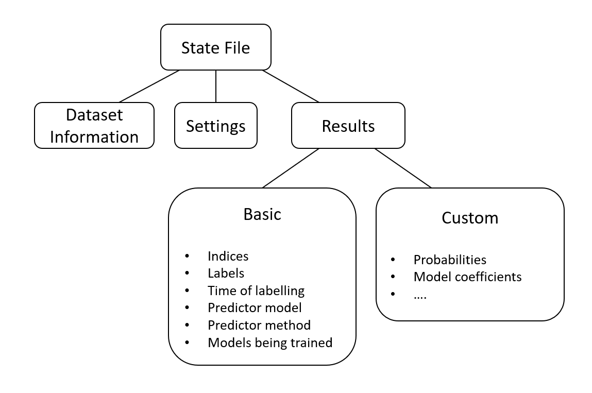

State File
==========
The purpose of the state file is to save all relevant data of a project, while being as small as possible and while
allowing fast access. Of course, what is relevant data depends on the use case. If you are doing a systematic review,
you want all your labelling actions to be stored, but if you are investigating the machine learning models behind
ASReview, you want more data like model parameters. In order to keep the state file as small as possible in both cases,
there is a basic state file which can be extended to include more data. The basic version contains all the absolutely
necessary data for a systematic review. You can extend it by including extra data like model parameters.

Basic Version
-------------
The state file contains information on the setup of the project, and information generated during the systematic review.
The first part consists of the software settings, and the dataset that is used for the project. To ensure the privacy
of the user, the actual dataset is not saved in the state file, only the numerical features that the machine learning
model needs.

The main information generated during the systematic review consists of the order in which the texts were
labelled, and the label that was given. However, for reproducibility, a number of other features should be saved. For
each text, the iteration of the model that suggested the text is stored in the state file, together with the query
strategy that was used. Also, if there were any models being trained in the background, this is saved. Finally, the time
between to labelling actions is saved.

As an example, a dataset with 2544 samples results in a basic state file of approximately 3.5MB. The main part of this
3.5MB is taken up by the feature matrix.

Extended Version
----------------
Other data, such as model parameters or the predicted probabilities at each iteration of the model, are not in the basic
version. This data is not immediately relevant for doing or reproducing a systematic review. Moreover, since the data
is stored at each iteration of the model, the amount of data that needs to be stored grows quadratically in terms of
the original dataset, which makes the state file large. Instead, this data can be added to the state file as custom
datasets.

To reduce the size, the user can choose not to save at each iteration, but only at certain intervals, or
when the label is positive. This allows the user to choose approximately how big the state file will be.
A dataset with around 2544 samples and 41 inclusions results in a state file of 9MB when saving model
probabilities every 10th iteration of the model. The state file will be 54MB if the probabilities are saved at every
iteration.

Detailed Description
---------------------
The state file is stored in the HDF5 format. It has three parts: 'data_properties', 'settings' and 'results'. The
'data_properties' part contains the feature matrix that was constructed from the dataset supplied by the user. In
'settings'  all information on settings and metadata is saved . Finally in 'results' we find all the data produced by
the labelling or simulation. The first two sections are the same in both the basic and the extended version. In the
results part there is the option to put extra data.

The basic datasets in 'results' are:
 - 'indices': Indices (row numbers) of the samples, in the order that they are labeled.
 - 'labels': Labels of the samples, in the same order as 'indices'.
 - 'predictor_models': Model that predicted the sample being labeled. This model is identified by a string with the name
    used in ASReview, for example 'nb' or 'svm'.
 - 'predictor_training_sets': Training set on which the predictor model was trained. It is indicated by an integer. If
   this is '0', the model was trained on the prior knowledge, if it is 'k' then the model is trained on the prior
   knowledge plus the first k samples.
 - 'predictor_methods': Prediction method of the predictor model, for example 'max' or 'random'.
 - 'time': The time at which the sample was labeled.
 - 'models_being_trained': The model that were being trained right after the sample was labeled. In
   simulation mode this is always the same model type with the training set equal to all labeled samples,
   but in lab mode, multiple models might be trained at the same time. This will also be relevant when
   multiple model types are used. The models are stored in a string, separated by a semicolon, e.g.
   'nb600;nb6001;lstm550'.

Besides these datasets, there is the option to store custom datasets, for example with all the sample
probabilities, or the model coefficients. This will be stored in a dynamic format: It will not be stored
every time a sample is labeled, but only at certain intervals, or when a sample is labeled relevant. As
an example, if we set the interval to 5, and the sample 4, 7, 8 and 13 where relevant, then we would store
data after labeling 4, 5, 7, 8, 10, 13, 15, etc. We will save one 1-D dataset containing
these indices, and a 2-D dataset containing the actual data, for example the probabilities.

Every dataset in the basic version is 1-dimensional, and contains as many entries as there are labelled samples. The
first entries correspond to the prior knowledge. After that, the i-th entry corresponds to the data from the i-th query.
Inside the state file the indexing goes by row number in the original dataset, which can be found in the
'data_properties' section of the state file. Outside of the state file everything goes by record_id, a unique identifier
associated to each sample. In the state file you can find a mapping between row number and record_id.

You can ask for information from the state file in multiple ways. First you can ask for a complete dataset, for example
the complete set of all labels. This is returned in the order in which it was labelled. You can also ask for the
information in a dataset corresponding to a specific record_id, or to a specific query.

Comparison with previous versions
---------------------------------
The two main reasons for creating a new state file (V3State) were to reduce the size of the file, and to make sure that
the state file can deal with new future applications of ASReview. There are two previous versions of the state file. One
in JSON format and one in HDF5 format. In both these state files, the probabilities of the model were recorded at every
iteration of the model. This was the main reason for the big size.

On a dataset with 2544 samples, the HDF5 state file is 103MB, while the JSOn state is 277MB large. On big datasets, or
when executing multiple simulation runs of a systematic review, this size becomes a real problem. By comparison, the
basic version of the new state file is 3.5MB, and the version with all probabilities is 54MB. The difference between the
size of the V3State and the previous HDF5State comes from the fact that in HDF5State there is a new results dataset for
each sample. In V3State, the results  are appended to the same dataset.

Schemas
-------
The schema of the state file:
::

   V3State    --- attrs --- current_queries    (str: easy access to current query)
   (HDF5 file) |         |- start_time         (str: Time state file was created)
               |         |- end_time           (str: Time state file was last closed)
               |         |- version            (str: state_file version)
               |         |- software_version   (str: software (ASReview) version)
               |         |- settings           (json'ed dict: contains the same info as the ASReviewSettings object)
               |- results --- attrs --- n_priors   (int)
               |           |- indices              (dtype <i4: All labelled indices in order. First n_priors are the prior ones)
               |           |- labels               (dtype <i4: All labels in order. First n_priors are the prior ones)
               |           |- models_training      (dtype |S6: Models being trained right after labeling a sample)
               |           |- predictor_models     (dtype |S10: Model that predicted the sample)
               |           |- predictor_methods    (dtype |S10: Prediction method for sample)
               |           |- predictor_training_sets    (dtype int: Training set on which the predictor model was trained)
               |           |- time                 (dtype |S29: Time at which the sample was labelled)
               |           |- custom --- probabilities_column_index    (dtype <i4: Indices where probabilties where saved)
               |                      |- probabilities_matrix          (dtype <f8: Probabilities matrix)
               |- data_properties --- hash --- attrs --- matrix_type   (str: csr_matrix)
                                                 |- data           (dtype <f8: These datasets can recreate a scipy sparse matrix)
                                                 |- indices        (dtype <i4)
                                                 |- indptr         (dtype <i4)
                                                 |- record_table   (dtype <i8)
                                                 |- shape          (dtype <i4)

The schema of the old JSON state file:
::

   JSONState --- pred_proba    (ndarray: last predicted probabilities)
           |- read_only     (bool:)
           |- settings      (ASReviewSettings: Described seperately)
           |- state_fp      (str: filepath)
           |- version       (str: Version of state file)
           |- _state_dict --- time --- start_time   (str: Time state file was created)
                (dict)     |        |- end_time     (str: Time state file was last closed)
                           |- version               (str: state_file version)
                           |- software_version      (str: ASReview version)
                           |- settings              (dict: contains the same info as the ASReviewSettings object)
                           |- results ----  0  --- labelled     (list: index, label, method='initial' for each prior)
                           |  (list)   |--  1  --- pool_idx     (list: indices not yet labelled)
                           |           | (dict) |- train_idx    (list: indices already labelled)
                           |           |        |- proba        (list: probabilities after previous query)
                           |           |        |- labelled     (list: [index, label, method] for new query)
                           |           |--  2  --- ...
                           |           |- ...
                           |- labels    (list: all labels)
                           |- data_properties --- hash --- record_table     (list: id's)
                           |      (dict)         (dict) |- feature_matrix   (str: Base64 encoding of matrix)
                           |                            |- matrix_type      (str: 'csr_matrix')
                           |- current_queries   (dict: easy access to current query)

The schema of the old HDF5 state file:
::

   HDF5State --- pred_proba    (ndarray: last predicted probabilities)
           |- read_only     (bool:)
           |- settings      (ASReviewSettings: Described seperately)
           |- state_fp      (str: filepath)
           |- version       (str: Version of state file)
           |- f --- attrs --- current_queries   (str: easy acces to current query)
      (HDF5 file)|         |- start_time        (str: Time state file was created)
                 |         |- end_time          (str: Time state file was last closed)
                 |         |- version           (str: state_file version)
                 |         |- settings          (json'ed dict: contains the same info as the ASReviewSettings object)
                 |- labels  (dtype <i4: all labels)
                 |- results --- 0 --- attrs --- creation_time   (str: time of creation of query group)
                 |           |     |- new_labels --- idx        (dtype <i4: index of priors)
                 |           |                    |- labels     (dtype <i4: labels of priors)
                 |           |                    |- methods    (dtype |S20: 'initial')
                 |           |- 1 --- attrs --- creation_time
                 |           |     |- new_labels --- idx        (dtype <i4: index)
                 |           |     |              |- labels     (dtype <i4: labels)
                 |           |     |              |- methods    (dtype |S20: method ('max'))
                 |           |     |- pool_idx                  (dtype <i4: indices not yet labelled)
                 |           |     |- train_idx                 (dtype <i4: indices already labelled)
                 |           |     |- proba                     (dtype <f8: probabilities after previous query)
                 |           |- 2 --- ...
                 |           |- ...
                 |- data_properties --- hash --- attrs --- matrix_type  (str: csr_matrix)
                                              |- data           (dtype <f8: These datasets can recreate a scipy sparse matrix)
                                              |- indices        (dtype <i4)
                                              |- indptr         (dtype <i4)
                                              |- record_table   (dtype <i8)
                                              |- shape          (dtype <i4)
