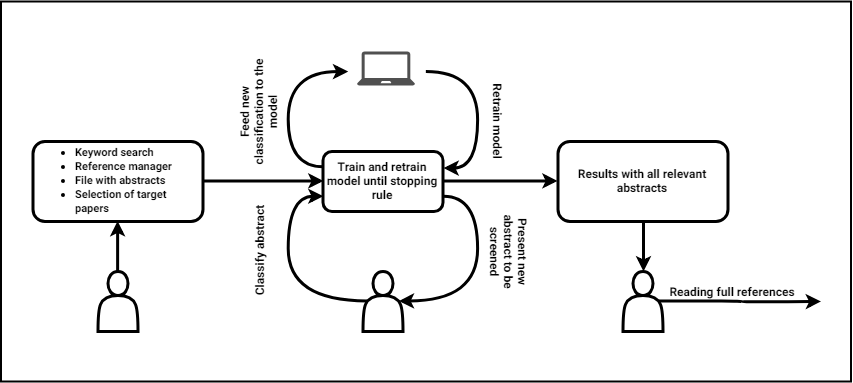

Active Learning
~~~~~~~~~~~~~~~

Active learning denotes the scenario in which the reviewer is labeling references that are presented by a machine learning model [3,4]. The machine learning model learns from the reviewers labeling decisions and uses this knowledge in selecting the reference that will be presented to the reviewer next. In this way, the annotated dataset starts out small and iteratively grows in size [4]. In the case of Automated Systematic Review, this process is necessary to provide some initial classifications to the model, because the reviewer starts with a dataset without annotations.

However, in the general sense the key idea behind active learning is that, if we allow the model to decide for itself which data it wants to learn from, its performance and accuracy may improve and it requires fewer training instances to do so [5,6]. Moreover, we increase the dataset's informativeness by having the reviewer annotate those references that are more informative to the model. It has been found that active learning over a smaller dataset consisting of more informative data brings forth a model that is able to generalize even better than a model that takes the traditional approach of iterating randomly through a provided dataset with annotations [1]. 

Different types of active learning are proposed: certainty-based active learning and uncertainty-based active learning. Certainty-based active learning, also known as max sampling, is typically the most suited to the scenario in which we are dealing with highly imbalanced datasets and finding all relevant references as soon as possible is quintessential to success [4]. This is because with certainty-based active learning, the model presents those references to the reviewer which are most likely to be inclusions first, thereby expediting the process of finding all of the relevant references. 

Traditionally, uncertainty sampling or uncertainty-based active learning is used in case training the best model is desired. Using uncertainty sampling, those references on which the model's classifications are the least certain will be presented to the reviewer first. However, in the case where time-saving is of the essence, uncertainty-based active learning may not be the optimal strategy [4]. Although uncertainty-based active learning generally leads to a more robust model in the end because it learns the most from these uncertain classifications, this gain is not significant [4]. This entails that uncertainty-based active learning may not be suited to a scenario in which we want to find the relevant references as soon as possible, such as with abstract screening for systematic reviews [4].

Ultimately, the active learning cycle has to stop at some point and finding a suitable stopping criterion for this active learning cycle has proven to be challenging. However, new methods to decide the ideal moment to stop are currently being developed [2].

[1] Cohn, D., Atlas, L., & Ladner, R. (1994). Improving generalization with active learning. Machine learning, 15(2), 201-221.

[2] Cormack, G. V., & Grossman, M. R. (2016). Engineering quality and reliability in  technology-assisted review. Proceedings of the 39th International ACM SI-GIR conference on Research and Development in Information Retrieval, 75–84.

[3] Kremer, J., Steenstrup Pedersen, K., & Igel, C. (2014). Active learning with support vector machines. Wiley Interdisciplinary Reviews: Data Mining and Knowledge Discovery, 4(4), 313–326.

[4] Miwa, M., Thomas, J., O’Mara-Eves, A., & Ananiadou, S. (2014). Reducing systematic review workload through certainty-based screening. Journal of biomedical informatics, 51, 242–253.

[5] Settles, B. (2009). Active learning literature survey. University of Wisconsin-Madison Department of Computer Sciences.

[6] Wallace, B. C., Trikalinos, T. A., Lau, J., Brodley, C., & Schmid, C. H. (2010). Semi-automated screening of biomedical citations for systematic reviews. BMC bioinformatics, 11(1), 55.
