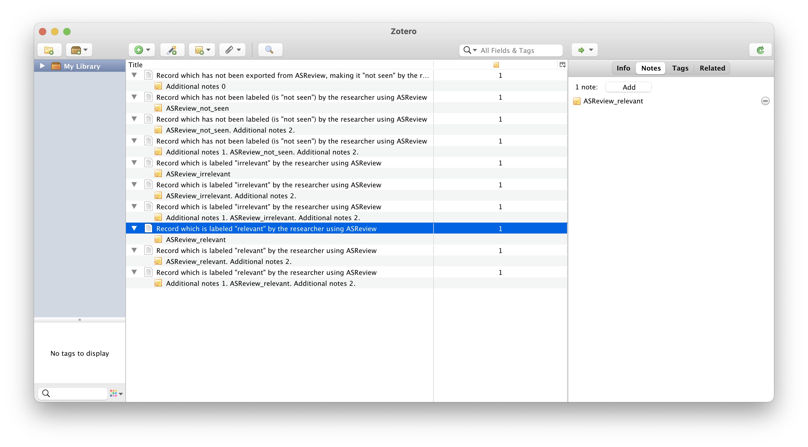
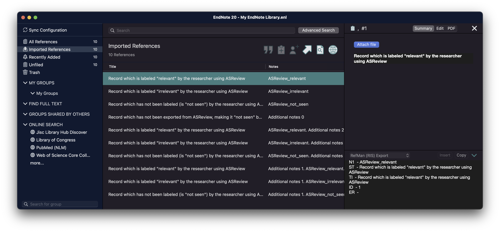

Data format
===========

To carry out a systematic review with ASReview on your own dataset, your data
file needs to adhere to a certain format. ASReview accepts the following
formats:

Tabular file format
-------------------

Tabular datasets with extensions ``.csv``, ``.tab``, ``.tsv``, or ``.xlsx``
can be used in ASReview LAB. CSV and TAB files are preferably comma,
semicolon, or tab-delimited.    The preferred file encoding is *UTF-8* or
*latin1*.

For tabular data files, the software accepts a set of predetermined column names:

.. _column-names:

.. table:: Table with column name definitions
    :widths: 20 60 20

    +-------------+---------------------------------------------------------------------------------------------------------+-----------+
    | Name        | Column names                                                                                            | Mandatory |
    +=============+=========================================================================================================+===========+
    | ID          | record_id                                                                                               | no        |
    +-------------+---------------------------------------------------------------------------------------------------------+-----------+
    | Title       | title, primary_title                                                                                    | yes\*     |
    +-------------+---------------------------------------------------------------------------------------------------------+-----------+
    | Abstract    | abstract, abstract note                                                                                 | yes\*     |
    +-------------+---------------------------------------------------------------------------------------------------------+-----------+
    | Keywords    | keywords                                                                                                | no        |
    +-------------+---------------------------------------------------------------------------------------------------------+-----------+
    | Authors     | authors, author names, first_authors                                                                    | no        |
    +-------------+---------------------------------------------------------------------------------------------------------+-----------+
    | DOI         | doi                                                                                                     | no        |
    +-------------+---------------------------------------------------------------------------------------------------------+-----------+
    | Included    | final_included, label, label_included, included_label, included_final, included, included_flag, include | no        |
    +-------------+---------------------------------------------------------------------------------------------------------+-----------+

\* Only a title or an abstract is mandatory.

**ID**
If your data contains a column titled ``record_id`` it needs to
consists only of integers, and it should contain no missing data and no
duplicates, otherwise you will receive an error. If there is no ``record_id``
it will be automtically generated by the software. This column can also be
used for the Simulation Mode to select prior knowledge.

**Title, Abstract** Each record (i.e., entry in the dataset) should hold
metadata on a paper. Mandatory metadata are only ``title`` or ``abstract``. If
both title and abstract are available, the text is combined and used for
training the model. If the column ``title`` is empty, the software will search
for the next column ``primary_title`` and the same holds for ``abstract`` and
``abstract_note``.

**Keywords, Authors** If ``keywords`` and/or ``author`` (or if the column is
empty: ``author names`` or ``first_authors``) are available it can be used for
searching prior knowledge. Note the information is not shown during the
screening phase and is also not used for training the model, but the
information is available via the API.

**DOI**
If a Digital Object Identifier ( ``DOI``) is available it will be displayed during the
screening phase as a clickable hyperlink to the full text document. Note by
using ASReview you do *not* automatically have access to full-text and if you do
not have access you might want to read this `blog post <https://asreview.ai/blog/tools-that-work-well-with-asreview-google-scholar-button/>`__.

**Included** A binary variable indicating the existing labeling decisions with
``0`` = irrelevant/excluded, and ``1`` = relevant/included. Different column
names are allowed, see the table. It can be used for:

- **Screening**: In ASReview LAB, if labels are available for a part of the
  dataset (see :doc:`data_labeled`), the
  labels will be automatically detected and used for prior knowledge. The first
  iteration of the model will then be based on these decisions and used to
  predict relevance scores for the unlabeled part of the data.
- **Exploration**: You can explore a completely labeled dataset in the Exploration
  Mode. The relevant/irrelevant label in the dataset will be displayed on each record.
  This option is useful for training purposes, presentations, and workshops.
- **Simulation**: In the :doc:`ASReview command line interface for simulations<cli/>`,
  the column containing the labels is used to simulate a systematic review run.
  Only records containing labels are used for the simulation, unlabeled records are ignored.

.. note::

  Files exported with ASReview LAB contain the column ``included``. When
  re-importing a partly labeled dataset in the the RIS file format, the labels
  stored in the N1 field are used as prior knowledge. When a completely
  labeled dataset is re-imported it can be used in the Exploration and
  Simualtion mode. 

RIS file format
---------------

RIS file formats (with extensions ``.ris`` or ``.txt``) are used by digital
libraries, like IEEE Xplore, Scopus and ScienceDirect. Citation managers
Mendeley, RefWorks, Zotero, and EndNote support the RIS file format as well.
See `(wikipedia) <https://en.wikipedia.org/wiki/RIS_(file_format)>`__  for 
detailed information about the format. 

For parsing RIS file format, ASReview LAB uses a Python RIS files parser and
reader (`rispy <https://pypi.org/project/rispy/>`__). Successful import/export
depends on a proper data set structure. The complete list of accepted fields and 
default mapping can be found on the `rispy GitHub page <https://github.com/MrTango/rispy>`_.

.. tip:: 

  Labeling decissions ``ASReview_relevant``, ``ASReview_irrelevant``, and
  ``ASReview_not_seen`` are stored with the N1 (Notes) tag. In citation managers
  Zotero and Endnote the labels can be used for making selections; see the
  screenshots or watch the `instruction video  <https://www.youtube.be/-Rw291AE20I>`_. 

.. note:: 

  When re-importing a partly labeled dataset in the the RIS file format, the
  labels stored in the N1 field are used as prior knowledge. When a completely
  labeled dataset is re-imported it can be used in the Exploration and
  Simualtion mode.  

   Example record with a labeling decision imported to Zotero

   
   Example record with a labeling decision imported to Endnote