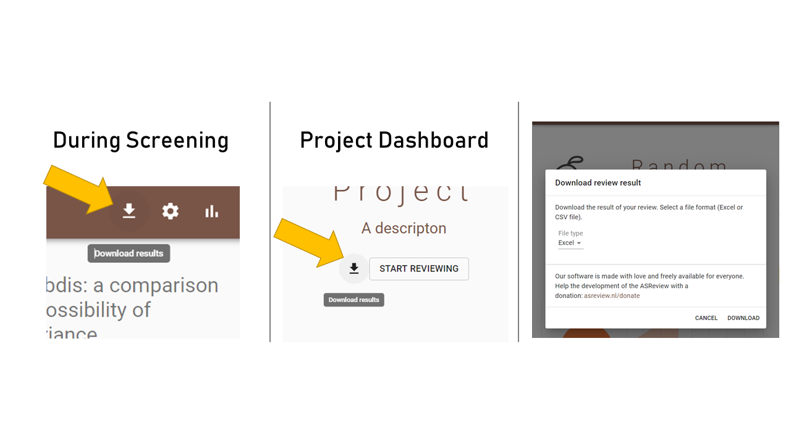

Pre-Screening
=============

Auto-Save
---------

Your work is saved automatically so you do not need to press any buttons,
or get stressed!

.. figure:: ../../images/auto_save.png
   :alt: Auto Save

The techincal files can be found in the **.asreview** folder on your machine
(on Windows: **C:\Users\NAME\.asreview\FILES**), but more importantly a file containing all
meta-data including your decissions can be downloaded any time during the screening process,
or on the project dashboard. When you click **download** you will be asked where to safe the files.

Select Model
------------

It is possible to change the settings of the Active learning model. There are
three ingredients that can be changed in the software: the type of classifier,
the query strategy and the feature extraction technique. 

To change the default setting:

1. Open ASReview LAB.
2. Start a new project, upload a dataset and select prior knowledge.
3. Click on the **edit** button.
4. Using the drop-down menu select a different classifier, query strategy or feature extraction technique.
5. Click Finish.

[ADD SCREEN SHOT]

The classifier is the machine learning model used to compute the relevance
scores. The available classifiers are Naive Bayes, Support Vector
Machine, Logistic Regression, and Random Forest. More classifiers can be
selected via the :doc:`API <../API/reference>`. The default is Naive Bayes,
though relatively simplistic, it seems to work quite well on a wide range of
datasets.

The query strategy determines which document is shown after the model has
computed the relevance scores. With certainty-based is selected the document
with the highest relevance score is showed followed by the 2nd in line,
etcetera, untill a new model is trained with new relevance scores. When
uncertainty-based is selected, the most uncertain docuemtn is sampled
according to the model (i.e. closest to 0.5 probability).  When random is
selected, as it says, randomly select samples with no regard to model assigned
probabilities. **Warning**: selecting this option means your review is not
going to be accelerated by ASReview.

The feature extraction technique determines the method how text is translated
into a vector that can be used by the classifier. The default is TF-IDF (Term
Frequency-Inverse Document Frequency) from `SKLearn <https://scikit-learn.org/stable/modules/generated/sklearn.feature_extraction.text.TfidfVectorizer.html>`_.
It works well in combination with Naive Bayes and other fast training models. 
Another option is Doc2Vec provided by the `gensim <https://radimrehurek.com/gensim/>`_ 
package which needs to be installed manually. 
To use it, please install the gensim package manually:

.. code:: bash
       pip install gensim

It takes relatively long to create a feature matrix with this method. However,
this only has to be done once per simulation/review. The upside of this method
is the dimension-reduction that generally takes place, which makes the
modelling quicker.

