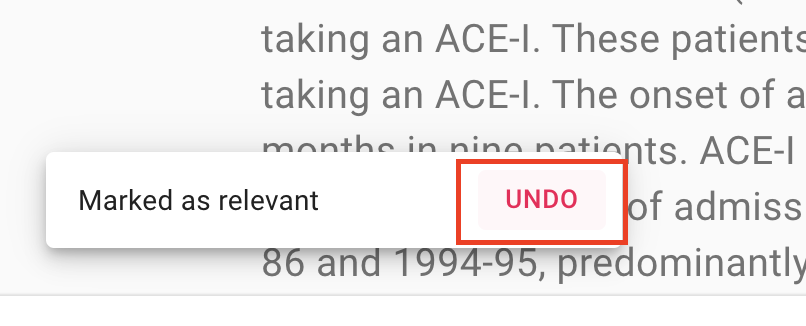

Screening
=========

.. contents:: Table of Contents

DOI
---

If a column with Digital Object Identifiers (DOI) is available in the meta-data
of your dataset, ASReview Lab will display the DOI with hyperlink during
screening. Most of the time, DOIs point to the full-text of a publication. See
:doc:`datasets <../intro/datasets>` for more information on including DOI values to your
datasets.

.. figure:: images/doi.png
   :alt: Digital Object Identifier (DOI)

Keyboard shortcuts
------------------

ASReview LAB supports keyboard shortcuts. By default, keyboard shortcuts are
disabled. Enable the shortcuts as follows:

1. Open ASReview LAB.
2. Click on the settings icon (top right).
3. Check the **keyboard settings** field.

The table below lists the available keyboard shortcuts.

+-----------------------------+------------------------+
| Action                      | Shortcut               |
+=============================+========================+
| Label record as relevant    | **r** or **Shift + r** |
+-----------------------------+------------------------+
| Label record as irrelevant  | **i** or **Shift + i** |
+-----------------------------+------------------------+
| Return to previous decision | **u** or **Shift + u** |
+-----------------------------+------------------------+

.. note::

	Return to previous decision, **u** or **Shift + u**, is only available
	if the **Undo** feature has been toggled on in the settings panel.

Undo last decision
------------------

In some cases, you might want to change your previous decision. The screening
interface of ASReview LAB can be used to return to the previous decision.

1. Open ASReview LAB.
2. Open or create a project.
3. Label the record displayed in the screen as relevant or irrelevant.
4. Click on **Undo** (See picture below).

5. Click on **Keep (ir)relevant** or **Convert to (ir)relevant**
6. Continue labeling.

It is possible to disable this option in the settings menu

1. Open ASReview LAB.
2. Click on the settings icon (top right).
3. Uncheck the **Undo** field.
