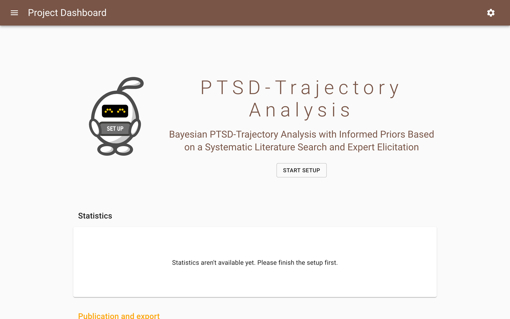
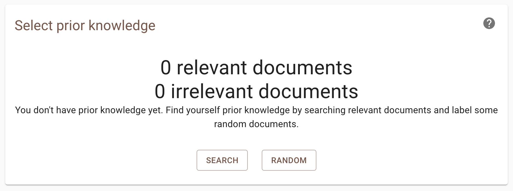
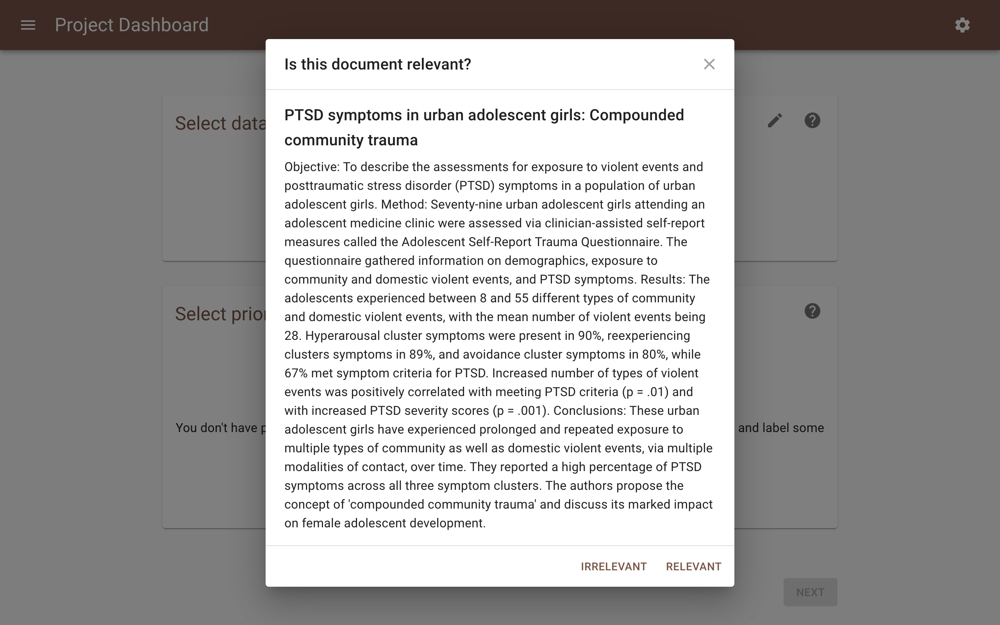

Pre-Screening
=============

Before you can actually start screening you have to initialize a project,
select a dataset, prior knowledge and a model.

Start Setup
-----------

After you have started a project, you are redirected to the project dashboard
and you will first be asked to initialize the setup.

1. Open ASReview LAB.
2. Start a new project.
3. Click the *Start Setup* button.

Already in this project dashboard some of the features are available which are
described in the :doc:`post_screening` section.

Select Dataset
--------------

To select a dataset:

1. Open ASReview LAB.
2. Start a new project.
3. Click the *Start Setup* button.
4. Choose one of the four options to select a dataset and click upload:

.. figure:: ../../images/asreview_prescreening_datasets.png
   :alt: ASReview dataset selector

From File
~~~~~~~~~

Upload your file by *Drag 'n' Drop*, or select your file via the browser.
The data needs to adhere to a :doc:`specific format<../intro/datasets>`. If a
file is uploaded and reckognized as one of the available formats, it will
display the message *Successful upload* and provides the number of records in
the dataset.

From URL
~~~~~~~~

Fill in a link to a file on the Internet. For example, a link from this
`dataset repository <https://github.com/asreview/systematic-review-datasets>`__.

From Plugin
~~~~~~~~~~~

Select a file available via a plug-in like the :doc:`COVID-19 plugin <../plugins/covid19>`.

Example Datasets
~~~~~~~~~~~~~~~~

Select one of the :ref:`example datasets <demonstration-datasets>`.

.. _partly-labeled-data:

Partly Labeled Data
-------------------

If you want to include decisions you've already made prior to setting up your
project, you can upload a partly labeled dataset containg labels for part of
the data and unlabeled recors you want to screen with ASReview. This might be
veru helpfull if you switch from screening in another tool to screening with
ASReview, or when updating an existing systematic review with more recent
publications.

Currently, this can be done by merging your dataset with labeled and unlabeled
records via Excel or another reference manager. Your dataset should contain a
column, called *label_included* (or: final_included, label, label_included,
included_label, included_final, included, included_flag, include) which is
filled with 1's or 0's for the publications that you have already screened,
and is empty for the records that you still need to screen using
ASReview.

To use a partly labeled dataset:

1. Open ASReview LAB.
2. Start a new project.
3. Click the *Start Setup* button.
4. Select your partly labeled dataset.

ASReview will recognize the column with the labels and show you the number of
prior relevant/irrelevant papers in the section *Prior Knowledge*.

.. _select-prior-knowledge:

Select Prior Knowledge
----------------------

The first iteration of the :doc:`active learning cycle
<../guides/activelearning>` requires prior knowledge to work. This knowledge
is used to train the first model. In this step you need to provide at least
one relevant and one irrelevant document. To facilitate this, it is possible
to search within your dataset (for finding prior relevant papers) or ask the
software to present a couple of random documents (for prior irrelevant
papers).

1. Open ASReview LAB.
2. Start a new project.
3. Click the *Start Setup* button.
4. Select a dataset.
5. Click **Search** or **Random** to select your prior knowledge.

After selecting some prior information, you can click **Next**.

.. figure:: ../../images/asreview_prescreening_prior_next.png
   :alt: ASReview prior knowledge selector next

Search
~~~~~~

Let's start with finding a prior relevant document. Probabily the most
efficient way to do this is by searching for a specific document you already
know is relevant. Click the search button and search your dataset by authors,
keywords or title, or a combination thereof. Enter your search terms (Use
'enter' to start searching).

.. figure:: ../../images/asreview_prescreening_prior_search.png
   :alt: ASReview prior knowledge search

Click the document you had in mind and click Relevant (Clicking Irrevant
results in an irrelevant document).

The Prior Knowledge step will now show 1 relevant document. This is already
enough to  proceed to the next step. Note that there are no restrictions on
the number of publications you need to provide, but preferably provide 1-5
relevant documents.

If you are done click **Next**.

Random
~~~~~~

You also need to provide at least one prior irrelevant document and we will
use the random option. Given that the majority of documents in the dataset is
probably irrelevant (extreme inbalanced data problem), the documents presented
here will most probable be irrelevant for your study. Click on random to and a
couple of random documents will be shown. Indicate for each document whether
it is relevant or irrelevant.

After labeling a couple of randomly selected documents, ASReview LAB will
ask you whether you want to stop. Click on **STOP** and click **Next**.

.. _select-model:

Select Model
------------

It is possible to change the settings of the Active learning model. There are
three ingredients that can be changed in the software: the type of classifier,
the query strategy and the feature extraction technique.

To change the default setting:

1. Open ASReview LAB.
2. Start a new project, upload a dataset and select prior knowledge.
3. Click on the **edit** icon (top right).
4. Using the drop-down menu select a different classifier, query strategy or feature extraction technique.
5. Click Finish.

.. figure:: ../../images/asreview_prescreening_model.png
   :alt: ASReview model

The classifier is the machine learning model used to compute the relevance
scores. The available classifiers are Naive Bayes, Support Vector
Machine, Logistic Regression, and Random Forest. More classifiers can be
selected via the :doc:`API <../API/reference>`. The default is Naive Bayes,
though relatively simplistic, it seems to work quite well on a wide range of
datasets.

The query strategy determines which document is shown after the model has
computed the relevance scores. With certainty-based is selected the document
with the highest relevance score is showed followed by the 2nd in line,
etcetera, untill a new model is trained with new relevance scores. When
uncertainty-based is selected, the most uncertain docuemtn is sampled
according to the model (i.e. closest to 0.5 probability).  When random is
selected, as it says, randomly select samples with no regard to model assigned
probabilities. **Warning**: selecting this option means your review is not
going to be accelerated by ASReview.

The feature extraction technique determines the method how text is translated
into a vector that can be used by the classifier. The default is TF-IDF (Term
Frequency-Inverse Document Frequency) from `SKLearn <https://scikit-learn.org/stable/modules/generated/sklearn.feature_extraction.text.TfidfVectorizer.html>`_.
It works well in combination with Naive Bayes and other fast training models.
Another option is Doc2Vec provided by the `gensim <https://radimrehurek.com/gensim/>`_
package which needs to be installed manually.
To use it, install the gensim package manually:

.. code:: bash

    pip install gensim

It takes relatively long to create a feature matrix with this method. However,
this only has to be done once per simulation/review. The upside of this method
is the dimension-reduction that generally takes place, which makes the
modelling quicker.

