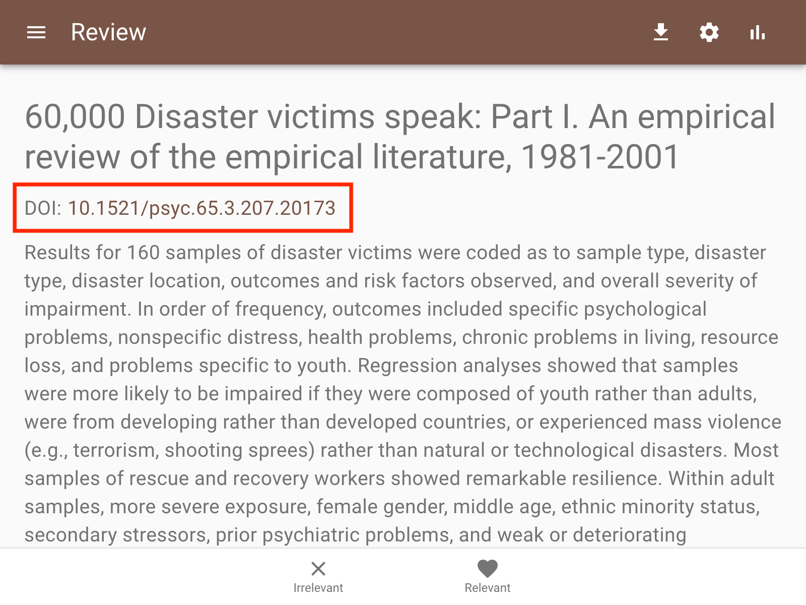

Screening
=========

The screen in which you provide labels for records shown to you by the
software is kept as simple as possible. This is because we want you to focus
on the content of the text so that you can make your deicssion as a true
Oracle. There are few features you can access during screening which we
present below.

Autosave
--------

Your work is saved automatically so you do not need to press any buttons,
or get stressed!

Label options
-------------

Below the text we provide two options: Relevant or Irrelevant.

To make a decission:

1. Open ASReview LAB.
2. Start a new project, upload a dataset and select prior knowledge.
3. Start screening.
4. Click on either the button Relevant or Irrelevant.

.. warning::

  If you are in doubt, think harder and take your time to make a decision, you
  are the oracle. Based on your input, a new model will be trained in the
  background. If you make decisions faster than the model needs for computing
  new relevance scores, you will simply be presented with the record next in
  line (etcetera) until the model is done training.

[SCREENSHOT]

.. _undo-last:

Undo Last Decision
------------------

In some cases, you might want to change your previous decision. The screening
interface of ASReview LAB can be used to return to the previous decision.

1. Open ASReview LAB.
2. Open or create a project.
3. Label the record displayed in the screen as relevant or irrelevant.
4. Click on **Undo** (See picture below).

.. figure:: ../../images/undo_button.png
   :alt: Undo previous decision

5. Click on **Keep (ir)relevant** or **Convert to (ir)relevant**
6. Continue labeling.

Statistics Panel
----------------

For unlabeled data the software offers some insightful graphs to keep track
of your screening process so far. To open the statistics panel:

1. Open ASReview LAB.
2. Start a new project, upload a dataset and select prior knowledge.
3. Start screening.
4. Click the **statistics** icon in the upper-right corner.
5. To close the panel click on the '>'.

[SCREENSHOT]

In the top of the statistics panel the project name , authors and total number
of records in the dataset are displayed.

The pie chart on the presents an overview of how many relevant (green) and
irrelevant (orange) records you have screened so far. Also, the total number
of records screened is displayed, as well as the percentage screened relative
to the total number of records in the dataset.

The second plot is a progress plot. On the x-axis the number of records
screened is tracked. The y-axis shows a moving average. It displays the ratio
between relevant and irrelevant records for a batch of 10 labeled records. If
you hoover over the plot you can see the moving average for any batch of 10
labeled records.

Underneath the progress plot the number of irrelevant records is shown, which
might help in deciding when to stop reviewing.

DOI
---

If a column with Digital Object Identifiers (DOI) is available in the meta-data
of your dataset, ASReview Lab will display the DOI with hyperlink during
screening. Most of the time, DOIs point to the full-text of a publication. See
:doc:`datasets <../intro/datasets>` for more information on including DOI values to your
datasets. To access the full text:

1. Open ASReview LAB.
2. Start a new project, upload a dataset and select prior knowledge.
3. Start screening.
4. As soon as a record contains a DOI number, it will be presented below the title.

Download Results
----------------

A file containing all meta-data including your decissions can be downloaded
any time during the screening process. To download your results:

1. Open ASReview LAB.
2. Start a new project, upload a dataset and select prior knowledge.
3. Start screening.
4. Click the **download** icon in the upper-right corner.
5. You will be aksed whether you want to save an excel or a csv file.
6. You will be aksed where to save the file.

[SCREENSHOT OF THE ICON AND POP-UP SCREEN]

Hamburger menu
--------------

Via the hamburger menu in the left-upper corner you can:

1. Navigate back to the :doc:`overview <pre_screening>` page containing all your projects (or to start a new project).
2. You can access the :doc:`Project Dashboard <post_screening>`.
3. Ask for `HELP <https://asreview.readthedocs.io/en/latest/>`_.
4. Provide feedback or `contribute <https://github.com/asreview/asreview/blob/master/CONTRIBUTING.md>`_ to the code.
5. Donate some money via our `crowdfunding platform <https://steun.uu.nl/project/help-us-to-make-covid-19-research-accessible-to-everyone>`_ (the software is for free, but the development is not)
6. Quit the software (all your results are automatically saved)

[SCREENSHOT]

.. _keybord-shortcuts:

Keyboard shortcuts
------------------

ASReview LAB supports the use of keyboard shortcuts during screening. The
table below lists the available keyboard shortcuts.

+-----------------------------+------------------------+
| Action                      | Shortcut               |
+=============================+========================+
| Label record as relevant    | **r** or **Shift + r** |
+-----------------------------+------------------------+
| Label record as irrelevant  | **i** or **Shift + i** |
+-----------------------------+------------------------+
| Return to previous decision | **u** or **Shift + u** |
+-----------------------------+------------------------+

.. note:

  Keyboard shortcuts are only available when the **Undo** feature has been
  enabled in the :ref:`settings panel<toggle-shortcuts>.

