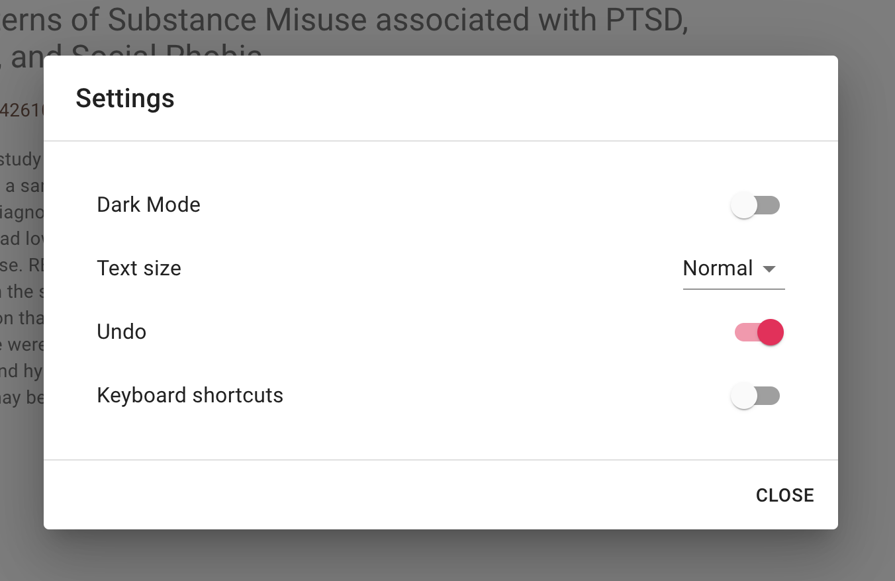
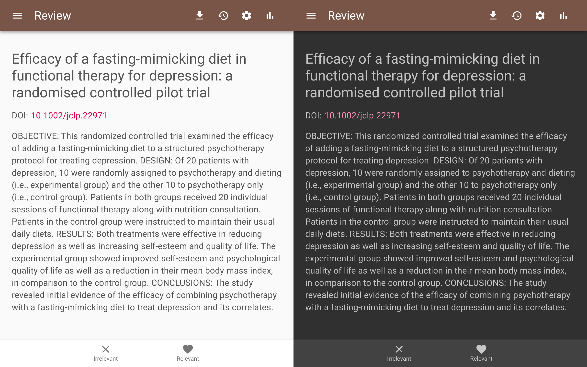
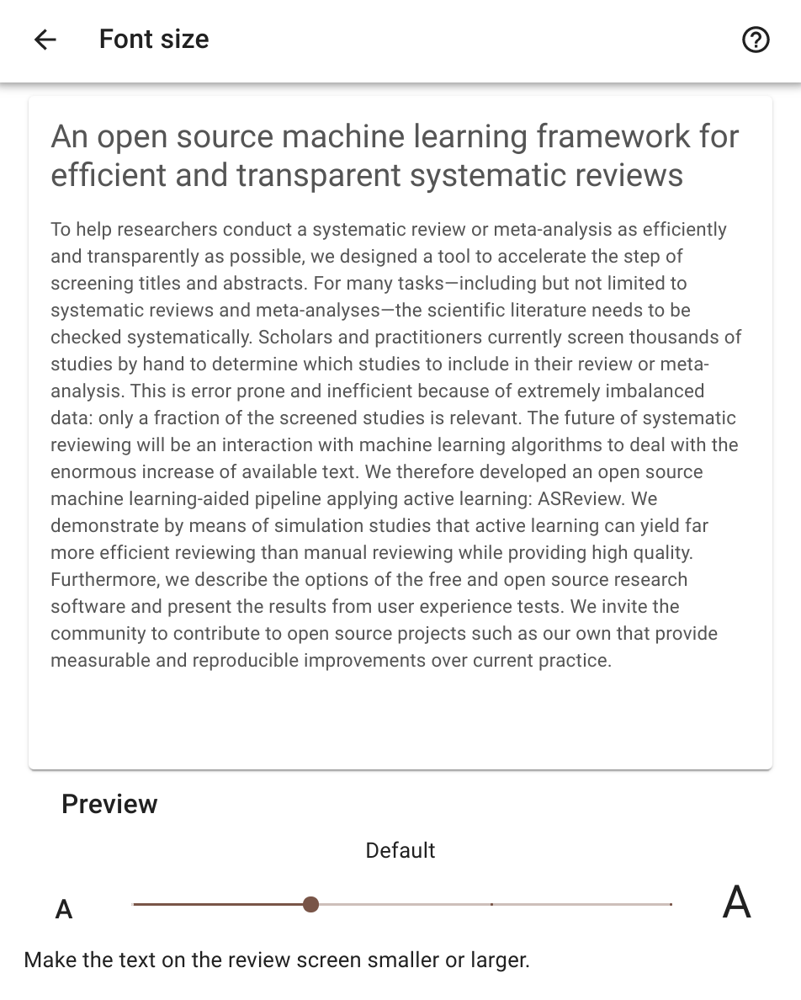
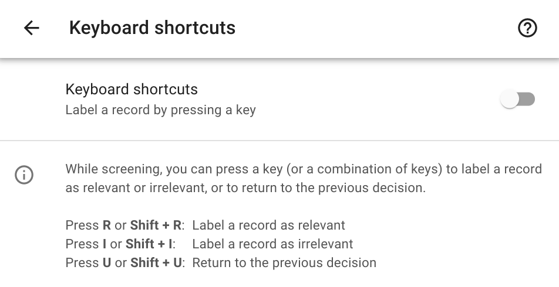

Settings
========

Click on Settings in the hamburger menu in the upper left cornor of ASReview LAB to configure your preferences.

.. note::
	Your preference is saved in the browser.

Display
-------

Dark mode
~~~~~~~~~

By default, the dark mode is disabled.

Font size
~~~~~~~~~

You can make the text on the review screen smaller or larger.

Review Preferences
------------------

Keyboard shortcuts
~~~~~~~~~~~~~~~~~~

You can press a key (or a combination of keys) to label a record as relevant or irrelevant, or to return to the previous decision during screening.
By default, keyboard shortcuts are disabled.

Undo
~~~~

You can allow returning to the previous decision during screening.
By default, the undo option is enabled.
