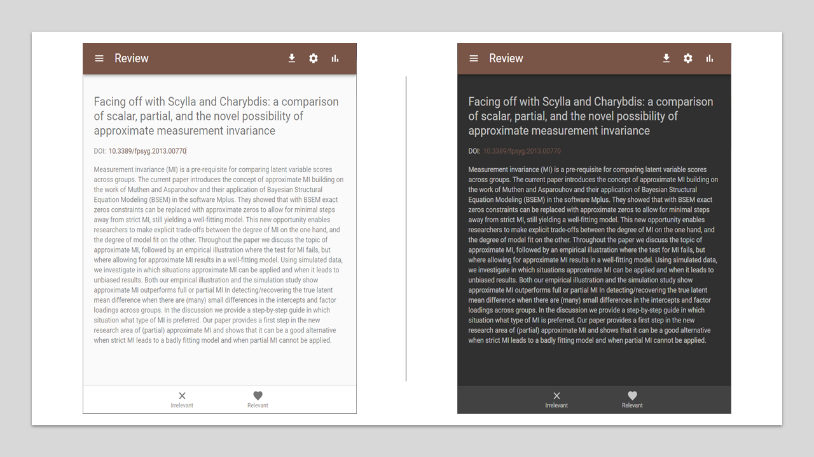
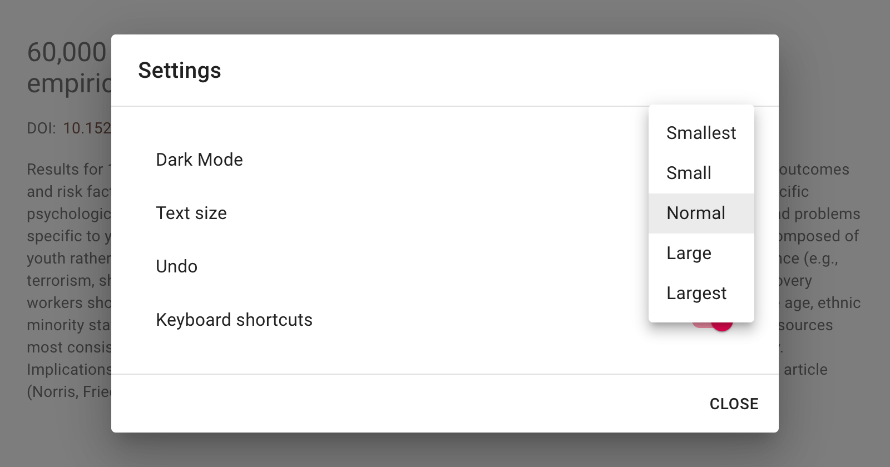
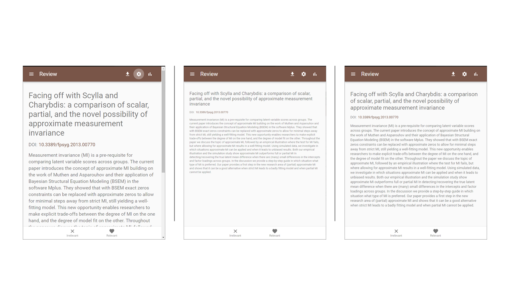

Settings
========

.. figure:: ../../images/asreview_settings.png
   :alt: ASReview settings

Dark Mode
---------

ASReview LAB supports dark mode. By default, the dark mode is disabled.
Enable the dark mode as follows:

1. Open ASReview LAB.
2. Click on the settings icon (top right).
3. Toggle the **Dark Mode** field.

.. note::

	Your preference is saved in the browser.

Text Size
---------

ASReview LAB supports different text sizes. By default, the text size is set to normal.
Change the text size as follows:

1. Open ASReview LAB.
2. Click on the settings icon (top right).
3. Select the size in the **Text Size** field.

Resulting in:

.. note::

	Your preference is saved in the browser.

Toggle Undo option
------------------

It is possible to enable or disable the :ref:`undo option <export-project>` in the settings menu:

1. Open ASReview LAB.
2. Click on the settings icon (top right).
3. Uncheck the **Undo** field.

.. _toggle-shortcuts:

Toggle Shortcuts
----------------

ASReview LAB supports the use of :ref:`keyboard shortcuts <keybord-shortcuts>`
during screening. By default, keyboard shortcuts are disabled. Enable the
shortcuts as follows:

1. Open ASReview LAB.
2. Click on the settings icon (top right).
3. Check the **keyboard settings** field.
