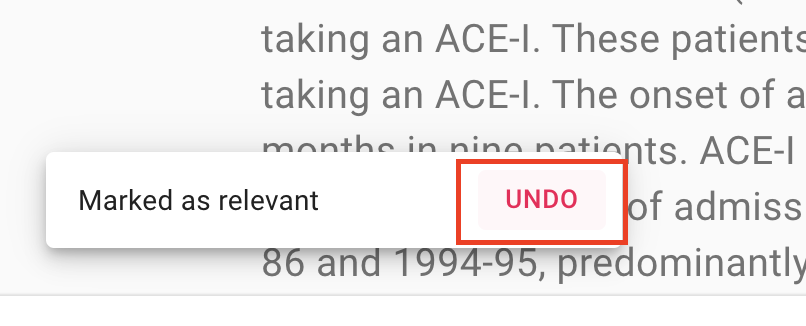

Undo last decision
------------------

In some cases, you might want to change your previous decision. The screening
interface of ASReview LAB can be used to return to the previous decision.

1. Open ASReview LAB.
2. Open or create a project.
3. Label the record displayed in the screen as relevant or irrelevant.
4. Click on **Undo** (See picture below).

5. Click on **Keep (ir)relevant** or **Convert to (ir)relevant**
6. Continue labeling.

It is possible to disable this option in the settings menu

1. Open ASReview LAB.
2. Click on the settings icon (top right).
3. Uncheck the **Undo** field.
