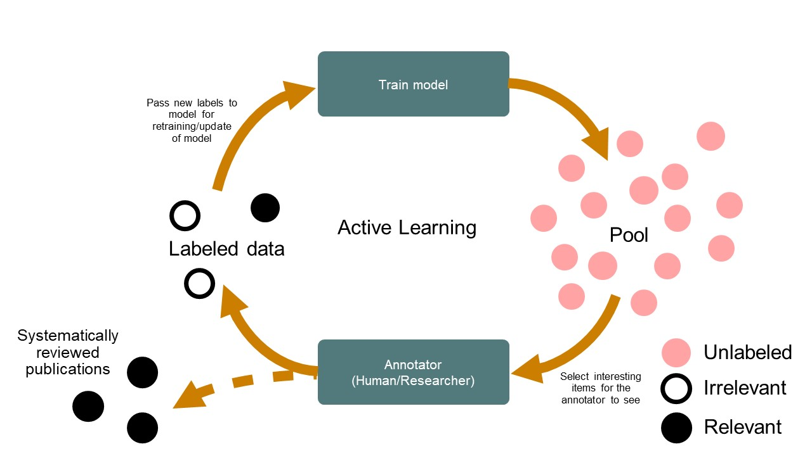

Active learning for Systematic Reviews
~~~~~~~~~~~~~~~~~~~~~~~~~~~~~~~~~~~~~~~

The rapidly evolving field of artificial intelligence (AI) has allowed the
development of AI-aided pipelines that assist in finding relevant texts for
such search tasks[1]. A well-established approach to increase the efficiency
of title and abstract screening is determining prioritization[2, 3] with
active learning[4], which is very effective for systematic reviewing[5-15]. It
works as follows: Just like with a classical pipeline, you start with the set
of all unlabeled records (e.g., meta-data containing titles and abstracts of
scientific papers) retrieved from a search (pool). This is followed by
constructing a training set, which, in the example of systematic reviewing,
consists of labeled data provided by the annotator (researcher) (e.g., some
relevant and irrelevant abstracts). Then, the active learning cycle starts.
Active learning denotes the scenario in which the reviewer is labeling
references that are presented by a machine learning model. The machine
learning model learns from the reviewers' decision and uses this knowledge in
selecting the next reference that will be presented to the reviewer. The
annotated dataset starts out small and iteratively grows in size:

1.	The first step is feature extraction. That is, an algorithm cannot make
predictions from the records as they are; their textual content needs to be
represented more abstractly. The algorithm can then determine the important
features that are necessary to classify a record, thereby drastically
decreasing the search space;

2.	A specific classification algorithm (i.e, machine learning model) is then
chosen;

3.	The chosen classifier is trained on the labeled records and estimates
relevance scores for all unlabeled records. The model chooses a record to show
to the user for the next iteration of the cycle;

4.	The annotator screens this record and provides a label, relevant or
irrelevant. The newly labeled record is moved to the training data set and
it’s back to the previous step.

The interaction with the human can be used to train a model with a minimum
number of labeling tasks and the trained model is the output which is then
used to classify new data, also called Human-in-the-Loop machine learning[16].
In the general sense the key idea behind active learning is that, if you allow
the model to decide for itself which data it wants to learn from, its
performance and accuracy may improve and it requires fewer training instances
to do so. Moreover, the dataset's informativeness is increased by having the
reviewer annotate those references that are more informative to the model
(**uncertainty-based sampling**).

The application of active learning to systematic reviewing is called
Researcher-In-The-Loop (RITL)[17] with three unique components:

(I) The primary output of the process is a selection of the pool with only relevant
papers;

(II) All data points in the relevant selection should have been seen by
a human at the end of the process (**certainty-based sampling**);

(III) The process requires a strong, systematic way of working. As such, it
entails several explicit and reproducible steps, as outlined in the `PRISMA
guidelines <http://www.prisma-statement.org/>`_ for systematic reviewing. This
procedure ensures (more or less)  that all likely relevant publications are
found in a standardized way based on pre-defined eligibility criteria,
extracting data from eligible studies, and synthesizing the results.

In the active learning cycle, the model incrementally improves its predictions
on the remaining unlabeled records, but hopefully all relevant records are
identified as early in the process as possible. The reviewer decides to stop
at some point during the process to conserve resources or when all records
have been labeled. In the latter case, no time was saved and therefore the
main question is to decide when to stop: i.e. to determine the point at which
the cost of labeling more papers by the reviewer is greater than the cost of
the errors made by the current model[18]. Finding 100% of the relevant papers
appears to be almost impossible, even for human annotators[19]. Therefore, we
typically aim to find 95% of the inclusions. However, in the situation of an
unlabeled dataset, you don’t know how many relevant papers there are left to
be found. So researchers might either stop too early and potentially miss many
relevant papers, or stop too late, causing unnecessary further reading[20].
That is, one can decide to stop reviewing after a certain amount of
non-relevant papers have been found in succession[21], but this is up to the
user to decide. See the `discussion board <https://github.com/asreview/asreview/discussions/557>`_
for more options. 

1.	Harrison, H., et al., Software tools to support title and abstract screening for systematic reviews in healthcare: an evaluation. BMC Medical Research Methodology, 2020. 20(1): p. 7.
2.	Cohen, A.M., K. Ambert, and M. McDonagh, Cross-Topic Learning for Work Prioritization in Systematic Review Creation and Update. J Am Med Inform Assoc, 2009. 16(5): p. 690-704.
3.	Shemilt, I., et al., Pinpointing Needles in Giant Haystacks: Use of Text Mining to Reduce Impractical Screening Workload in Extremely Large Scoping Reviews. Res. Synth. Methods, 2014. 5(1): p. 31-49.
4.	Settles, B., Active Learning. Synthesis Lectures on Artificial Intelligence and Machine Learning, 2012. 6(1): p. 1-114.
5.	Yu, Z. and T. Menzies, FAST2: An intelligent assistant for finding relevant papers. Expert Systems with Applications, 2019. 120: p. 57-71.
6.	Yu, Z., N.A. Kraft, and T. Menzies, Finding Better Active Learners for Faster Literature Reviews. Empir. Softw. Eng., 2018. 23(6): p. 3161-3186.
7.	Miwa, M., et al., Reducing Systematic Review Workload through Certainty-Based Screening. J Biomed Inform, 2014. 51: p. 242-253.
8.	Cormack, G.V. and M.R. Grossman, Engineering quality and reliability in technology-assisted review. Proceedings of the 39th International ACM SIGIR conference on Research and Development in Information Retrieval, 2016: p. 75-84.
9.	Cormack, G.V. and M.R. Grossman, Autonomy and Reliability of Continuous Active Learning for Technology-Assisted Review. 2015.
10.	Wallace, B.C., C.E. Brodley, and T.A. Trikalinos, Active learning for biomedical citation screening. Proceedings of the 16th ACM SIGKDD international conference on Knowledge discovery and data mining, 2010: p. 173-182.
11.	Wallace, B.C., et al., Deploying an interactive machine learning system in an evidence-based practice center: abstrackr. Proceedings of the ACM International Health Informatics Symposium (IHI), 2012: p. 819-824.
12.	Wallace, B.C., et al., Semi-Automated Screening of Biomedical Citations for Systematic Reviews. BMC Bioinform, 2010. 11(1): p. 55-55.
13.	Gates, A., et al., Performance and Usability of Machine Learning for Screening in Systematic Reviews: A Comparative Evaluation of Three Tools. Systematic Reviews, 2019. 8(1): p. 278-278.
14.	Gates, A., C. Johnson, and L. Hartling, Technology-assisted title and abstract screening for systematic reviews: a retrospective evaluation of the Abstrackr machine learning tool. Systematic Reviews, 2018. 7(1): p. 45.
15.	Singh, G., J. Thomas, and J. Shawe-Taylor, Improving Active Learning in Systematic Reviews. 2018.
16.	Holzinger, A., Interactive Machine Learning for Health Informatics: When Do We Need the Human-in-the-Loop? Brain Inf., 2016. 3(2): p. 119-131.
17.	Van de Schoot, R. and J. De Bruin Researcher-in-the-loop for systematic reviewing of text databases. 2020.  DOI: 10.5281/zenodo.4013207.
18.	Cohen, A.M., Performance of Support-Vector-Machine-Based Classification on 15 Systematic Review Topics Evaluated with the WSS\@95 Measure. J Am Med Inform Assoc, 2011. 18(1): p. 104-104.
19.	Wang, Z., et al., Error rates of human reviewers during abstract screening in systematic reviews. PloS one, 2020. 15(1): p. e0227742.
20.	Yu, Z., N. Kraft, and T. Menzies, Finding better active learners for faster literature reviews. Empirical Software Engineering, 2018.
21.	Ros, R., E. Bjarnason, and P. Runeson. A machine learning approach for semi-automated search and selection in literature studies. in Proceedings of the 21st International Conference on Evaluation and Assessment in Software Engineering. 2017.
22.	Webster, A.J. and R. Kemp, Estimating omissions from searches. The American Statistician, 2013. 67(2): p. 82-89.
23.	Stelfox, H.T., et al., Capture-mark-recapture to estimate the number of missed articles for systematic reviews in surgery. The American Journal of Surgery, 2013. 206(3): p. 439-440.
24.	Kastner, M., et al., The capture–mark–recapture technique can be used as a stopping rule when searching in systematic reviews. Journal of clinical epidemiology, 2009. 62(2): p. 149-157.

