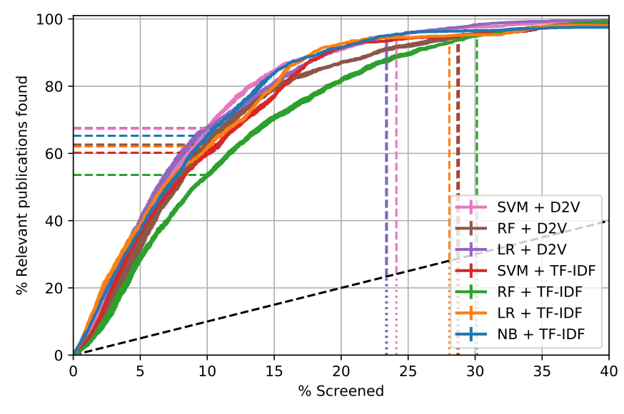
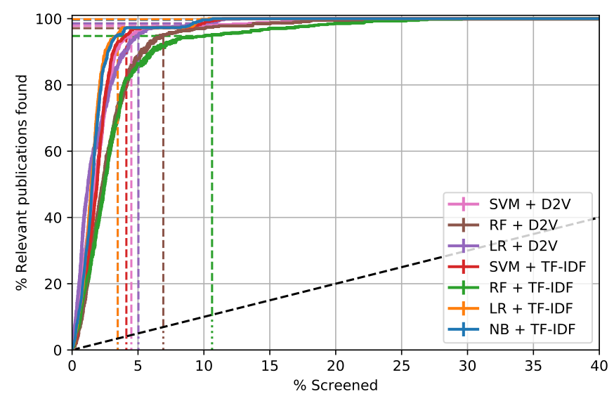
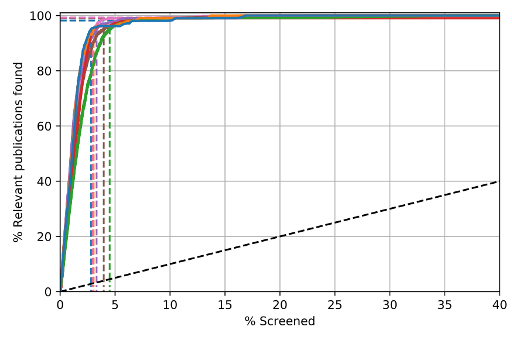
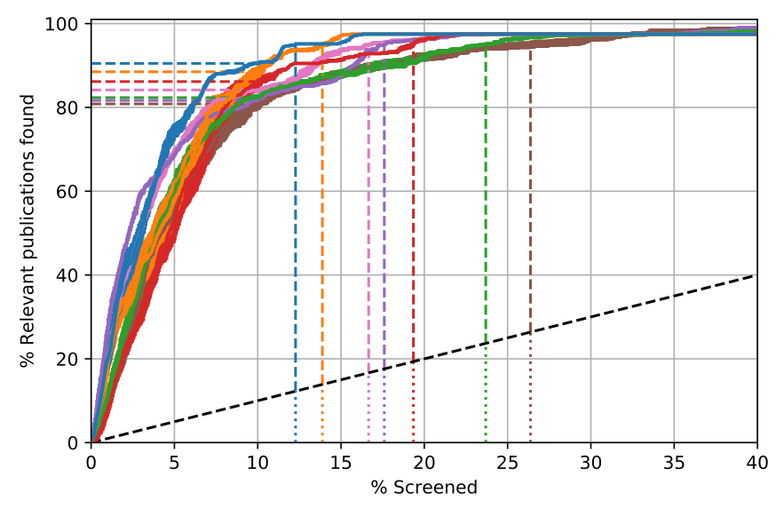
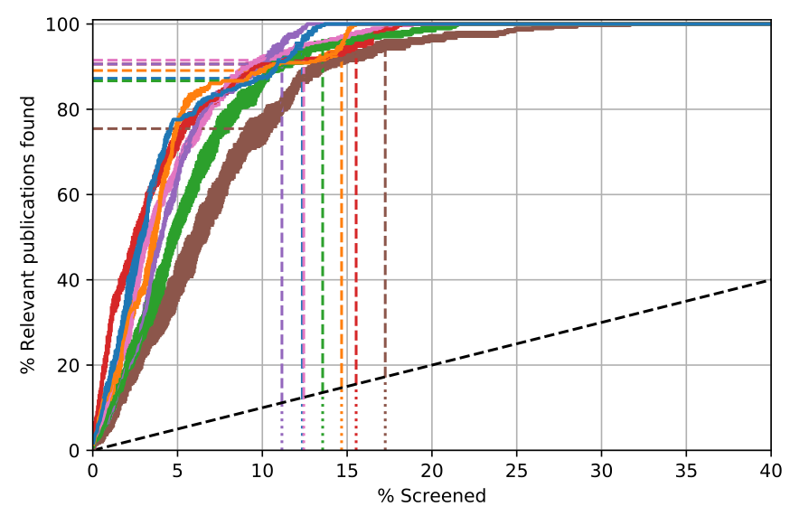
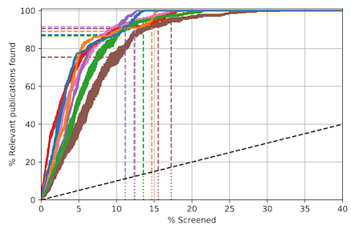

Simulation results
==================

To provide insight into how much screening effort ASReview could
potentially save, seven ASReview models were simulated on six existing
systematic review datasets `(Ferdinands, 2020)
<https://github.com/GerbrichFerdinands/asreview-thesis/blob/master/manuscript/manuscript/Ferdinands%2C-G---MSBBSS.pdf/>`_. In short, for all six datasets ASReview
could have saved at least 60% of screening effort (e.g. WSS​@95% was >
40%). For some datasets, ASReview was even able to detect 95% of
relevant publications after screening only 5% of relevant publications.

Datasets
--------
To assess the generalizability of the models across research
contexts, the models were simulated on data from varying research contexts. Data were collected from the fields of medicine (Cohen et al. 2006;
Appenzeller‐Herzog et al. 2019), virology (Kwok et al. 2020), software
engineering (Yu, Kraft, and Menzies 2018), behavioural public
administration (Nagtegaal et al. 2019) and psychology (van de Schoot et
al. 2017). Datasets are available in the `ASReview systematic review
datasets
repository <https://github.com/asreview/systematic-review-datasets>`__.

The data were preprocessed from their source into a dataset
containing title and abstract of the publications obtained in the
initial search. Candidate studies with missing abstracts and duplicate
instances were removed from the data. All datasets consisted of
thousands of candidate studies, of which only a fraction was deemed
relevant to the systematic review. For the Virus and the Nudging
dataset, the inclusion rate was about 5 per cent. For the remaining six
datasets, inclusion rates were centred around 1-2 per cent.

.. raw:: html

   <!-- Preprocessing scripts and resulting datasets can be found on the [GitHub repository for this thesis](https://github.com/GerbrichFerdinands/asreview-thesis). Datasets were labelled to indicate which candidate studies were included in the systematic review, thereby indicating relevant publications.  -->

**Table 1 - Statistics on the systematic review datasets**

+----------+------------------------+-----------------------+--------------------+
| Dataset  | Candidate publications | Relevant publications | Inclusion rate (%) |
+==========+========================+=======================+====================+
| Nudging  | 1847                   | 100                   | 5.41               |
+----------+------------------------+-----------------------+--------------------+
| PTSD     | 5031                   | 38                    | 0.76               |
+----------+------------------------+-----------------------+--------------------+
| Software | 8896                   | 104                   | 1.17               |
+----------+------------------------+-----------------------+--------------------+
| Ace      | 2235                   | 41                    | 1.83               |
+----------+------------------------+-----------------------+--------------------+
| Virus    | 2304                   | 114                   | 4.95               |
+----------+------------------------+-----------------------+--------------------+
| Wilson   | 2333                   | 23                    | 0.99               |
+----------+------------------------+-----------------------+--------------------+

Models
------

To assess the effect of different ASReview models, seven models were
evaluated differing in terms of the classification technique (Naive
Bayes, Linear Regression, Support Vector Machine, and Random Forest) and
the feature extraction strategy they adopt (TF-IDF and Doc2vec). The
Naive Bayes + TF-IDF model is the current default in ASReview. Note that
the ASReview GUI currently only offers freedom of choice for a
classification technique. However, the models presented here are not
exhaustive as the ASReview backend implements various other
configurations.

Evaluation
----------

Model performance was assessed by two different measures, Work Saved
over Sampling (WSS), and Relevant References Found (RRF). WSS indicates the reduction in publications needed to be screened, at a
given level of recall (Cohen et al. 2006). Typically measured at a
recall level of 0.95, WSS​@95 yields an estimate of
the amount of work that can be saved at the cost of failing to identify
5% of relevant publications. In the current study, WSS is computed at
0.95 recall. RRF statistics are computed at 10%, representing the
proportion of relevant publications that are found after screening 10%
of all publications.

Furthermore, model performance was visualized by plotting recall curves.
Plotting recall as a function of the proportion of screened publications
offers insight in model performance throughout the entire screening
process (Cormack and Grossman 2014; Yu, Kraft, and Menzies 2018). The x-axis represents the proportion of screened publications, the y-axis represents the proportion of relevant publications found. The curves give information in two directions. On the one hand, they display the proportion of relevant publications found for any point during the screening process (on the x-axis), RRF. On the other hand, they present the proportion of publications that need to be screened to achieve a certain level of recall (on the y-axis), 1-WSS. The quicker the curve reaches towards the top of the y-axis, the better the performance.

For every simulation, the RRF​@10 and WSS​@95, are reported as means over 15
trials. To indicate the spread of performance within simulations, the
means are accompanied by an estimated standard error of the mean (\hat
s). To compare overall performance across datasets, median performance
is reported for every dataset, accompanied by the Median Absolute
Deviation (MAD), indicating variability between models within a certain
dataset. Recall curves are plot for every simulation, representing the
average recall over 15 trials (\pm) the standard error of the mean.

Results
-------
The figures below show the recall curves of simulations for all model-dataset combinations. These curves plot recall as a function of the proportion of publications screened. The curves represent the average recall over 15 trials where the error margin represents the standard error of the mean in the direction of the y-axis. The x-axis is cut off at 40% since all for simulations, the models reached 95% recall after screening 40% of the publications. The dashed horizontal lines indicate the RRF​@10 values, the dashed vertical lines the WSS​@95 values. The dashed grey diagonal line corresponds to the expected recall curve when publications are screened in random order.

Recall curves
~~~~~~~~~~~~~

LRTB: Nudging dataset, PTSD dataset, Software dataset, Ace dataset, Virus dataset, Wilson dataset.

Between models comparison
~~~~~~~~~~~~~~~~~~~~~~~~~

For all datasets, the models were able to detect the relevant publications much faster compared to when screening publications at random order as the recall curves exceed the expected recall when screening at random order by far. While all models perform quite well, the NB + TF-IDF shows high performance on all measures across all datasets, whereas the RF + TF-IDF model never performed best on any of the measures across all datasets. Neither TF-IDF nor D2V feature extraction showed superior performance when simulated on certain datasets nor when combined with certain classification techniques.

Between datasets comparison
~~~~~~~~~~~~~~~~~~~~~~~~~~~

Firstly, models showed much higher performance for some datasets than for others. While performance on the PTSD and the Software dataset was quite high, the performance was much lower across models for the Nudging and Virus datasets. Secondly, the performance variability between models differed across datasets. within the PTSD, Software and Virus datasets, model performance is less spread out than within the Nudging, Ace and Wilson dataset. Thirdly, the curves for the Ace (Figure 2c) and Wilson (Figure 2e) datasets show a larger standard error of the mean compared to other the other datasets. For these datasets, model performance seemed to be more dependent on the initial training dataset compared to others.

WSS and RRF tables
~~~~~~~~~~~~~~~~~~

**Table 2 - WSS@95 values (mean, standard error) for all model-dataset
combinations, and median (MAD) for all datasets**

+---------+---------+---------+----------+---------+---------+---------+
|         | Nudging | PTSD    | Software | Ace     | Virus   | Wilson  |
|         |         |         |          |         |         |         |
+=========+=========+=========+==========+=========+=========+=========+
| SVM +   | 66.2    | 91.0    | 92.0     | 75.8    | 69.7    | 79.9    |
| TF-IDF  | (2.90)  | (0.41)  | (0.10)   | (1.95)  | (0.81)  | (2.09)  |
+---------+---------+---------+----------+---------+---------+---------+
| NB +    | 71.7    | 91.7    | 92.3     | 82.9    | 71.2    | 83.4    |
| TF-IDF  | (1.37)  | (0.27)  | (0.08)   | (0.99)  | (0.62)  | (0.89)  |
+---------+---------+---------+----------+---------+---------+---------+
| RF +    | 64.9    | 84.5    | 90.5     | 71.3    | 63.9    | 81.6    |
| TF-IDF  | (2.50)  | (3.38)  | (0.34)   | (4.03)  | (3.54)  | (3.35)  |
+---------+---------+---------+----------+---------+---------+---------+
| LR +    | 66.9    | 91.7    | 92.0     | 81.1    | 70.3    | 80.5    |
| TF-IDF  | (4.01)  | (0.18)  | (0.10)   | (1.31)  | (0.65)  | (0.65)  |
+---------+---------+---------+----------+---------+---------+---------+
| SVM +   | 70.9    | 90.6    | 92.0     | 78.3    | 70.7    | 82.7    |
| D2V     | (1.68)  | (0.73)  | (0.21)   | (1.92)  | (1.76)  | (1.44)  |
+---------+---------+---------+----------+---------+---------+---------+
| RF +    | 66.3    | 88.2    | 91.0     | 68.6    | 67.2    | 77.9    |
| D2V     | (3.25)  | (3.23)  | (0.55)   | (7.11)  | (3.44)  | (3.43)  |
+---------+---------+---------+----------+---------+---------+---------+
| LR +    | 71.6    | 90.1    | 91.7     | 77.4    | 70.4    | 84.0    |
| D2V     | (1.66)  | (0.63)  | (0.13)   | (1.03)  | (1.34)  | (0.77)  |
+---------+---------+---------+----------+---------+---------+---------+
| median  | 66.9    | 90.6    | 92.0     | 77.4    | 70.3    | 81.6    |
| (MAD)   | (3.05)  | (1.53)  | (0.47)   | (5.51)  | (0.90)  | (2.48)  |
+---------+---------+---------+----------+---------+---------+---------+

**Table 3 - RRF@10 values (mean, standard error) for all model-dataset
combinations, and median (MAD) for all datasets**

+---------+---------+---------+----------+---------+---------+---------+
|         | Nudging | PTSD    | Software | Ace     | Virus   | Wilson  |
|         |         |         |          |         |         |         |
+=========+=========+=========+==========+=========+=========+=========+
| SVM +   | 60.2    | 98.6    | 99.0     | 86.2    | 73.4    | 90.6    |
| TF-IDF  | (3.12)  | (1.40)  | (0.00)   | (5.25)  | (1.62)  | (1.17)  |
+---------+---------+---------+----------+---------+---------+---------+
| NB +    | 65.3    | 99.6    | 98.2     | 90.5    | 73.9    | 87.3    |
| TF-IDF  | (2.61)  | (0.95)  | (0.34)   | (1.40)  | (1.70)  | (2.55)  |
+---------+---------+---------+----------+---------+---------+---------+
| RF +    | 53.6    | 94.8    | 99.0     | 82.3    | 62.1    | 86.7    |
| TF-IDF  | (2.71)  | (1.60)  | (0.00)   | (2.75)  | (3.19)  | (5.82)  |
+---------+---------+---------+----------+---------+---------+---------+
| LR +    | 62.1    | 99.8    | 99.0     | 88.5    | 73.7    | 89.1    |
| TF-IDF  | (2.59)  | (0.70)  | (0.00)   | (5.16)  | (1.48)  | (2.30)  |
+---------+---------+---------+----------+---------+---------+---------+
| SVM +   | 67.3    | 97.8    | 99.3     | 84.2    | 73.6    | 91.5    |
| D2V     | (3.00)  | (1.12)  | (0.44)   | (2.78)  | (2.54)  | (4.16)  |
+---------+---------+---------+----------+---------+---------+---------+
| RF +    | 62.6    | 97.1    | 99.2     | 80.8    | 67.3    | 75.5    |
| D2V     | (5.47)  | (1.90)  | (0.34)   | (5.72)  | (3.19)  | (14.35) |
+---------+---------+---------+----------+---------+---------+---------+
| LR +    | 67.5    | 98.6    | 99.0     | 81.7    | 70.6    | 90.6    |
| D2V     | (2.59)  | (1.40)  | (0.00)   | (1.81)  | (2.21)  | (5.00)  |
+---------+---------+---------+----------+---------+---------+---------+
| median  | 62.6    | 98.6    | 99.0     | 84.2    | 73.4    | 89.1    |
| (MAD)   | (3.89)  | (1.60)  | (0.00)   | (3.71)  | (0.70)  | (2.70)  |
+---------+---------+---------+----------+---------+---------+---------+

Conclusion
----------
Overall, the findings confirm the great potential of active learning models in reducing workload for systematic reviewers. All models were able to detect 95% of the relevant publications after screening less than 40% of the total number of publications, indicating that active learning models can save more than half of the workload in the screening process. The results shed new light on the performance of different classification techniques, indicating that the Naive Bayes classification technique is superior to the widely used Support Vector Machine. As model performance differs vastly across datasets, this study raises the question of what causes models to yield more workload savings for some systematic review datasets than for others. To facilitate the applicability of active learning models in systematic review practice, it is essential to identify how dataset characteristics relate to model performance.

References
----------

.. raw:: html

   

.. raw:: html

   

[1] Cohen AM, Hersh WR, Peterson K, Yen P-Y. Reducing Workload in
Systematic Review Preparation Using Automated Citation Classification. J
Am Med Inform Assoc 2006;13:206–19.
`https://doi.org/10.1197/jamia.M1929 <https://doi.org/10.1197/jamia.M1929>`__.

.. raw:: html

   

.. raw:: html

   

[2] Appenzeller‐Herzog C, Mathes T, Heeres MLS, Weiss KH, Houwen RHJ,
Ewald H. Comparative effectiveness of common therapies for Wilson
disease: A systematic review and meta-analysis of controlled studies.
Liver Int 2019;39:2136–52.
`https://doi.org/10.1111/liv.14179 <https://doi.org/10.1111/liv.14179>`__.

.. raw:: html

   

.. raw:: html

   

[3] Kwok KTT, Nieuwenhuijse DF, Phan MVT, Koopmans MPG. Virus
Metagenomics in Farm Animals: A Systematic Review. Viruses 2020;12:107.
`https://doi.org/10.3390/v12010107 <https://doi.org/10.3390/v12010107>`__.

.. raw:: html

   

.. raw:: html

   

[4] Yu Z, Kraft NA, Menzies T. Finding better active learners for faster
literature reviews. Empir Softw Eng 2018;23:3161–86.
`https://doi.org/10.1007/s10664-017-9587-0 <https://doi.org/10.1007/s10664-017-9587-0>`__.

.. raw:: html

   

.. raw:: html

   

[5] Nagtegaal R, Tummers L, Noordegraaf M, Bekkers V. Nudging healthcare
professionals towards evidence-based medicine: A systematic scoping
review. J Behav Public Adm 2019;2.
`https://doi.org/10.30636/jbpa.22.71 <https://doi.org/10.30636/jbpa.22.71>`__.

.. raw:: html

   

.. raw:: html

   

[6] van de Schoot R, Sijbrandij M, Winter SD, Depaoli S, Vermunt JK. The
GRoLTS-Checklist: Guidelines for reporting on latent trajectory studies.
Struct Equ Model Multidiscip J 2017;24:451–67.
`https://doi.org/10/gdpcw9 <https://doi.org/10/gdpcw9>`__.

.. raw:: html

   

.. raw:: html

   

[7] Cormack GV, Grossman MR. Evaluation of machine-learning protocols
for technology-assisted review in electronic discovery. In:. Proceedings
of the 37th international ACM SIGIR conference on Research & development
in information retrieval, Gold Coast, Queensland, Australia: Association
for Computing Machinery; 2014, pp. 153–62.
`https://doi.org/10.1145/2600428.2609601 <https://doi.org/10.1145/2600428.2609601>`__.

.. raw:: html

   

.. raw:: html

   

