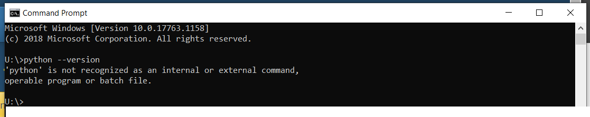
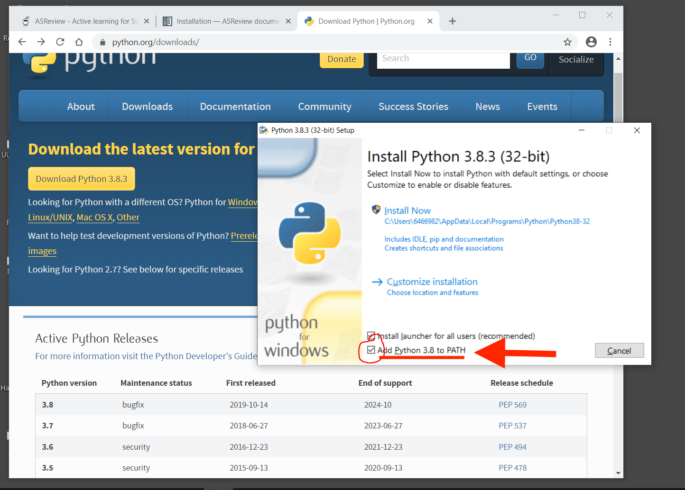
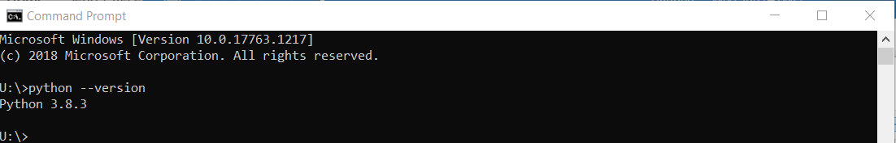
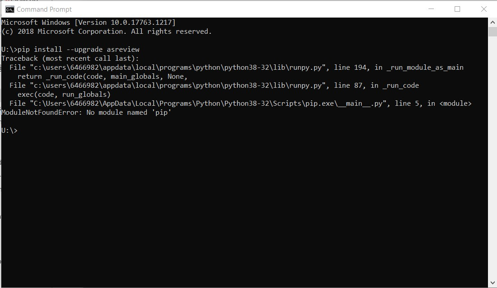

Installation
============

.. contents:: Table of Contents

This is a guide on how to install ASReview. Please start by selecting the correct user manual for your operating system:

- `**Installation for Windows users** <installation.html#install-asreview-for-windows-users>`__
- `**Installation for macOS/unix system users** <installation.html#install-asreview-for-macos-users>`__

**IMPORTANT: If you run into any issues during the installation, please consult `the troubleshooting section <installation.html#troubleshooting>`__ .**

Install ASReview for Windows users
----------------------------------

1. Install Python
~~~~~~~~~~~~~~~~~~~~~~
This section explains how to install Python on your computer. The ASReview software runs with Python in the background. Therefore, running ASReview requires having Python 3.6+ installed. More knowledge about Python is not necessary to run ASReview.

First, check if Python is already installed on your computer. To do this, open the Command Prompt (search for ``CMD.exe``). Within this prompt, execute the following command:

.. code::

    python --version

Now, if the command returns you have a Python version is 3.6 or higher, you can go to the next section.

However, if the command returns something like ``'python' is not recognized as an internal or external command, operable program or batch file.``, you will still have to install Python:

|
|

To install Python, go to https://www.python.org/downloads/ to download the latest Python version for Windows and follow the default installation instructions. **IMPORTANT**: make sure to check the following box to add Python to your PATH environment variable:
After installing Python, make sure to close and reopen your Command prompt (``CMD.exe``), and again, within this prompt, again execute:

.. code::

    python --version

to check if Python (version 3.6 or higher) has been properly installed:

2. Install ASReview
~~~~~~~~~~~~~~~~~~~~~~~~
If your Python version is 3.6 or higher, you can start installing the ASReview
software on your computer. Execute the following in the Command prompt (`CMD.exe`):

.. code::

    pip install asreview

If ASReview was installed succesfully, this command should return a bunch of text of which the last line is something like:

.. code::
    Successfully installed asreview-0.9.6

*Note: if you run into an error at this step, try executing `python -m pip install asreview` instead. If this doesn't fix your problems, please consult `the troubleshooting section <installation.html#troubleshooting>`__.*

3. Launch ASReview
~~~~~~~~~~~~~~~~~~~~~~~
Congratulations! You are now ready to start using ASReview.
Launch ASReview by executing in the Command prompt:
 
.. code::

    asreview oracle

A web browser will open the ASReview user interface. Please follow the steps in our `Quick Tour <quick-tour.html>`__ on how to carry out your first Automated Systematic Review!

--------------------------------------------------------------------------------

Install ASReview for MacOS users
--------------------------------

1. Install Python
~~~~~~~~~~~~~~~~~
This section explains how to install Python on your computer. The ASReview software runs with Python in the background. Therefore, running ASReview requires having Python 3.6+ installed. More knowledge about Python is not necessary to run ASReview.

First, check if Python is already installed on your computer. Open the program
`Terminal` on your computer. Execute the following

.. code::

    python --version

Now, if the command returns something like ``python: command not found``, you will need to install Python. Go to https://www.python.org/downloads/ to download the latest Python version for macOS. You can follow the default installation instructions. **IMPORTANT: make sure to check the box to add Python to your PATH environment variable:**

After installing Python, make sure to close and reopen your Terminal, and again execute:

.. code::

    python --version

to check if Python has been properly installed. If your Python version is 3.6.x or higher, you can proceed to the following section.

2. Install ASReview
~~~~~~~~~~~~~~~~~~~
If your Python version is 3.6+, you can start installing the ASReview
software on your computer. Execute the following in the Terminal:

.. code::

    pip install asreview

If ASReview was installed succesfully, this command should return a bunch of text of which the last line is something like:

    .. code::
        Successfully installed asreview-0.9.6

*Note: if you run into an error at this step, try executing `python -m pip install asreview` instead. If this doesn't fix your problems, please consult `the troubleshooting section <installation.html#troubleshooting>`__.*

3. Launch ASReview
~~~~~~~~~~~~~~~~~~
Congratulations! You are now ready to start using ASReview.
Launch ASReview by executing in the Terminal:

.. code::

    asreview oracle

A web browser will open the ASReview user interface. Please follow the steps in our `Quick Tour <quick-tour.html>`__ on how to carry out your first Automated Systematic Review!

--------------------------------------------------------------------------------

Upgrade ASReview
----------------

You can upgrade to newer versions of the ASReview software with

.. code::

    pip install --upgrade asreview

Server installation
-------------------

Although ASReview should only be used in closed networks, it is possible to
run on a server or custom domain. Use the command line arguments `ip` and
`port` for configuration.

.. code::

    asreview oracle --port 5555 --ip xxx.x.x.xx

Troubleshooting
---------------

The following section describes familiar errors and how to solve them.
If this information does not solve your error, please let us know by filing an issue in our GitHub repository (or, if you do not have a GitHub account, send us an e-mail at asreview@uu.nl)

Unknown command "pip" on command line or terminal
~~~~~~~~~~~~~~~~~~~~~~~~~~~~~~~~~~~~~~~~~~~~~~~~~

If you get one of the following errors:

.. code::

  -bash: pip: No such file or directory

.. code::

  'pip' is not recognized as an internal or external command, operable program or batch file.

Most likely, the environment variables aren't configured correctly. There are
tutorials on the internet to deal with this. However, a simple way to deal
with this is adding `python -m` in front of the command. For example:

.. code::

  python -m pip install asreview

Unknown command "asreview" on command line or terminal
~~~~~~~~~~~~~~~~~~~~~~~~~~~~~~~~~~~~~~~~~~~~~~~~~~~~~~

In some situations, the entry point "asreview" can not be found after installation.
First check whether the package is correctly installed. Do this with the command
`python -m asreview -h`. If this shows a decription of the program, please use
`python -m` in front of all your commands. For example:

.. code-block::

  python -m asreview oracle

No module named 'pip'
~~~~~~~~~~~~~~~~~~~~~
When installing or upgrading ASReview, it can occur that you run into the following warning:

.. code-block::

    WARNING: You are using pip version 19.2.3, however version 20.1.1 is available.
    You should consider upgrading via the 'python -m pip install --upgrade pip' command.

Or even run into error ``No module named 'pip'``:

You can solve this error by executing:

.. code-block::

  python -m ensurepip

Followed by

.. code-block::

  python -m pip install --upgrade pip

Now you should be able to upgrade ASReview by executing:

.. code-block::

    pip install --upgrade asreview

Or if the last command is not succesful, try:

.. code-block::

    python -m pip install --upgrade asreview

instead.

Python3 command
~~~~~~~~~~~~~~~

Some users have to call the `python3` binary instead of just `python`. At the
moment, this will result is a freeze in Step 5 of the review. The model is not
able to train. Solve this by making `python3` the default `python` executable
on your device or make a virtual environment.

.. code::

    python3 -m venv asreview/env
    source ~/asreview/env/bin/activate

Install and run `asreview` in the virtual enviroment.

.. code::

    pip install asreview
    asreview oracle

For more details on creating a virtual environment, please have a look at
https://docs.python.org/3/library/venv.html.
