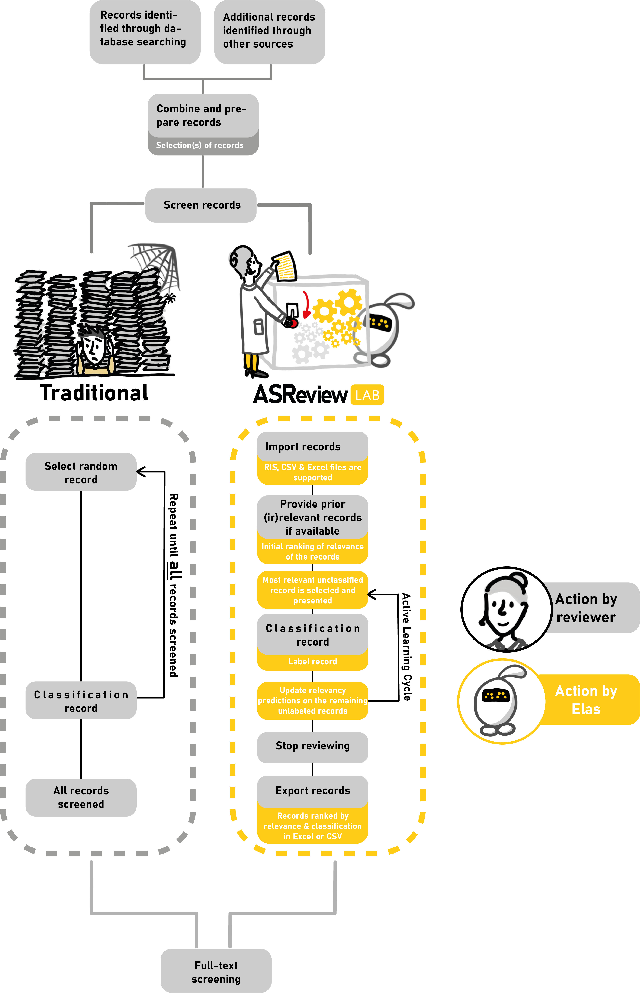

About ASReview
--------------

Anyone who goes through the process of screening large amounts of texts knows
how labor intensive this can be. The future will be an interaction with
machine learning algorithms to deal with the enormous increase of available
text. Therefore, an open source machine learning-aided pipeline applying
active learning was developed at `Utrecht University <https://www.uu.nl>`_, titled
**ASReview**. ASReview aims to help scholars and practitioners to
get an overview of the most relevant records for their work as efficiently as
possible, while being transparent in the process.

Research Team
~~~~~~~~~~~~~

ASReview is a research project coordinated by `Rens van de Schoot
<https://www.rensvandeschoot.com/>`_ (full Professor at the Department of Methodology &
Statistics and ambassador of the focus area Applied Data Science at Utrecht
University, The Netherlands), together with `Jonathan de Bruin
<https://github.com/J535D165>`_, Lead engineer of the ASReview project and
working at the Information and Technology Services department at Utrecht
University.

The advisory board consists of machine learning expert `Daniel Oberski
<http://daob.nl/about-me/>`_, associate professor at Utrecht University’s
Department of Methodology & Statistics, and the department of Biostatistics at
the Julius Center, University Medical Center Utrecht),  full professor `Lars
Tummers <https://larstummers.com/>`_ (Professor of Public Management and
Behavior at Utrecht University), `Ayoub Bagheri <https://www.uu.nl/staff/ABagheri>`_ (NLP-expert at Utrecht University),
`Bianca Kramer <https://www.uu.nl/staff/bmrkramer>`_ (Open Science expert at
the Utrecht University library), `Jan de Boer
<https://www.uu.nl/staff/JdeBoer>`_ (Information specialist at the Utrecht
university library), `Felix Weijdema <https://www.uu.nl/staff/FPWeijdema>`_
(Systematic review specialist at the Utrecht University library), and `Martijn
Huijts <https://www.uu.nl/staff/MTIHuijts>`_ (UX-expert at the department Test
and Quality Services at Utrecht University).

The artwork for the ASReview project is created by `Joukje Willemsen <http://www.statistics-illustrated.com/>`_.

Moreover, many others contribute to the project, like researchers Gerbrich Ferdinands
and Laura Hofstee, as well as many students like Yongchao Terry Ma, Sofie van
den Brand, Sybren Hindriks, and Albert Harkema. See
`ASReview project members <https://github.com/orgs/asreview/people/>`_ for an
overview of the people involved in the project.

ASReview thanks the community for their contributions. A full
list of code contributors can be found on the
`contributors' <https://github.com/asreview/asreview/graphs/contributors>`_ page on Github.

The Case of Systematic Reviewing
~~~~~~~~~~~~~~~~~~~~~~~~~~~~~~~~

ASReview is a generic tool for the screening  of :doc:`any type of
text <datasets>`, but often use the case of systematic reviewing is ued to
illustrate its usefulness, see also the blog post `ASReview Class 101 <https://asreview.nl/blog/asreview-class-101/>`_.

With the emergence of online publishing, the number of scientific papers on
any topic, e.g. COVID19, is skyrocketing. Simultaneously, the public press
and social media also produce data by the second. All this textual data
presents opportunities to scholars, but it also confronts them with new
challenges. To summarize all this data, researchers write systematic reviews,
providing essential, comprehensive overviews of relevant topics.  To achieve
this, they have to screen (tens of) thousands of studies by hand  for
inclusion in their overview. As truly relevant papers are very sparse (i.e.,
often <10%),  this is an extremely imbalanced data problem. The process of
finding these  rare relevant papers is error prone and very time intensive.

The rapidly evolving field of machine learning (ML) has allowed the
development  of ML-aided pipelines that assist in finding relevant texts for
such search tasks.  A well-established approach to increase the efficiency of
title and abstract  screening is determining prioritization with :doc:`active
learning<../guides/activelearning>`,  which is very effective
for :doc:`systematic reviewing<../guides/simulation_study_results>`.

The goal of ASReview is to help scholars and practitioners to get an overview
of the most relevant records for their work as efficiently as possible, while
being transparent in the process. It is uses active learning, allows multiple
ML-models,  and ships with a benchmark mode which is especially useful for
comparing and designing algorithms.  Furthermore, it is intended to be easily
extensible, allowing third parties to add modules  that enhance the pipeline
and can process any text (although we consider systematic reviewing as a very
useful approach).

