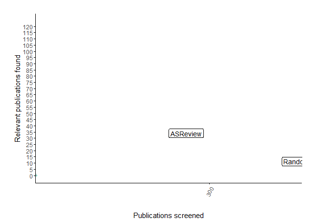

Fully or partially labeled data
===============================

ASReview LAB contains a large amount of benchmark datasets that can
be used in the :doc:`exploration <../lab/exploration>` or :doc:`simulation
<../lab/simulation>` mode. The labelled datasets are PRISMA-based reviews on
various research topics, are available under an open licence and are
automatically harvested from the `dataset repository
<https://github.com/asreview/systematic-review-datasets>`_. See `index.csv
<https://github.com/asreview/systematic-review-datasets/blob/master/index.csv>`_
for all available properties.

Partially labeled data
----------------------

Partially labeled datasets are datasets with a review decision for a subset of
the records in the dataset.

A partly labeled dataset contains labeling decisions for part of the records,
and part of the data does not have labels. The goal is to use the labels as
prior knowledge to screen the unseen records. The labeled records will be
recognized by ASReview LAB and are used to train the first iteration of the
active learning model. This might be helpful if you switch from screening in
another tool to screening with ASReview, or when updating an existing
systematic review with more recent publications. For more options, see `How to collaborate with ASReview? <https://github.com/asreview/asreview/discussions/975>`_ on the ASReview discussion board.

.. note::

  Merging labeled with unlabeled data should be done outside ASReview LAB, for
  example in reference manager software.

For tabular datasets (:ref:`e.g., CSV, XLSX <data-format>`), the dataset should
contain a column, called :ref:`label_included <column-names>` which is
filled with 1's or 0's for the records that are already screened
and is empty for the records that you still need to screen using ASReview.

For the RIS file format, the dataset is handled automatically. The label
(`ASReview_relevant`, `ASReview_irrelevant`, `ASReview_not_seen`) is stored under the
N1 (Notes) tag. If the N1 tag is missing, it will be created for each record
after importing the dataset. An example of a RIS file with N1 tag in the `ASReview
GitHub repository <https://github.com/asreview/asreview/blob/master/tests/demo_data/baseline_tag-notes_labels.ris>`_
where all records are valid. You can also find a record without a
N1 (Notes) tag defined - the tag will be created after importing to
ASReview and populated with a label.

ASReview will recognize the column with the labels and show you the number of
prior relevant/irrelevant records in the section *Prior Knowledge*.

Fully labeled data
------------------

Fully labeled datasets are datasets with a review decision for each record.

Featured Datasets
~~~~~~~~~~~~~~~~~

Some featured datasets are:

-  The *PTSD Trajectories* data by Van de Schoot et al. (`2017 <https://doi.org/10.1080/10705511.2016.1247646>`_, `2018 <https://doi.org/10.1080/00273171.2017.1412293>`_) stems from a review  of longitudinal studies that applied unsupervised machine learning techniques on longitudinal data of self-reported symptoms of posttraumatic stress assessed after trauma exposure. In total, 5,782 studies were obtained by searching Pubmed, Embase, PsychInfo, and Scopus, and through a snowballing strategy in which both the references and the citation of the included papers were screened. Thirty-eight studies were included in the review (0.66%).

-  The *Virus Metagenomics* data by `Kwok et al. (2020) <https://doi.org/10.3390/v12010107>`_ which systematically described studies that performed viral Metagenomic Next-Generation Sequencing (mNGS) in common livestock such as cattle, small ruminants, poultry, and pigs.44 Studies were retrieved from Embase (n = 1,806), Medline (n = 1,384), Cochrane Central (n = 1), Web of Science (n = 977), and Google Scholar (n = 200, the top relevant references). After deduplication this led to 2,481 studies obtained in the initial search, of which 120 inclusions (4.84%).

-  The *Software Fault Prediction* by `Hall et al. (2012) <https://doi.org/10.1109/TSE.2011.103>`_ stems from a systematic review of studies on fault prediction in software engineering. Studies were obtained from ACM Digital Library, IEEExplore and the ISI Web of Science. Additionally, a snowballing strategy and a manual search were conducted, accumulating to 8,911 publications of which 104 were included in the systematic review (1.2%).

-  The *ACEinhibitors* by `Cohen et al. (2006) <https://doi.org/10.1197/jamia.M1929>`_ data stems from a systematic review on the efficacy of Angiotensin-converting enzyme (ACE) inhibitors. The data is a subset of 2,544 publications from the TREC 2004 Genomics Track document corpus48. This is a static subset from all MEDLINE records from 1994 through 2003, which allows for replicability of results. Forty-one publications were included in the review (1.6%).

Results
~~~~~~~

For the featured datasets, the animated plots below show how fast you can find
the relevant papers by using ASReview LAB compared to random screening papers
one by one. These animated plots are all based on a single run per dataset
in which only one paper was added as relevant and one as irrelevant.

*PTSD Trajectories*:

38 inclusions out of 5,782 papers

.. figure:: ../../images/gifs/ptsd_recall_slow_1trial_fancy.gif
   :alt: Recall curve for the ptsd dataset

*Virus Metagenomics*:

120 inclusions out of 2,481 papers

*Software Fault Prediction*:

104 inclusions out of 8,911 papers

.. figure:: ../../images/gifs/software_recall_slow_1trial_fancy.gif
   :alt: Recall curve for the software dataset

*ACEinhibitors*:

41 inclusions out of 2,544 papers

.. figure:: ../../images/gifs/ace_recall_slow_1trial_fancy.gif
   :alt: Recall curve for the ACE dataset
