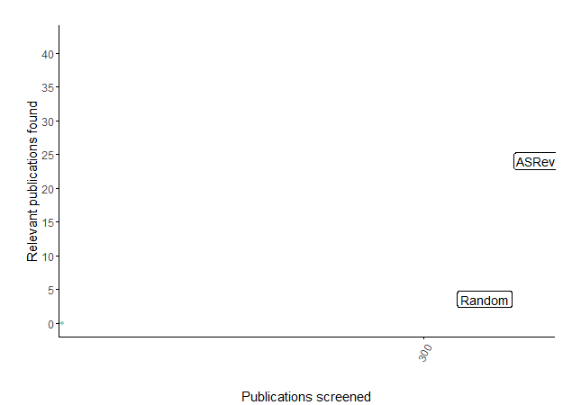
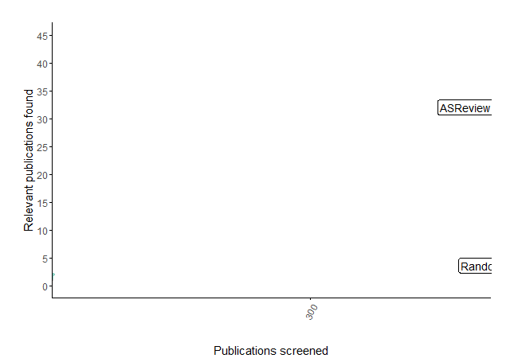

Prepare your Data
=================

To perform an systematic review, ASReview requires a dataset representing
all records (e.g., abstracts of scientific papers) obtained in a systematic
search. To create such a dataset for a systematic review, typically an `online
library search <https://asreview.nl/the-importance-of-abstracts/>`__ is
performed for all studies related to a particular topic.

It is possible to use your own dataset with unlabeled, partly labeled (where
the labeled records are used for training a model for the unlabeled records),
or fully labeled records (used for the Simulation mode). For testing and
demonstrating ASReview (used for the Exploration mode), the software offers
`Benchmark Datasets`_. Also, a plugin with :doc:`Corona related
publications <../plugins/covid19>` is available.

.. warning::

    If you upload your own data, make sure to remove duplicates and to
    retrieve  as many abstracts as possible (`don't know how?
    <https://asreview.nl/the-importance-of-abstracts/>`_). With clean data you
    benefit most from what :doc:`active learning <../guides/activelearning>`
    has to offer.

Data Format
-----------

To carry out a systematic review with ASReview on your own dataset, your data
file needs to adhere to a certain format. ASReview accepts the following
formats:

 - **RIS-files** `(wikipedia) <https://en.wikipedia.org/wiki/RIS_(file_format)>`__ with
   extension ``.ris`` or ``.txt``. RIS files are used by digital libraries, like
   IEEE Xplore, Scopus and ScienceDirect. Citation managers Mendeley, RefWorks,
   Zotero, and EndNote support the RIS format as well.

 - **Tabular datasets** with extensions ``.csv``, ``.xlsx``, or ``.xls``. CSV files should
   be comma separated and UTF-8 encoded.

For tabular data files, the software accepts a set of predetermined column names:

.. table:: Table with column name definitions
    :widths: 20 60 20

    +-------------+---------------------------------------------------------------------------------------------------------+-----------+
    | Name        | Column names                                                                                            | Mandatory |
    +=============+=========================================================================================================+===========+
    | ID          | record_id                                                                                               | no        |
    +-------------+---------------------------------------------------------------------------------------------------------+-----------+
    | Title       | title, primary_title                                                                                    | yes\*     |
    +-------------+---------------------------------------------------------------------------------------------------------+-----------+
    | Abstract    | abstract, abstract note                                                                                 | yes\*     |
    +-------------+---------------------------------------------------------------------------------------------------------+-----------+
    | Keywords    | keywords                                                                                                | no        |
    +-------------+---------------------------------------------------------------------------------------------------------+-----------+
    | Authors     | authors, author names, first_authors                                                                    | no        |
    +-------------+---------------------------------------------------------------------------------------------------------+-----------+
    | DOI         | doi                                                                                                     | no        |
    +-------------+---------------------------------------------------------------------------------------------------------+-----------+
    | Included    | final_included, label, label_included, included_label, included_final, included, included_flag, include | no        |
    +-------------+---------------------------------------------------------------------------------------------------------+-----------+
    | debug_label | debug_label                                                                                             | no        |
    +-------------+---------------------------------------------------------------------------------------------------------+-----------+

\* Only a title or an abstract is mandatory.

**ID**
If your data contains a column titled ``record_id`` it needs to
consists only of integers, and it should contain no missing data and no
duplicates, otherwise you will receive an error. If there is no ``record_id``
it will be automtically generated by the software. This column can also be
used for the Simulation Mode to select prior knowledge.

**Title, Abstract** Each record (i.e., entry in the dataset) should hold
metadata on a paper. Mandatory metadata are only ``title`` or ``abstract``. If
both title and abstract are available, the text is combined and used for
training the model. If the column ``title`` is empty, the software will search
for the next column ``primary_title`` and the same holds for ``bastract`` and
``abstract_note``.

**Keywords, Authors** If ``keywords`` and/or ``author`` (or if the colum is
empty: ``author names`` or ``first_authors``) are available it can be used for
searching prior knowledge. Note the information is not shown during the
screening phase and is also not used for training the model, but the
information is available via the API.

**DOI**
If a Digital Object Identifier ( ``DOI``) is available it will be displayed during the
screening phase as a clickable hyperlink to the full text document. Note by
using ASReview you do *not* automatically have access to full-text and if you do
not have access you might want to read this `blog post
<https://asreview.nl/tools-that-work-well-with-asreview-google-scholar-button/>`__.

**Included** A binary variable indicating the existing labeling decisions with
``0`` = irrelevant/excluded, and ``1`` = relevant/included. Different column
names are allowed, see the table. The use is twofold:

- **Screening**: In ASReview LAB, if labels are available for a part of the
  dataset (see :doc:`partly labeled data <../features/pre_screening>`), the
  labels will be automatically detected and used for prior knowledge. The first
  iteration of the model will then be based on these decisions and used to
  predict relevance scores for the unlabeled part of the data.
- **Simulation**: In the :doc:`ASReview command line interface for simulations<../API/cli/>`,
  the column containing the labels is used to simulate a systematic review run.
  Only records containing labels are used for the simulation, unlabeled records are ignored.

.. note::

  Files exported with ASReview LAB contain the column ``included`` and can be used for
  prior knowledge.

**debug_label**
You can explore a existing fully labeled dataset in the Exploraton
Mode. A column called named ``debug_label`` is required, indicating the relevant
and irrelevant records with ones and zeroes. The relevant records will be displayed in
green during screening. This option is useful for training purposes,
presentations, and workshops.

Compatibility
-------------

Citation Managers
~~~~~~~~~~~~~~~~~

The following table provides an overview of export files from citation
managers  which are accepted by ASReview.

+-----------------+---------------+----------------+--------------+--------------+
|                 | **.ris**      | **.tsv**       | **.csv**     | **.xlsx**    |
+-----------------+---------------+----------------+--------------+--------------+
| **Endnote**     | Supported     | Not supported  |              |              |
+-----------------+---------------+----------------+--------------+--------------+
| **Excel**       |               |                | Supported\*  |  Supported   |
|                 |               |                |              |              |
+-----------------+---------------+----------------+--------------+--------------+
| **Mendeley**    | Supported     |                |              |              |
|                 |               |                |              |              |
+-----------------+---------------+----------------+--------------+--------------+
| **Refworks**    | Supported     | Not supported  |              |              |
|                 |               |                |              |              |
+-----------------+---------------+----------------+--------------+--------------+
| **Zotero**      | Supported     |                | Supported    |              |
|                 |               |                |              |              |
+-----------------+---------------+----------------+--------------+--------------+

- Supported: The data can be exported from the citation manager and imported in ASReview using this extension.
- Not supported: The exported format can not be imported in ASReview.
- (empty): The data cannot be exported from the citation manager in this format.

\* Only comma seperated files are supported. Semicolon seperated files are not supported.

Search Engines
~~~~~~~~~~~~~~

When using search engines, it is often possible to store the articles of
interest in a list or folder within the search engine itself. Thereafter, you
can choose from different ways to export the list/folder. When you have the
option to select parts of the citation to be exported, choose the option which
will provide the most information.

The export files of the following search engines have been tested for their
acceptance in ASReview:

+-----------------+---------------+----------------+---------------+---------------+
|                 | **.ris**      | **.tsv**       | **.csv**      | **.xlsx**     |
|                 |               |                |               |               |
+-----------------+---------------+----------------+---------------+---------------+
|**CINHAL**       | Not supported |                |Not supported  |               |
|**(EBSCO)**      |               |                |               |               |
+-----------------+---------------+----------------+---------------+---------------+
|**Cochrane**     | Supported     |                | Supported     |               |
+-----------------+---------------+----------------+---------------+---------------+
| **Embase**      | Supported     |                | Supported     | Supported     |
+-----------------+---------------+----------------+---------------+---------------+
|**Eric (Ovid)**  | Not supported |                |               |Not supported  |
+-----------------+---------------+----------------+---------------+---------------+
|**Psychinfo**    | Not supported |                |               |Not supported  |
|**(Ovid)**       |               |                |               |               |
+-----------------+---------------+----------------+---------------+---------------+
| **Pubmed**      | Not supported |                |Not supported  |               |
+-----------------+---------------+----------------+---------------+---------------+
| **Scopus**      | Supported     |                |Supported      |               |
+-----------------+---------------+----------------+---------------+---------------+
|**Web of**       | Not supported |Not supported   |               |               |
|**Science**      |               |                |               |               |
+-----------------+---------------+----------------+---------------+---------------+

- Supported: The data can be exported from the search engine and imported in ASReview using this extension.
- Not supported: The exported data can not be imported in ASReview using this extension.
- (empty): The data cannot be exported from the search engine using this extension.

If the export of your search engine is not accepted in ASReview, you can also
try the following: import the search engine file first into one of the
citation managers mentioned in the previous part, and export it again into a
format that is accepted by ASReview.

Systematic Review Software
~~~~~~~~~~~~~~~~~~~~~~~~~~

There are several software packages available for systematic reviewing. Some
of them use machine learning, while other focus on screening and management.
The overview below shows an overview of alternative software programs and the
compatibility with ASReview.

+-----------------+---------------+----------------+--------------+--------------+
|                 | **.ris**      | **.tsv**       | **.csv**     | **.xlsx**    |
|                 |               |                |              |              |
+-----------------+---------------+----------------+--------------+--------------+
| **Abstrackr**   | Supported     |                | Supported    |              |
+-----------------+---------------+----------------+--------------+--------------+
| **Covidence**\* | Supported     |                | Supported    |              |
+-----------------+---------------+----------------+--------------+--------------+
| **Distiller**   |Not supported  |                | Supported\** | Supported\** |
+-----------------+---------------+----------------+--------------+--------------+
|**EPPI-reviewer**| Supported     |                |              |Not supported |
+-----------------+---------------+----------------+--------------+--------------+
| **Rayyan**      | Supported     |                | Supported    |              |
+-----------------+---------------+----------------+--------------+--------------+
|**Robotreviewer**|               |                |              |              |
|\***		  |    		  |                |              |              |
+-----------------+---------------+----------------+--------------+--------------+

- Supported: The data can be exported from the software and imported in ASReview using this extension.
- Not supported: The exported data can not be imported in ASReview using this extension.
- (empty): The data cannot be exported from the software using this extension.

\* When using Covidence it is possible to export articles in .ris formats for different citation managers,
such as Endnote, Mendeley, Refworks and Zotero. All of these are compatible with ASReview.

\** When exporting from Distiller set the ``sort references by`` to ``Authors``. Then the data can be
imported in ASReview.

\*** Robotreviewer does not provide exports suitable for asreview, since it supports evidence synthesis.

.. _benchmark-datasets:

Benchmark Datasets
------------------

The ASReview software contains a large amount of benchmark datasets that can
be used in the :doc:`exploration <../lab/exploration>` or :doc:`simulation
<../lab/simulation>` mode. The labelled datasets are PRISMA-based reviews on
various research topics, are available under an open licence and are
automatically harvested from the `dataset reposisotory
<https://github.com/asreview/systematic-review-datasets>`_. See `index.csv
<https://github.com/asreview/systematic-review-datasets/blob/master/index.csv>`_
for all available properties.

Featured Datasets
~~~~~~~~~~~~~~~~~

Some featured datasets are:

-  The *PTSD Trajectories* data by Van de Schoot et al. (`2017 <https://doi.org/10.1080/10705511.2016.1247646>`_, `2018 <https://doi.org/10.1080/00273171.2017.1412293>`_) stems from a review  of longitudinal studies that applied unsupervised machine learning techniques on longitudinal data of self-reported symptoms of posttraumatic stress assessed after trauma exposure. In total, 5,782 studies were obtained by searching Pubmed, Embase, PsychInfo, and Scopus, and through a snowballing strategy in which both the references and the citation of the included papers were screened. Thirty-eight studies were included in the review (0.66%).

-  The *Virus Metagenomics* data by `Kwok et al. (2020) <https://doi.org/10.3390/v12010107>`_ which systematically described studies that performed viral Metagenomic Next-Generation Sequencing (mNGS) in common livestock such as cattle, small ruminants, poultry, and pigs.44 Studies were retrieved from Embase (n = 1,806), Medline (n = 1,384), Cochrane Central (n = 1), Web of Science (n = 977), and Google Scholar (n = 200, the top relevant references). After deduplication this led to 2,481 studies obtained in the initial search, of which 120 inclusions (4.84%).

-  The *Software Fault Prediction* by `Hall et al. (2012) <https://doi.org/10.1109/TSE.2011.103>`_ stems from a systematic review of studies on fault prediction in software engineering. Studies were obtained from ACM Digital Library, IEEExplore and the ISI Web of Science. Additionally, a snowballing strategy and a manual search were conducted, accumulating to 8,911 publications of which 104 were included in the systematic review (1.2%).

-  The *ACEinhibitors* by `Cohen et al. (2006) <https://doi.org/10.1197/jamia.M1929>`_ data stems from a systematic review on the efficacy of Angiotensin-converting enzyme (ACE) inhibitors. The data is a subset of 2,544 publications from the TREC 2004 Genomics Track document corpus48. This is a static subset from all MEDLINE records from 1994 through 2003, which allows for replicability of results. Forty-one publications were included in the review (1.6%).

Results
~~~~~~~

For the featured datasets, the animated plots below show how fast you can find
the relevant papers by using ASReview LAB compared to random screening papers
one by one. These animated plots are all based on a single run per dataset
in which only one paper was added as relevant and one as irrelevant.

*PTSD Trajectories*:

38 inclusions out of 5,782 papers

*Virus Metagenomics*:

120 inclusions out of 2,481 papers
../../images/gifs/virusM_recall_slow_1trial_fancy.gif
   :alt: Recall curve for the Virus Metagenomics dataset

*Software Fault Prediction*:

104 inclusions out of 8,911 papers

.. figure:: ../../images/gifs/software_recall_slow_1trial_fancy.gif
   :alt: Recall curve for the software dataset

*ACEinhibitors*:

41 inclusions out of 2,544 papers

