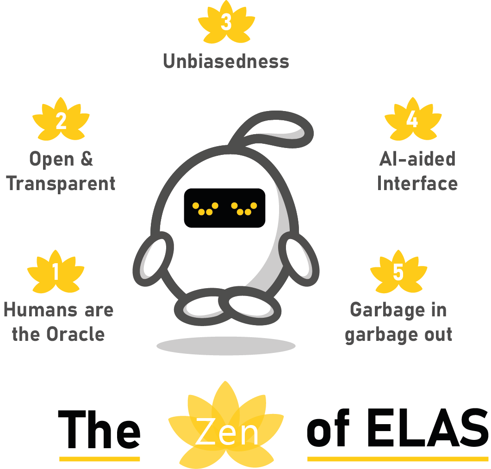

The Zen of Elas
---------------

Elas is the mascotte of ASReview and your `Electronic Learning Assistant
<https://asreview.nl/the-story-behind-elas/>`_ who will guide you through the
interactive process  of making decisions using Artificial Intelligence in
ASReview. Elas comes with some important principles:

**Humans are the Oracle**
It’s the interaction between humans and machines
which will take science a major leap forward. We believe a human should make
the final decision about whether to mark a record as relevant/irrelevant
(hence, is the Oracle), and the software merely orders the records on the
relevance score as predicted by the model in each iteration of the active
learning cycle.

**Open & Transparent**
We are strong proponents of `open science <https://asreview.nl/open-science/>`_,
and therefore ASReview code is free and openly available. We value your privacy
and hence do not get to see any of your data
(everything stays on your device). We do hope you believe like us in the
`FAIR data principles <https://www.go-fair.org/fair-principles/>`_ and publish your data,
results, and project file on a data repository.

**Unbiasedness**
We signed the `DORA-declaration <https://sfdora.org/>`_, and we
only present text for unbiased decision making. So, when screening for
example academic papers we only show titles and abstracts, and we do not
present authors, or journal names. This way, you can focus on what is truly
important (the content) and don’t get tempted to use irrelevant information.

**AI-aided Interface** Simplicity is the ultimate sophistication (Davinci)
and, therefore, we keep the front-end as clean as possible. Boring, but
efficient because the :doc:`magic <../guides/activelearning>` happens under
the hood.

**Garbage in garbage out**
We focus on the machine learning part of the pipeline and not on the preprocessing or
postprocessing of the data (which reference managers are designed for). Be
aware of the principle GIGO and `check the quality of your data first <https://asreview.nl/the-importance-of-abstracts/>`_. Don’t blame Elas if the performance is not as good as expected due to low quality input data.

