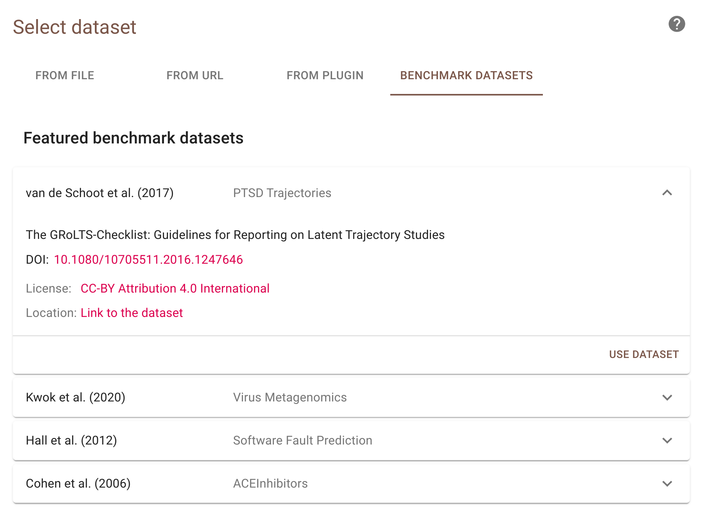

Exploration Mode
================

The exploration mode can be used to explore to performance of the active
learning software and the performance of :ref:`different algorithms
<feature-extraction-table>` on already labeled data. In this mode relevant
records are displayed in green and a recall curve can be obtained.

It is assumed you have already installed Python and ASReview. If this
is not the case, see :doc:`../intro/installation`. Also, you should
have created a :doc:`project<launch>` - the name is not
relevant, but is advised to have a explore-prefix.

Upload a Benchmark Dataset
--------------------------

Select one of the available :ref:`benchmark-datasets <benchmark-datasets>`.

Prior Inclusions
~~~~~~~~~~~~~~~~

In the next step, you are asked to add prior inclusions. Select 1-5 papers of
your choice. For the featured datasets you can use the following titles of
papers:

*PTSD Trajectories*:

- Latent trajectories of trauma symptoms and resilience: the 3-year longitudinal prospective USPER study of Danish veterans deployed in Afghanistan
- A Latent Growth Mixture Modeling Approach to PTSD Symptoms in Rape Victims
- Peace and War: Trajectories of Posttraumatic Stress Disorder Symptoms Before, During, and After Military Deployment in Afghanistan
- The relationship between course of PTSD symptoms in deployed U.S. Marines and degree of combat exposure
- Trajectories of trauma symptoms and resilience in deployed US military service members: Prospective cohort study

*Virus Metagenomics*:

- Detection of viromes of RNA viruses using the next generation sequencing libraries prepared by three methods.
- Identification of a novel astrovirus in domestic sheep in Hungary.
- Identification of novel bovine group A rotavirus G15P[14] strain from epizootic diarrhea of adult cows by de novo sequencing using a next-generation sequencer.
- Detection of novel viruses in porcine fecal samples from China.
- Metagenomic Analysis of the Jinding Duck Fecal Virome.

*Software Fault Prediction*:

- Predicting Defect-Prone Software Modules at Different Logical Levels
- Quantitative analysis of faults and failures in a complex software system
- A Comprehensive Empirical Study of Count Models for Software Fault Prediction
- Predicting fault prone modules by the Dempster-Shafer belief networks
- Robust prediction of fault-proneness by random forests

*ACEinhibitors*:

- Quinapril in patients with congestive heart failure: controlled trial versus captopril.
- Clinical effects of early angiotensin-converting enzyme inhibitor treatment for acute myocardial infarction are similar in the presence and absence of aspirin: systematic overview of individual data from 96,712 randomized patients. Angiotensin-converting Enzyme Inhibitor Myocardial Infarction Collaborative Group.
- Efficacy of different drug classes used to initiate antihypertensive treatment in black subjects: results of a randomized trial in Johannesburg, South Africa.
- Long-term mortality in patients with myocardial infarction: impact of early treatment with captopril for 4 weeks.
- Comparison of perindopril versus captopril for treatment of acute myocardial infarction.

Prior Exclusions
~~~~~~~~~~~~~~~~

Mark five random papers as irrelevant.

START reviewing
~~~~~~~~~~~~~~~

Start reviewing the first 50, 100 or even 200 papers. Abstracts in green are
relevenant papers and abstracts in black are irrelevant.

- For the *PTSD Trajectories* dataset you expect to find about 7 out of 38 relevant papers after screening 50 papers, 19 after screening 100 papers and 36 after 200 papers.
- For the *Virus Metagenomics* dataset you expect to find 20 out of 120 relevant papers after screening 50 papers, 40 after screening 100 papers and 70 after 200 papers
- For the *Software Fault Prediction* dataset you expect to find 25 out of 104 relevant papers after screening 50 papers, 48 after screening 100 papers and 88 after 200 papers.
- For the *ACEinhibitors* dataset you expect to find 16 out of 41 relevant papers after screening 50 papers, 27 after screening 100 papers and 32 after 200 papers.

Upload Your own Data for Exploration
------------------------------------

You can explore a previously labeled dataset in ASReview LAB by adding an
extra column called ‘debug_label’ to your dataset. This column should indicate
the relevant (1) and irrelevant (0) records. The relevant records will show up
green during screening.

1. Open ASReview LAB.
2. Start a new project.
3. Click the *Start Setup* button.
4. Select your labeled dataset containing the ‘debug_label’.
