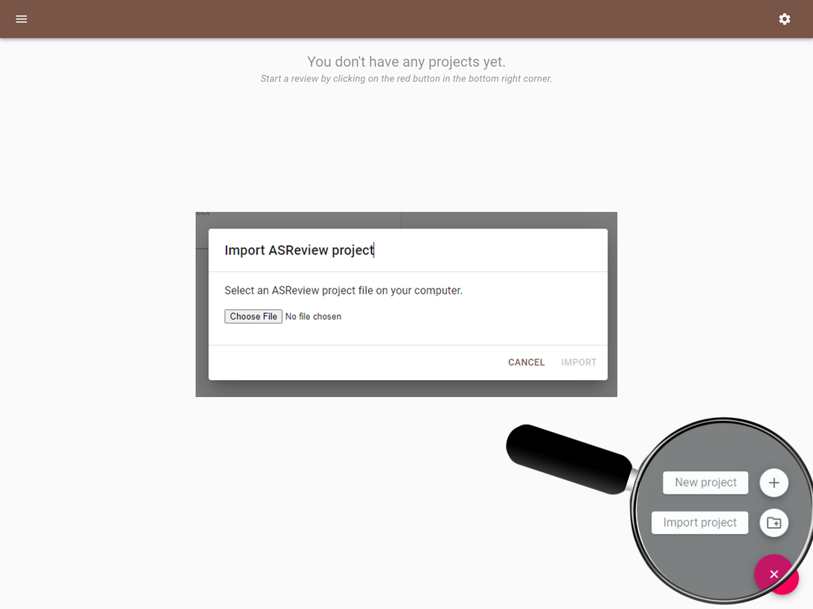

Start, Open and Import a Project
================================

This is a quick tour in launching ASReview and starting, opening and importing
a project.

[ADD SCREENSHOT OF PROJECT PAGE WITH PANELS]

Launching ASReview Lab
----------------------

This tutorial assumes you have already installed Python and ASReview. If this
is not the case, see the :doc:`../intro/installation` documentation.

Launch ASReview LAB by running the following command in the command line
(`CMD.exe` for Windows or `Terminal` for MacOS/Linux):

.. figure:: ../../images/v0.14_00_cmd.png
   :alt: cmd

Create a New Project
--------------------

To start with ASReview, first a project needs to be initialized. Click on the
red button in the bottom right corner, select **new** and a pop-screen will appear.

.. figure:: ../../images/v0.14_01_empty_project_screen_new_project.png
   :alt: Empty project page

Provide Project Info
--------------------

Next, provide a project name (obligatory), your name and a short description
on your systematic review project.

.. figure:: ../../images/v0.14_02_empty_project_screen_pop-up.png
   :alt: Create a new project

Open a Project
--------------

If you want to continue with an existing project, simply click on the title.

.. figure:: ../../images/v0.14_04_overview_projects.png
   :alt: Project overview

Import a Project
----------------

You can also import an ``.asreview`` project file which was :ref:`exported
<export-project>`. Importing can be done by clicking the red button in the
bottom right corner of the home page. In the pop-up screen choose the project
file from your computer and click `Import`. After a successful project
initialization, a project dashboard will be shown.

Project Dashboard
-----------------

After a successful project initialization, a project dashboard will be shown
and you are ready to continue with setting-up the project, like uploading data
for the :doc:`Oracle <oracle>` or the :doc:`Exploration <exploration>` mode.
The other options in the project dashboard are desribed in the :doc:`features
<../features/post_screening>`-overview

.. figure:: ../../images/v0.14_03_project_dashboard_empty.png
   :alt: Project dashboard in setup stage
