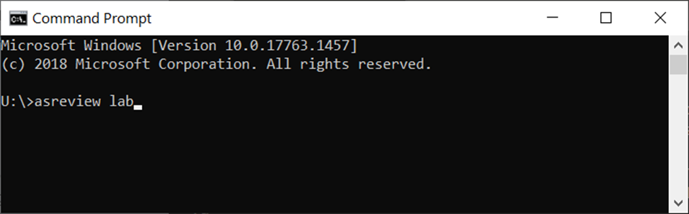
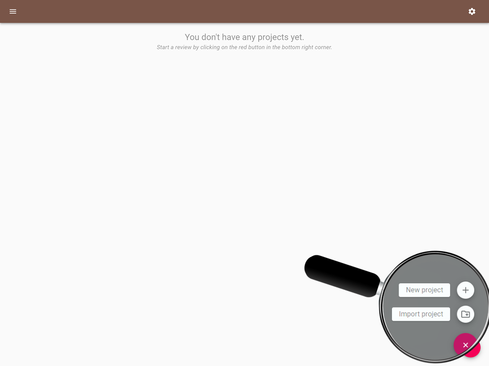
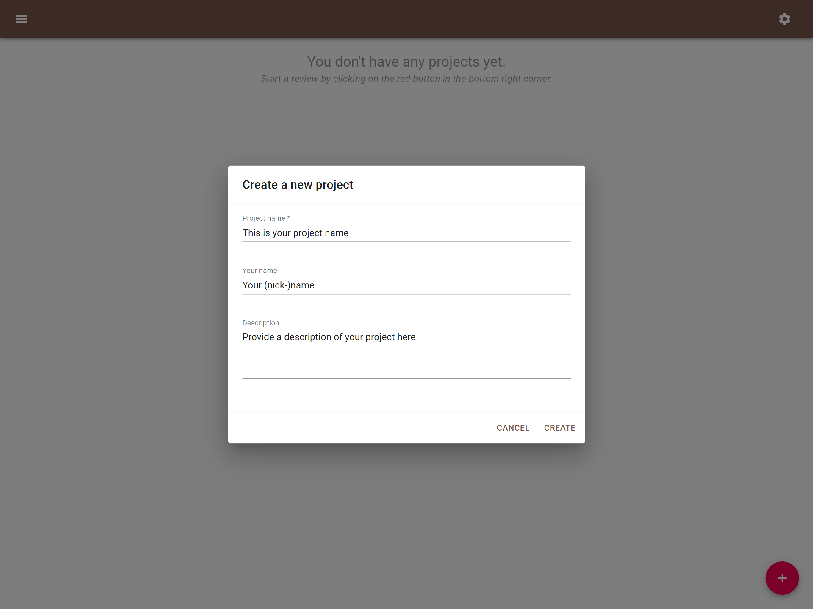
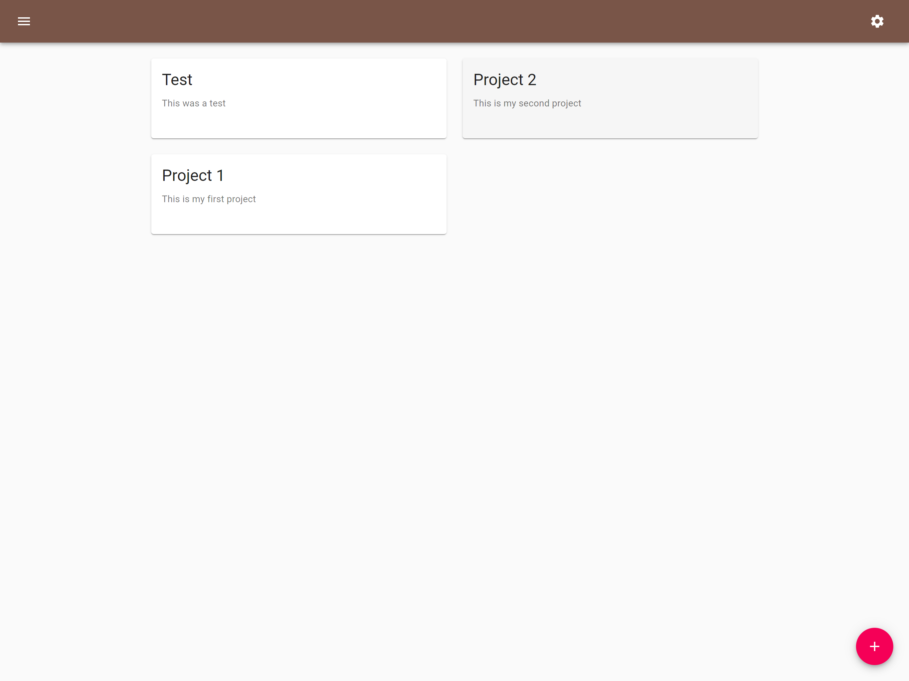
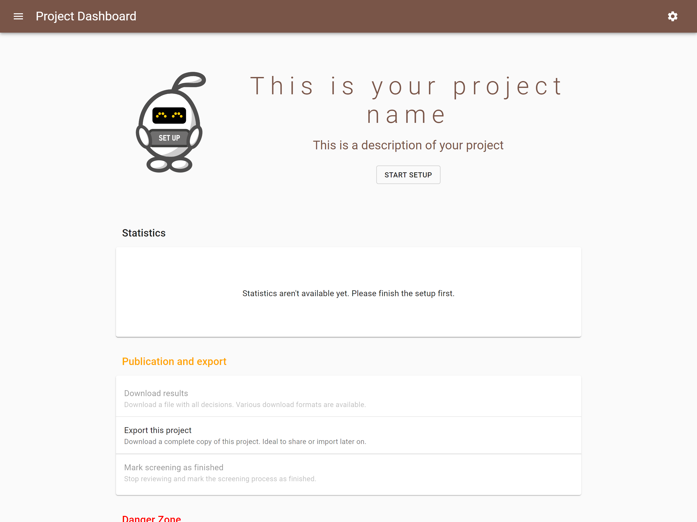

Start, Open and Import a Project
================================

This is a quick tour on launching ASReview and basic project routines like
starting, opening and importing a project. It assumes you have ASReview
installed. If this is not the case, see the :doc:`../intro/installation`
guide.

Launch ASReview Lab
-------------------

Launch ASReview LAB by running the following command in the command line
(`CMD.exe` for Windows or `Terminal` for MacOS/Linux):

Create a New Project
--------------------

To start reviewing a dataset with ASReview LAB, you first need project to
initialize a project. Click on the red button in the bottom right corner,
select **new** and a pop-screen will appear.

Provide Project Info
--------------------

Next, provide a project name (obligatory), your name and a short description
on your systematic review project.

Open a Project
--------------

If you want to continue with an existing project, simply click on the title.

Import a Project
----------------

Another option is to import an ASReview project file (``.asreview``
extension). Usually, this is a project exported from ASReview LAB via the
:ref:`export-project` panel. Importing can be done by
clicking the red button in the bottom right corner of the home page. In the
pop-up screen choose the project file from your computer and click `Import`.
After a successful project initialization, a project dashboard will be shown.

Project Dashboard
-----------------

After a successful project initialization, a project dashboard will be shown
and you are ready to continue with setting-up the project, like uploading data
for the :doc:`oracle` or the :doc:`exploration`. The other options in the
project dashboard are described in the :doc:`features section
<../features/post_screening>`.

