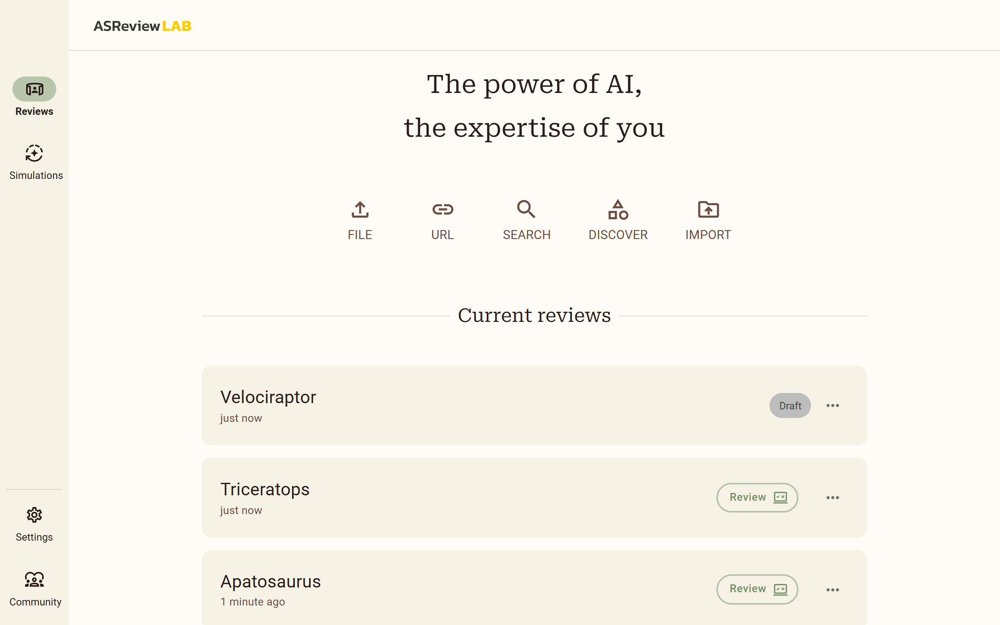

Manage projects
===============

ASReview LAB allows you to manage your projects. You can create, open, and
delete projects. You can also import and export projects. This is useful for
sharing results, archiving projects, and for backup purposes. The projects
dashboard shows all your projects. You can open a project by clicking on the
project name.

   On the Reviews or Simulations page, you can see all your projects. You can
   open a project dashboard by clicking on the project name. You can also start
   screening directly by clicking on the *Review* button. The three dots on the
   right allow you to export or delete the project.

Import Project
--------------

To import a project:

1. :doc:`start`.
2. Go to *Reviews* (http://localhost:5000/reviews) or *Simulations* (http://localhost:5000/simulations)
3. Click on the *Import* icon on the right.
4. Drag and drop your project file or select a file. The project should be
   an ASReview project file (extension ``.asreview``).
5. Open the project from the *Reviews* or *Simulations* page.

Export Project
--------------

The ASReview project file (extension ``.asreview``) can be exported from
ASReview LAB. The file contains the dataset, review history, notes, and model
configuration. It can be imported into ASReview LAB on a different device,
which allows other users to replicate the project, or continue the systematic
review.

To export your project:

1. :doc:`start`.
2. Go to *Reviews* (http://localhost:5000/reviews) or *Simulations* (http://localhost:5000/simulations)
3. Click the three dots on the right of the project you want to export.
4. Click on *Export Project*

.. tip::

   Use this options also for backup purposes. The ASReview project file
   contains all your data, including the dataset, review history, notes, and
   model configuration. You can use this file to restore your project in
   case of data loss or corruption.

Delete Project
--------------

To permanently delete a project, including ALL files:

1. :doc:`start`.
2. Go to *Reviews* (http://localhost:5000/reviews) or *Simulations* (http://localhost:5000/simulations)
3. Click the three dots on the right of the project you want to export.
4. Click on *Export Project*
5. Type the project name in the confirmation box.
6. Click on *Delete forever*.
