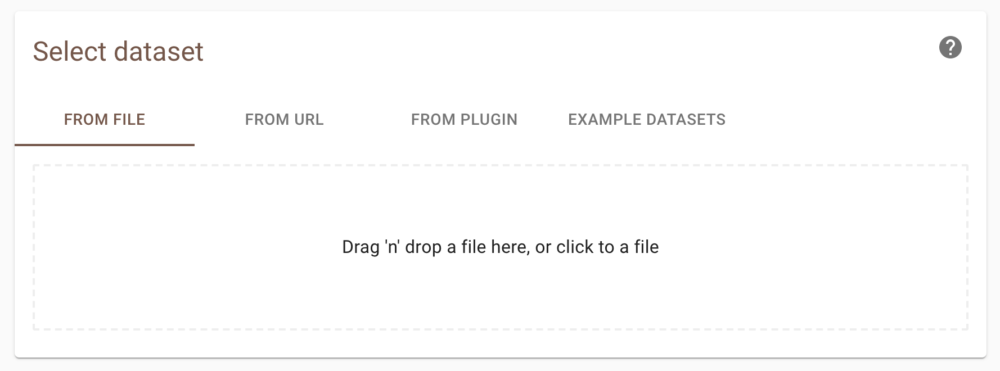
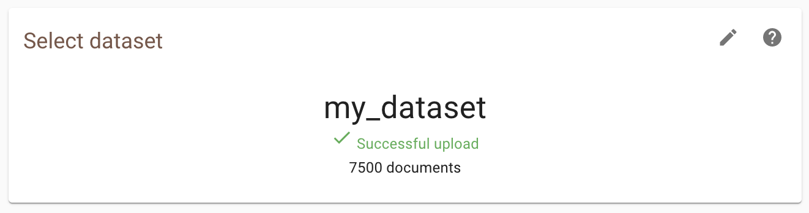
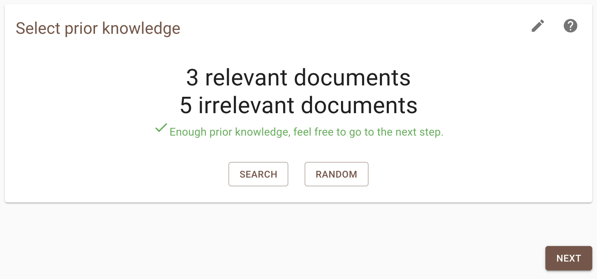
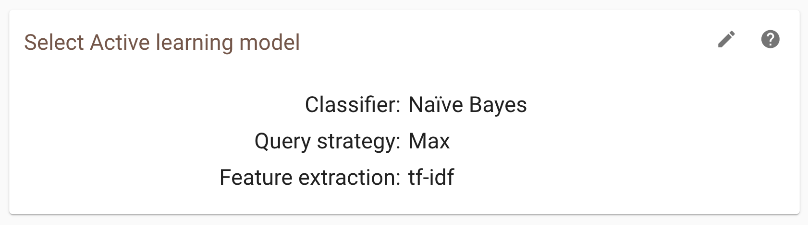
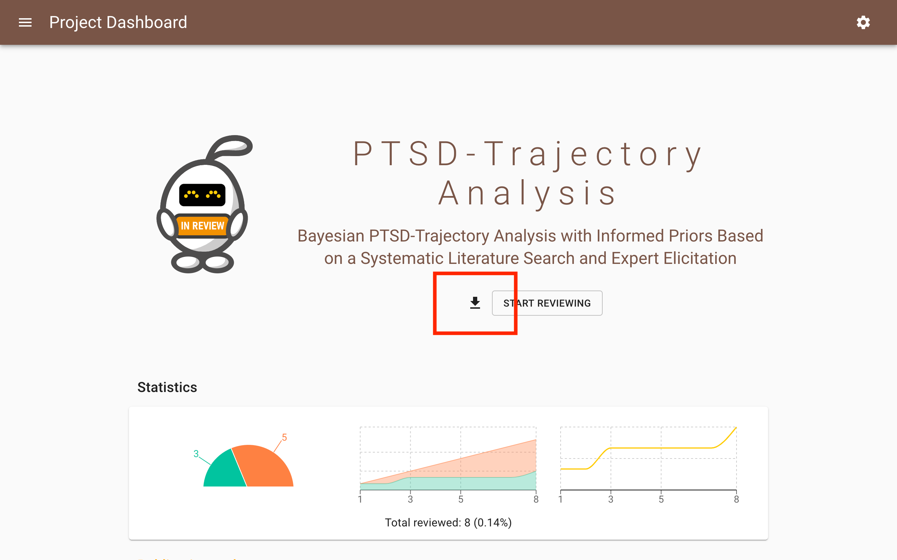

Oracle Mode
===========

This is a quick tour in using the ASReview LAB software in Oracle Mode, which
is the user-friendly frontend for active learning in systematic reviews for
unlabeled data with interaction by the user. A more elaborate instruction can
be found in this `blogpost <https://asreview.nl/blog/asreview-class-101/>`_ on the
ASReview website.

This tutorial assumes you have already installed Python and ASReview. If this
is not the case, check out the :doc:`../intro/installation` page.
Also, you should have created a :doc:`project<launch>`.

Select Dataset
--------------

Select the dataset you want to use, which should contain at least the
titles and/or abstracts of all documents (records) you want to screen.

There are four ways to select a dataset:

- Upload your own dataset. Read more about the format on :doc:`../intro/datasets`.
- Import a dataset with an URL. Read more about the format on :doc:`../intro/datasets`.
- Select a dataset from an :doc:`extension <../extensions/overview_extensions>` (for example to use the :doc:`COVID-19 extension <../extensions/extension_covid19>`).
- Choose one of the :doc:`benchmark data sets <exploration>`.

After a successfull upload of the data, move to the next step.

.. warning::

    If you upload your own data, make sure to remove duplicates and to retrieve
    as many abstracts as possible (`don't know how?
    <https://asreview.nl/blog/the-importance-of-abstracts/>`_). With clean data you
    benefit most from what :doc:`active learning <../guides/activelearning>`
    has to offer.

Select Prior Knowledge
----------------------

The first iteration of the :doc:`active learning cycle
<../guides/activelearning>` requires some prior knowledge to work. This
knowledge is used to train the first model. In this step you need to provide
at least one relevant and one irrelevant document. To facilitate this, it is
possible to :ref:`search for specific records <features/pre_screening:Search>` within
your dataset (for finding prior relevant papers), ask the software to present
a couple of :ref:`random documents <features/pre_screening:Random>` (for prior
irrelevant papers), or to upload :ref:`partly labeled data
<partly-labeled-data>`. When searching for specific records be sure to be precise
with the search terms (use the full title of an article for example),
as only the first 10 results are shown to you.

Select Active Learning Model
----------------------------

In the next step of the setup, you can :ref:`select a model <select-model>`.
The default setup (Naïve Bayes, tf-idf, Max) overall has fast and
:doc:`excellent performance <../guides/simulation_study_results>`, but many
more options are :ref:`davaialble <feature-extraction-table>` . After choosing
your model, click on `Finish`. You will return to the project page and the
model is trained for the first time.

Start Reviewing
---------------

As soon as the model is ready, a button appears with **Start Review**. Click
the button to start screening. ASReview LAB presents you a document to screen
and label. If you have selected certainty-based sampling it will be the
document with the highest relevance score.

You are asked to make a decision: relevant or irrelevant?

.. figure:: ../../images/asreview_screening_asreview_label.png
   :alt: ASReview Screening

While you review the documents, the software continuously improves its
understanding of your decisions, constantly updating the underlying model.

As you keep reviewing documents and providing more labels, the number of
unlabeled documents left in the dataset will decline. When to stop is left to
the user. The `blogpost *ASReview Class 101* <https://asreview.nl/blog/asreview-class-101/>`_
and the `discussion board <https://github.com/asreview/asreview/discussions/557>`_ 
provide some tips on when to stop with screening.

Download Results
----------------

During the screening or via the :doc:`dashboard <../features/post_screening>`
you can download the results with your decisions by clicking the download
icon. A dialog will show the download options. Choose from the menu whether
you would like to download your results as a CSV or an Excel file and click
`Download`.

Return to Project Dashboard
---------------------------

If you want to return to the project dashboard, click the hamburger menu (top
left) and click **Project Dashboard**.
