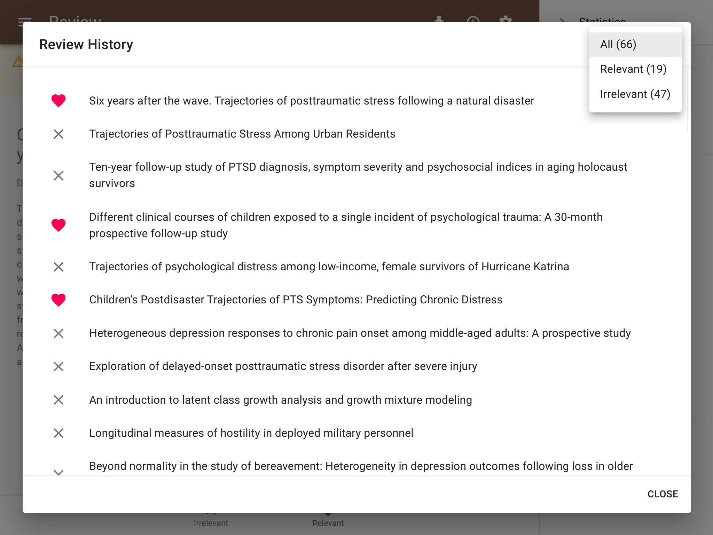
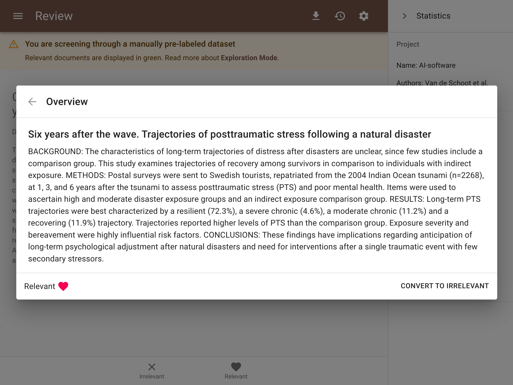
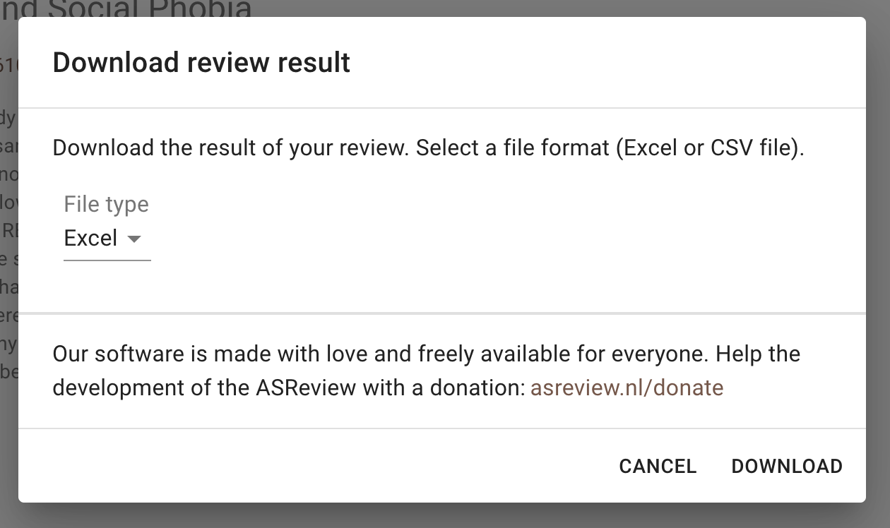

Screening
=========

The user interface in which you provide labels for records shown to you by the
software is kept as simple as possible. This is because ASReview wants you to
focus on the content of the text so that you can make your decision as a true
Oracle. You can access the following features during screening.

Screening
---------

As soon as the model is ready, a button appears with **Start Review**. Click
the button to start screening. ASReview LAB presents you a document to screen
and label. If you have selected certainty-based sampling it will be the
document with the highest relevance score.

You are asked to make a decision: relevant or irrelevant?

.. figure:: ../../images/asreview_screening_asreview_label.png
   :alt: ASReview Screening

While you review the documents, the software continuously improves its
understanding of your decisions, constantly updating the underlying model.

More specifically, each labeling decision of the user starts the training
of a new model given there is no model being trained at that time.
When this new model is trained, the unseen records' rank order is
updated. Training and labeling occur asynchronous. With fast models, a new
ranking will probably be available before the user finished reading the text. With
slower models, training continues until a new model is trained, and the user can
continue screening the next record in line (2nd, 3rd, etc.). Therefore, the
record shown to the user can be the one with the highest relevance score of
the second last model or the highest-ranked as resulted from the latest model until a new
model is trained.

As you keep reviewing documents and providing more labels, the number of
unlabeled documents left in the dataset will decline. When to stop is left to
the user. The `blogpost *ASReview Class 101* <https://asreview.nl/blog/asreview-class-101/>`_
and the `discussion board <https://github.com/asreview/asreview/discussions/557>`_
provide some tips on when to stop with screening.

.. warning::

  If you are in doubt, take your time to think on the decision, you
  are the oracle. Based on your input, a new model will be trained in the
  background. If you make decisions faster than the model needs for computing
  new relevance scores, you will simply be presented with the record next in
  line (etcetera) until the model is done training.

Autosave
--------

Your labeling decision is saved automatically. There is no need to press any buttons to
save your work anywhere in ASReview LAB.

.. _undo-last:

Undo decisions
--------------

In some cases, you might want to change your previous decision. The screening
interface of ASReview LAB offers two options to change your decision.

Undo last decision
~~~~~~~~~~~~~~~~~~

You can allow returning to the previous decision during screening.
By default, the undo option is enabled.

1. Open ASReview LAB.
2. Open or create a project.
3. Label the record displayed in the screen as relevant or irrelevant.
4. Click on **Undo** (See picture below).

.. figure:: ../../images/undo_button.png
   :alt: Undo previous decision

5. Click on **Keep (ir)relevant** or **Convert to (ir)relevant**
6. Continue labeling.

Review History
~~~~~~~~~~~~~~

An overview of your decisions made during screening can be found in the
**Review History** dialog.

Open history
~~~~~~~~~~~~

1. Open ASReview LAB.
2. Open or create a project.
3. Start/continue screening.
4. Click on **Review History** in the *menu bar* on top. A dialog will open with the labeled records.
5. With the drop-down list, you can select records to display (all, relevant only, or irrelevant only).
6. By clicking on a title, the full information opens.

Changing decisions
~~~~~~~~~~~~~~~~~~

7. To change a label of a record, click **convert to ...**. The next iteration of the model will take the new label into account.
8. To go back to the overview, click **←**.
9. To close the Review History, click **Close**.

Full Text
---------

If a column with Digital Object Identifiers (DOI) is available in the metadata
of your dataset, ASReview LAB will display the DOI with hyperlink during
screening. Most of the time, DOIs point to the full-text of a publication. See
:doc:`datasets <../intro/datasets>` for more information on including DOI values to your
datasets. To access the full text:

.. figure:: ../../images/doi.png
   :alt: Digital Object Identifier (DOI)

Statistics Panel
----------------

For unlabeled data, ASReview LAB offers some insightful graphs to keep track
of your screening process so far. To open the statistics panel:

1. Open ASReview LAB.
2. Open a project.
3. Start screening.
4. Click the **statistics** icon in the upper-right corner.
5. To close the panel click on the '>' icon.

In the top of the statistics panel the project name, authors and total number
of records in the dataset are displayed.

The pie chart presents an overview of how many relevant (green) and
irrelevant (orange) records have been screened so far. Also, the total number
of records screened is displayed, as well as the percentage screened relative
to the total number of records in the dataset.

The second plot is a progress plot. On the x-axis the number of records
screened is tracked. The y-axis shows a moving average. It displays the ratio
between relevant and irrelevant records for a batch of 10 labeled records. If
you hoover over the plot you can see the moving average for any batch of 10
labeled records.

Underneath the progress plot, the number of irrelevant records after the last
relevant is shown. This statistic might help in deciding when to stop
reviewing, see `blogpost *ASReview Class 101*
<https://asreview.nl/blog/asreview-class-101/>`_ for more instructions how to
use this graph.

Download Results
----------------

A file containing all metadata including your decisions can be downloaded
any time during the screening process. To download your results:

1. Open ASReview LAB.
2. Open a project.
3. Start screening.
4. Click the **download** icon in the upper-right corner.
5. You will be asked whether you want to save an Excel or a CSV file.
6. You will be asked where to save the file.

Hamburger menu
--------------

Via the hamburger menu in the left-upper corner you can:

1. Navigate back to the :doc:`overview <pre_screening>` page containing all your projects (or to start a new project).
2. You can access the :doc:`Project Dashboard <post_screening>`.
3. Navigate to the documention via the `HELP <https://asreview.readthedocs.io/en/latest/>`_ button.
4. Provide feedback or `contribute <https://github.com/asreview/asreview/blob/master/CONTRIBUTING.md>`_ to the code.
5. Donate to the ASReview project via the `ASReview crowdfunding platform <https://asreview.nl/donate>`_.
6. Quit the software (your progress is saved automatically).

.. _keybord-shortcuts:

Keyboard shortcuts
------------------

ASReview LAB supports the use of keyboard shortcuts during screening. The
table below lists the available keyboard shortcuts.

+-----------------------------+------------------------+
| Action                      | Shortcut               |
+=============================+========================+
| Label record as relevant    | **r** or **Shift + r** |
+-----------------------------+------------------------+
| Label record as irrelevant  | **i** or **Shift + i** |
+-----------------------------+------------------------+
| Return to previous decision | **u** or **Shift + u** |
+-----------------------------+------------------------+

.. note:

  Keyboard shortcuts are only available when the **Undo** feature has been
  enabled in the :ref:`settings panel<toggle-shortcuts>.

Display
-------

Dark mode
~~~~~~~~~

ASReview LAB offers the option to customize the screening appearance and functionality.

1. Open ASReview LAB.
2. Click on Menu (top left).
3. Click on Settings.

.. figure:: ../../images/asreview_settings.png
   :alt: ASReview settings

.. note::
  Your preference is saved in the browser.

By default, the dark mode is disabled.

.. figure:: ../../images/asreview_settings_dark_mode.png
   :alt: Dark mode

Font size
~~~~~~~~~

You can make the text on the review screen smaller or larger.

.. figure:: ../../images/asreview_settings_font_size.png
   :alt: Font size

Review Preferences
------------------

Keyboard shortcuts
~~~~~~~~~~~~~~~~~~

You can press a key (or a combination of keys) to label a record as relevant
or irrelevant, or to return to the previous decision during screening.
By default, keyboard shortcuts are disabled.

.. figure:: ../../images/asreview_settings_keyboard_shortcuts.png
   :alt: Keyboard shortcuts

Return to Project Dashboard
---------------------------

If you want to return to the project dashboard, click the hamburger menu (top
left) and click **Project Dashboard**.
