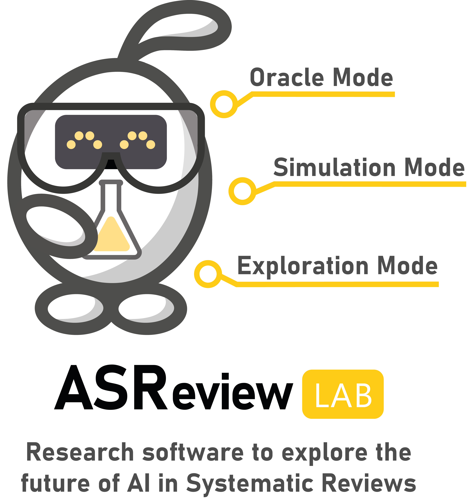

Overview
========

ASReview LAB is user-friendly software for exploring the future of AI in
systematic reviews. The software implements an :doc:`../lab/oracle`, an
:doc:`../lab/exploration`, and a :doc:`../lab/simulation`. The oracle mode
provides a screening interface that can be used to perform an AI-aided
systematic review with the interaction of the reviewer (the oracle). The
simulation mode can be used to simulate the performance of ASReview on
existing systematic reviews. The exploration mode can be used for exploring a
fully labeled dataset in combination with the user-friendly screening
interface of the oracle mode. This mode is excellent for teaching purposes.

The source code of ASReview is available open source under an Apache-2.0
license on `GitHub <https://github.com/asreview/asreview>`__. Compiled and
packaged versions of the software are available on the `Python Package Index
<https://pypi.org/project/asreview>`_ or `Docker Hub
<https://hub.docker.com/r/asreview/asreview>`_.

If you encounter any issues during the process, first consult the
:doc:`Frequently Asked Questions<../intro/faq>` or the Troubleshooting in the
:doc:`installation manual <../intro/installation>`. If you cannot find your
problem, we ask you to file an issue via `Github
<https://github.com/asreview/asreview/issues/new/choose>`__.

