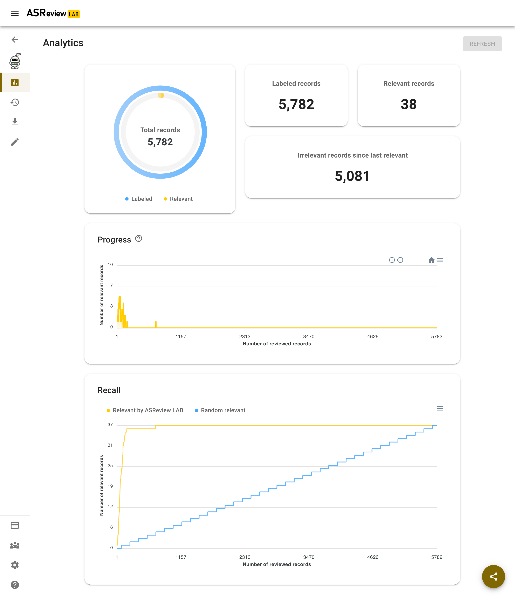
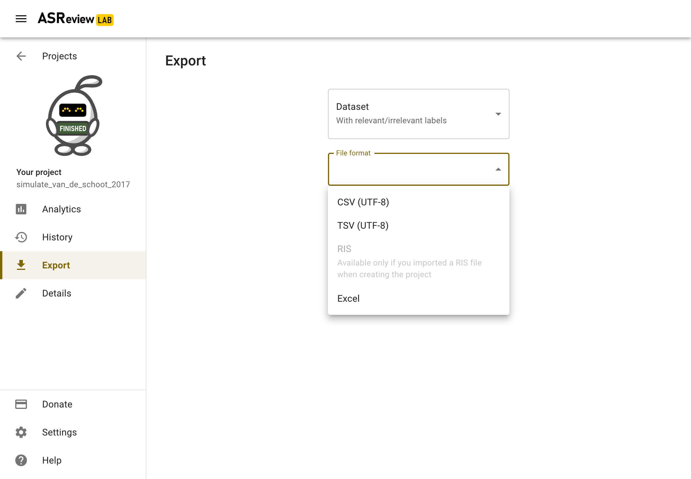
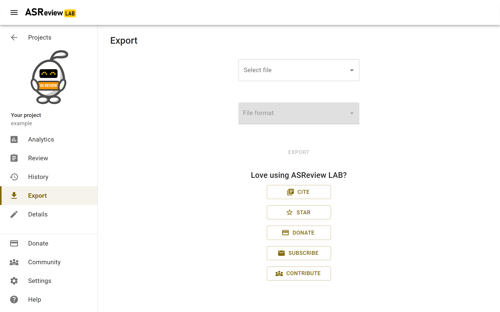

Progress and results
====================

During screening, you might want to keep track of your progress and to obtain
information for your stopping criteria. This section provides documentation on
useful tools for these purposes.

Analytics
---------

ASReview LAB offers some insightful statistics, a progress chart, and recall
chart to keep track of your screening process and help you to decide when to
stop screening.

To open
the statistics panel:

1. :doc:`start`.
2. Open or :doc:`project_create`.
3. Click on Analytics on in the left menu.

   This figure shows the Analytics page of a fully labeled dataset. All
   relevant records are found in the first part of the screening.

Summary statistics
~~~~~~~~~~~~~~~~~~

The summary statistics are counts of the records in your dataset.

- Total records: the total number of records in your dataset.
- Labeled records: the number of records that you labeled as relevant or irrelevant, including those you added as prior knowledge.
- Relevant records: the number of records that you labeled as relevant, including those you added as prior knowledge.
- Irrelevant records: the number of records that you labeled as irrelevant, including those you added as prior knowledge.
- Irrelevant since last relevant: the number of irrelevant records you have seen since the last relevant record.

Charts
~~~~~~

The charts on the analytics page can be useful to monitor your progress. There
is a *Progress* and a *Recall* chart. The charts do not include prior
knowledge and are most relevant after you have screened at least 10 records.

**Progress chart**

The progress chart plots the number of relevant records in the last 10 records
that you reviewed in ASReview LAB. For example, when you reviewed 100 records,
you labeled 3 relevant records between the 91st and 100th reviewed records.

**Recall chart**

The recall chart plots the number of relevant records against the number of
records that you reviewed in ASReview LAB. *Relevant by ASReview LAB* refers to
the relevant records that you labeled with the assistance of the active
learning model. *Random relevant* refers to the relevant records that you might
find if you manually reviewed the records so far without the assistance of the
active learning model.

**Export Figure**

The plots can be exported as a figure:

1. :doc:`start`.
2. Open or :doc:`project_create`.
3. Click on Analytics on in the left menu.
4. Click on the hamburger menu next to the Progress or Recall chart.
5. Select *Download SVG* or *PNG* to export a figure, or select *Download CSV* to export the data behind the figure.

Stop screening
--------------

The `blogpost
*ASReview Class 101* <https://asreview.ai/blog/asreview-class-101/>`_ and the
`How to stop screening?
<https://github.com/asreview/asreview/discussions/557>`_ discussion provide
tips on when to stop with screening.

.. tip::

  The number of *irrelevant records since last relevant* will increase the longer you screen.

.. tip::

  With *Maximum* as :ref:`lab/project_create:Query Strategy`, you will
  see a decline in the number of relevant items in the plots the longer you screen. This may
  help to decide when to 'stop screening <https://github.com/asreview/asreview/discussions/557>`_.

.. tip::

  The data behind the recall plot can be used to calculate the `knee-algorithm <https://github.com/asreview/asreview/discussions/1115>`_ as a stopping criteria.

Mark project as finished
------------------------

When you decide to stop screening, you can mark the project as finished. You
can undo this at any time. To mark your project as finished:

1. :doc:`start`.
2. Go to the *Projects dashboard* (http://localhost:5000/projects)
3. Hover the project you want to mark as finished and click on *Options*.
4. Click on *Mark as finished*.

The button to continue screening is now disabled. This can be undone by
clicking again on *Mark as in review*.

Export results
--------------

You can export the results of your labeling to a RIS, CSV, TSV, or Excel file.
A file contains all imported data including your decisions, or a file with a
selection of the relevant records only.

The following variables will be added to your tabular dataset:

- The column titled **included** contains the labels as provided by the user:
  ``0`` = not relevant, ``1`` = relevant and if missing it means the record is
  not seen during the screening process.
- The column titled **asreview_ranking** contains an identifier to
  preserve the rank ordering as described below.
- The column **asreview_prior** contains a label ``1`` if a record has been
  used to train the first iteration of the model, a label ``0`` if not used
  for training, and empty when the record was not seen.
- The column **asreview_label_to_validate** is added in the exploration mode and
  contains the labels initially present in the data.
- The column **Notes** contain any notes you made during screening.

For RIS files, the
labels **ASReview_relevant**, **ASReview_irrelevant**, **ASReview_not_seen**,
and **ASReview_prior**, **ASReview_validate_relevant/irrelevant/not_seen**
are stored with the `N1` (Notes) tag. In citation managers like Zotero and
Endnote, the labels can be used for making selections.

The file is ordered as follows:

1. All relevant records you have seen in the order they were shown during the screening process.
2. All records not seen during the screening and ordered from most to least relevant according to the last iteration of the model.
3. All non-relevant records are presented in the order these are shown during the screening process.

To download your results follow these steps:

1. :doc:`start`.
2. Open or :doc:`project_create`.
3. Click on *Export* in the menu on the left.
4. Select *Dataset*.
5. Select the file type for prefer: i.e. Excel, RIS, TSV, or CSV file.
6. Save the file to your device.

.. note::

    A RIS file can only be exported if a RIS file is imported.

Love using ASReview? On the Export screen you can get inspired how you can
give back to our open-source and community-driven project.

