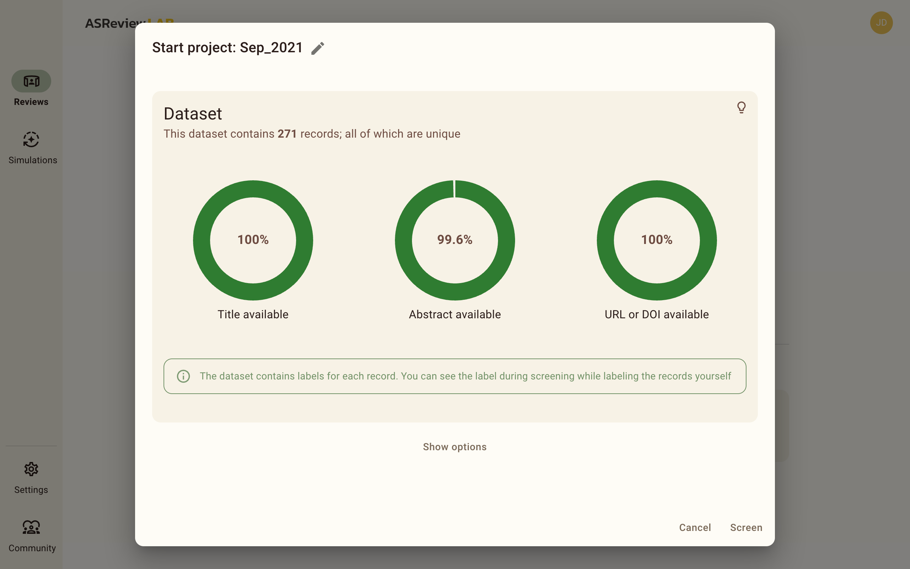

Start a review
==============

To start reviewing a dataset with ASReview LAB, you create a project containing
a dataset with records to screen. The project will contain your dataset,
settings, labeling decisions, and machine learning models.

To start a review project, you need to:

1. :doc:`start`.
2. Go to the *Reviews* if you are not already there
   (http://localhost:5000/reviews)
3. Upload, select, or choose a dataset to screen.
4. Verify the dataset with the charts. Ensure that the dataset completeness
   is sufficient.

Add Dataset
-----------

The first step in creating a project is to select a dataset. You can upload a
dataset from your computer, select a dataset from Discovery, or use a dataset
from a URL or DOI. When uploading a dataset from your computer, URL, or DOI,
ensure that the dataset is in a supported format. See :doc:`data` for extensive
information about the supported formats and metadata.

.. tip::

    You will benefit most from what active learning has to offer with
    :ref:`lab/data:High-quality data`.

From File
~~~~~~~~~

Drag and drop your file or select your file.

From URL (or DOI)
~~~~~~~~~~~~~~~~~

Provide a URL or a DOI to a dataset. Many data repositories are supported via
`Datahugger <https://github.com/J535D165/datahugger>`__. If the DOI points to
multiple files, you can select the specific file you want to use (e.g.,
`10.17605/OSF.IO/WDZH5 <https://doi.org/10.17605/OSF.IO/WDZH5>`__).

Click on *Download* to download and add the dataset to the project.

From Discovery
~~~~~~~~~~~~~~

Under Discovery, you can select existing datasets from the `SYNERGY dataset
<https://github.com/asreview/synergy-dataset>`__ or installed dataset
extensions. The SYNERGY dataset is a collection of fully labeled datasets that
can be used, but not exclusively, to benchmark the performance of active
learning models.

More options
------------

Under the dataset card, you find *Show options*. Clicking on *show options* will
open extra options for the review.

Add Tags
~~~~~~~~

You can add tags to your records to review. Tags are useful for organizing your
records afterwards or for data extraction. You can add tags and tag groups to
your review by clicking on the *Add tags* button. You can add multiple tags to a
tag group, and you can add multiple tags to a dataset. In the current version,
you can't delete tags, so be careful with the tags you add.

Tags are presented to you in the *Reviewer* interface. Tags are presented as
checkboxes, and you can select multiple tags for a record. You can find the
selected tags in the collection and during the export of the dataset.

Change AI Model
~~~~~~~~~~~~~~~

By default, ASReview LAB uses the ELAS ultra model. This is a fast and efficient
model that is trained on the SYNERGY dataset. You can change the model to a
different model by clicking on the dropdown button. You can select from the
following models:

- ELAS ultra
- ELAS multilingual
- ELAS heavy
- Custom

Most users will benefit from the ELAS ultra model and don't need to change the
model. The ELAS multilingual model is useful for datasets that are multilingual
or contain non-English records.

For more information about the models and the required :doc:`dory` extension,
see the :ref:`lab/models` page.

Prior Knowledge
~~~~~~~~~~~~~~~

Prior knowledge refers to records in your dataset that you already know are
relevant or irrelevant. Providing prior knowledge helps train the model during
the initial and subsequent iterations of the active learning cycle. The model
uses this information to generate an initial ranking of records in your dataset.

.. note::

  If your dataset includes :ref:`lab/data_labeled:Partially labeled data`,
  ASReview LAB will automatically use the labeled records as prior knowledge.

To add prior knowledge:

1. Click on *Search* to search your dataset by authors, keywords, titles, or a
   combination of these.
2. Enter your search terms and press *Enter*. Only the first 10 results will be
   displayed, so ensure your search terms are precise.
3. Review the record you were searching for and select the relevant or
   irrelevant label. You can also add tags to the record. Avoid labeling all
   items; select only those you intend to use as training data.
4. Close the search window or click on *Return* to return to the previous
   screen.

Providing accurate prior knowledge improves the model's performance and can
accelerate the review process.

Screen
------

Once you have selected a dataset and optionally added tags, changed the model,
or searched for prior knowledge, you can click on *Screen* to start the review. For
more tips on how to screen records, see :doc:`screening`.
