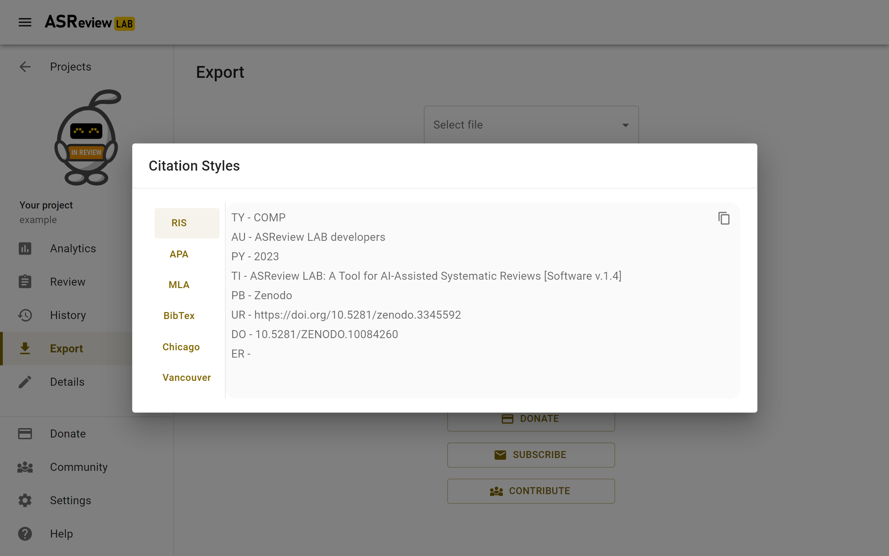

Research
========

The open source ASReview LAB software is one of the products of the `ASReview
research project <https://asreview.ai/about/>`_. The ASReview research project
is a fundamental and applied research project studying the application of AI
in the field of systematically reviewing large amounts of text data.

.. note::

  The ASReview project is developed by researchers for researchers, and anyone is welcome to join the community!

There are still 1001 scientific papers that can be published using the
ASReview products. We welcome researchers worldwide to work on papers like
applying the existing models to new types of datasets (different scientific
fields, other languages, multilanguage data, text data outside academia,
large datasets, etcetera), adding new models and testing the performance on
the available benchmark datasets, adding and testing new stopping rules or
performance metrics, and so on!

Scientific principles
---------------------

The research team works according to the Open Science principles and invests in an
inclusive community contributing to the project. In short, research is
conducted according to the following fundamental principles:

- Research output should be `FAIR <https://www.uu.nl/en/research/open-science>`_ (Findable Accessible Interoperable and Reusable).
- Research should be conducted with integrity, and we commit ourselves to the `Netherlands Code of Conduct for Research Integrity <https://www.nwo.nl/en/netherlands-code-conduct-research-integrity>`_.
- Output should be rewarded according to the Declaration on Research Assessment (`DORA <https://sfdora.org/read/>`_).

Utrecht University has established `specific regulations <https://www.uu.nl/en/organisation/about-us/codes-of-conduct>`_ governing conduct for its employees. These are based on the key principles of professional and quality academic conduct and ethically-responsible research. Members of the team employed by Utrecht University, commit themselves to these regulations in all their conduct, including all work related to ASReview. Adherence to similar key principles is expected of all researchers involved in all facets of the ASReview project.

Cite
----

For scientific use, we encourage users to cite:

- The paper published in `Nature Machine Intelligence <https://www.nature.com/articles/s42256-020-00287-7>`_ to cite the **ASReview project**.

- For a detailed description of the the data model, see the paper `Reproducibility and Data Storage Checklist <https://osf.io/preprints/psyarxiv/g93zf>`__.

- More studies related to the project can be found on `asreview.ai/research <https://asreview.ai/research/>`_.

For citing the documentation (or to download the pdf) go to `Zenodo <https://doi.org/10.5281/zenodo.4287119>`_.

For citing the software **ASReview LAB**, refer to the `specific release
<https://doi.org/10.5281/zenodo.3345592>`_ of the software, available on the
export screen.

