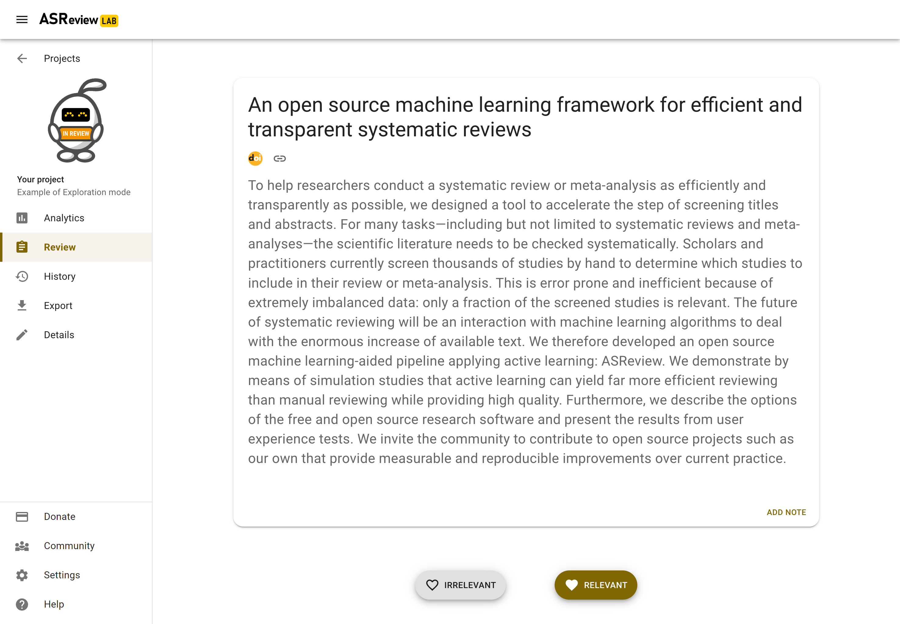
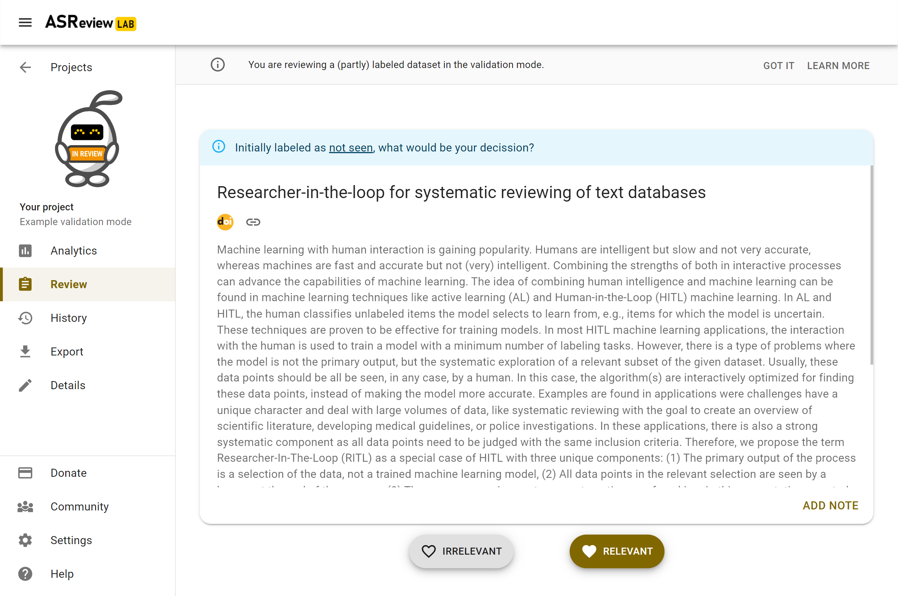
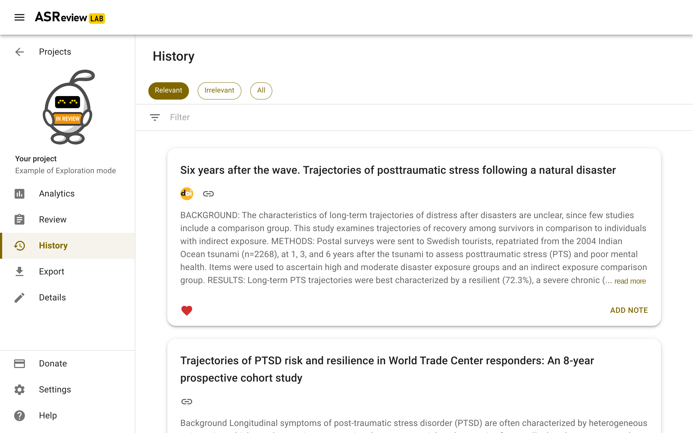
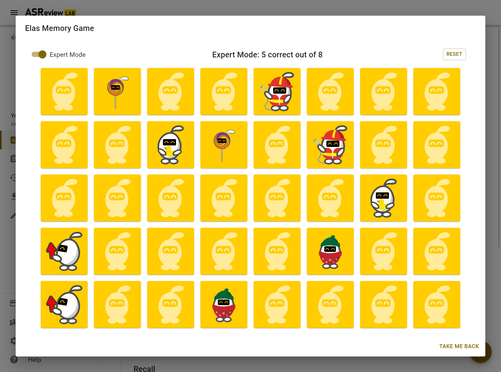

Screening
=========

.. note::

  Only for Oracle and Validation. Read more about the options for the Simulation mode in the :doc:`simulation_overview`.

Introduction
------------

As soon as your project is initiated, you can start reviewing. Click on
*Review* in the left menu if your project is not on the review page yet.
ASReview LAB presents you a title and abstract to screen and label.

You are asked to make a decision: relevant or irrelevant?

Screening in Oracle mode
~~~~~~~~~~~~~~~~~~~~~~~~

In the Oracle mode, unlabeled records are presented to you. Depending on the
selected strategy it is the most likely relevant record (default
setting) or based on another:ref:project_create:Query Strategy.

Click on the decision of your choice, and a new record is presented to you. While
you review the next record, a new model is being trained. ASReview LAB
continuously improves its understanding of your decisions, constantly updating
the underlying ordering of the records.

Each labeling decision of the user starts the training of a new model given
no model is being trained at that time. When this new model is trained,
the unseen records' rank order is updated. Training and labeling occur
asynchronously. With fast models, a new ranking will probably be available
before the user finishes reading the text. With slower models, training
continues until a new model is trained, and the user can continue screening
the next record in line (2nd, 3rd, etc.). Therefore, the record shown to the
user can be the one with the highest relevance score of the second last model
or the highest-ranked as a result of the latest model until a new model is
trained. For a detailed description of the the data model, see the paper
`Reproducibility and Data Storage Checklist <https://osf.io/preprints/psyarxiv/g93zf>`__.

As you keep reviewing documents and providing labels, you will probably see
fewer relevant records. When to stop screening is left to you. See
:doc:`progress` for more information on progress monitoring and information on
when to stop.

.. tip::

  If you are in doubt about your decision, take your time as you are the
  oracle. Based on your input, a new model will be trained, and you do not
  want to confuse the prediction mode. For the model, it may be better to
  consult others, and read the full text (in case of reviewing abstracts of
  scientific papers)

Screening in Validation mode
~~~~~~~~~~~~~~~~~~~~~~~~~~~~

The Validation mode (formerly known as Exploration mode) is tailored for
scenarios where it's necessary to validate existing labels or engage in a
review process without being an oracle. This mode is especially beneficial
for validating labels made by a first screener, reviewing labels predicted by
Large Language Models(LLMs) such as ChatGPT, or for educational and training
purposes.

In this mode, records are presented along with an indication of their previous
labeling status: relevant, irrelevant, or not seen. This status is displayed
via a color-coded bar above each record. If a record was labeled by another
screener or an AI model, you have the opportunity to validate, or challenge
these labels, helping to refine the dataset by correcting any potential
misclassifications, useful for the quality evaluation of the `SAFE procedure <https://www.researchsquare.com/article/rs-2856011/>`_.

Additionally, the Validation mode is useful for educational use. Instructors
and learners can utilize this mode to simulate the screening process without
being the expert decision-maker. This setup is particularly advantageous in
workshop settings, where participants can engage with the screening process
using the labeled `SYNERGY datasets <https://github.com/asreview/synergy-dataset>`_.
This hands-on experience
offers valuable insights into the software's functionality and the systematic
review process without the need to be a content expert. For comprehensive
online teaching materials and tutorials on using ASReview LAB
effectively, please visit the `ASReview Academy <https://asreview.github.io/asreview-academy/ASReviewLAB.html>`_.

Autosave
--------

Your decisions (and notes) are saved automatically into your ASReview project
file. There is no need to press any buttons to save your work anywhere in
ASReview LAB (in fact, there is not even a *save* button).

Change decisions
----------------

In some cases, you might want to change your previous decision. The screening
interface of ASReview LAB offers two options to change your decision.

Undo last decision
~~~~~~~~~~~~~~~~~~

You can return to your previous decision during screening.

1. :doc:`start`.
2. Open or :doc:`project_create`.
3. Label the record displayed in the screen as relevant or irrelevant.
4. Click on *Undo* (At the bottom right)
5. Click on *Keep (ir)relevant* or *Convert to (ir)relevant*.
6. Continue screening.

You can disable
this option in the Settings menu.

Screening history
~~~~~~~~~~~~~~~~~

An overview of your decisions made during screening can be found on the
**History** page. You can change decisions on this page.

1. :doc:`start`.
2. Open or :doc:`project_create`.
3. Click on History in the menu on the left.

Changing decisions on the history page

4. To change a label of a record, click the heart icon. The next iteration of the model will take the new label into account.

Full Text
---------

If a column with Digital Object Identifiers (DOI) or URLs is available in the
metadata of your dataset, ASReview LAB will display the DOI and URL during
screening. Most of the time, DOIs point to the full-text of a publication. See
:doc:`datasets <data>` for more information on including DOI and URL values to
your datasets.

Keyboard shortcuts
------------------

ASReview LAB supports the use of keyboard shortcuts during screening. The
table below lists the available keyboard shortcuts.

You can press a key (or a combination of keys) to label a record as relevant
or irrelevant, or to return to the previous decision during screening.
By default, keyboard shortcuts are disabled.

+-----------------------------+------------------------+
| Action                      | Shortcut               |
+=============================+========================+
| Label record as relevant    | **r** or **Shift + r** |
+-----------------------------+------------------------+
| Label record as irrelevant  | **i** or **Shift + i** |
+-----------------------------+------------------------+
| Return to previous decision | **u** or **Shift + u** |
+-----------------------------+------------------------+

.. note::

  Keyboard shortcuts are only available when the **Undo** feature has been
  enabled in the Settings (bottom left).

Display
-------

Dark mode
~~~~~~~~~

ASReview LAB offers the option to customize the screening appearance and functionality.

1. :doc:`start`.
2. Click on *Settings* (bottom left).
3. Go to *Display* and toggle the dark mode

.. note::
  Your preference is saved in the browser.

Font size
~~~~~~~~~

You can make the text on the review screen smaller or larger.

1. :doc:`start`.
2. Click on *Settings* (bottom left).
3. Go to *Display* and click on *Font size*.
4. Slide the slider to the desired font size.

ELAS Memory Game
----------------

If you want a break from screening, you can search for the hidden ELAS memory
game.

.. figure:: ../../images/game.png
   :alt: ELAS Memory Game

If you really need a long break, try the expert mode.

