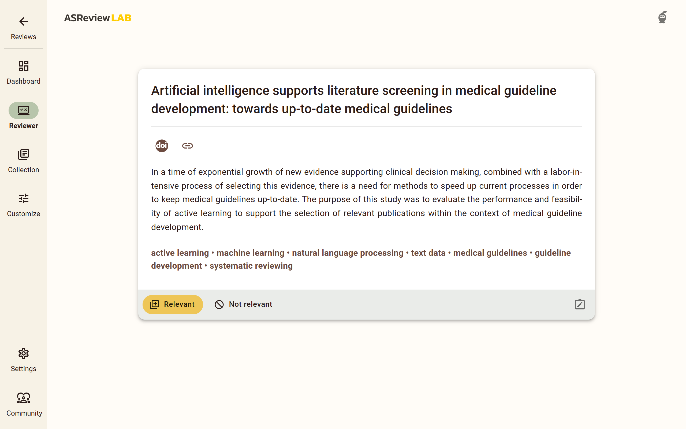

Screening
=========

Once your project is set up, you can immediately begin screening records. To get
started, click on *Reviewer* in the left menu if you are not already on the
review page. ASReview LAB will present you with a title and abstract to evaluate
and label.

Your task is to decide whether the record is relevant or irrelevant. Simply
click on your choice, and the next record will be presented to you. While you
review, ASReview LAB works in the background, training a model based on your
decisions and continuously improving its understanding of your preferences. This
process updates the ranking of the remaining records, ensuring that the most
relevant records are prioritized for review.

   The review screen of ASReview LAB with the title and abstract of a record to
   review. Click on the relevant or irrelevant button to label the record and
   continue to the next record. You can also add a note to the record or check
   self-defined tags.

Each labeling decision by the user starts the training of a new model, provided
no model is being trained at that time. When this new model is trained, the
unseen records' rank order is updated. Training and labeling occur
asynchronously. With fast models, a new ranking will likely be available before
the user finishes reading the text. With slower models, training continues until
a new model is trained, and the user can continue screening the next record in
line (2nd, 3rd, etc.).

As you keep reviewing documents and providing labels, you will probably see
fewer relevant records. When to stop screening is left to you. See
:doc:`progress` for more information on progress monitoring and information on
when to stop.

.. tip::

  If you are in doubt about your decision, take your time as you are the oracle.
  Based on your input, a new model will be trained, and you do not want to
  confuse the prediction model. For the model, it may be better to consult
  others and read the full text (in the case of reviewing abstracts of
  scientific papers).

Autosave
--------

Your decisions (and notes) are saved automatically into your ASReview project
file. There is no need to press any buttons to save your work anywhere in
ASReview LAB (in fact, there is not even a *save* button).

Change decisions
----------------

In some cases, you might want to change your previous decision. An overview of
your decisions made during screening can be found on the **Collection** page.
You can change decisions on this page.

1. :doc:`start`.
2. Open or :doc:`project_create`.
3. Click on **Collection** in the menu on the left.
4. To change the label of a record, click on the three dots on the right of the
   record.
5. Click on *Change label to*.

Full Text
---------

If Digital Object Identifiers (DOI) or URLs are available in the metadata of the
records in your dataset, ASReview LAB will display the DOI and URL during
screening. Most of the time, DOIs point to the full text of a publication. See
:doc:`datasets <data>` for more information on including DOI and URL values in
your datasets.

Keyboard shortcuts
------------------

ASReview LAB supports the use of keyboard shortcuts during screening. The table
below lists the available keyboard shortcuts.

.. list-table:: Keyboard Shortcuts
  :header-rows: 1

  * - Action
    - Shortcut
  * - Label record as relevant
    - **r** or **Shift + r**
  * - Label record as irrelevant
    - **i** or **Shift + i**
  * - Add note to record
    - **n** or **Shift + n**

Show model information
----------------------

ASReview LAB allows you to view the model used to present you the record you
currently see. This is especially useful if you are interested in the underlying
model and how it works, or if you want to switch to a different model.

1. :doc:`start`.
2. Click on *Settings* (bottom left).
3. Click on *Show model information* to enable or disable the model view.
4. Go back to the reviewer screen if you are not there yet.

.. note::

  The model information is only available when the record presented to you is
  the recommendation of a model. If you haven't trained a model yet, you will
  not see that the record is presented to you at random.

.. warning::

  Switching models during screening can be hard to understand for new users or
  non-technical users. As the model is trained in the background after each
  decision, records might be presented with the "old" model for a while. Once
  the new model is trained, a record is presented to you based on the new model.
  This can be confusing for new users.

Dark mode
---------

ASReview LAB offers the option to customize the screening appearance and
functionality.

1. :doc:`start`.
2. Click on *Settings* (bottom left).
3. Click on Dark mode to enable or disable dark mode. You can also use the
   system preference.

.. note::
  Your preference is saved in the browser.

Font size
---------

ASReview LAB allows you to adjust the font size of the text displayed during
screening.

1. :doc:`start`.
2. Click on *Settings* (bottom left).
3. Click on *Font size*.
4. Slide the slider to the desired font size.

ELAS Game
---------

If you want a break from screening, click on the ELAS mascot on the top right in
the reviewer screen `;)`. Let us know about your high score!
