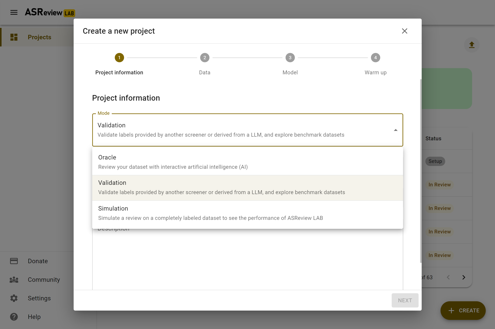
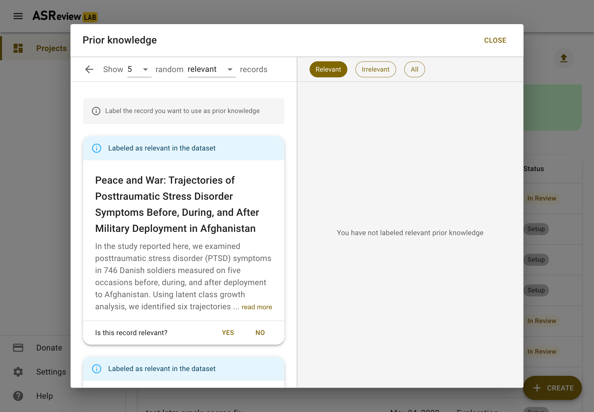
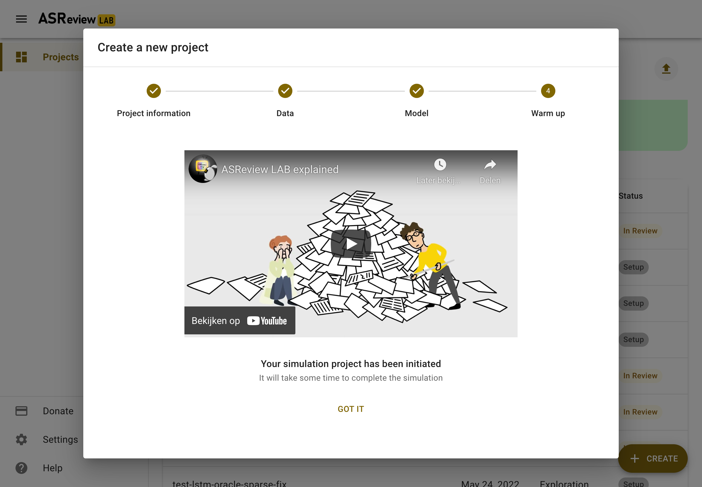

Simulate via the webapp
=======================

To run a simulation in the ASReview webapp, create a project as described in
:doc:`project_create`. Most of the steps of the setup are identical or
straightforward. In this section, some of the differences are highlighted.

In the step on *Project Information*, select the "Simulation"
mode (see figure below).

In the step *Data*, import a :ref:`fully labeled dataset <lab/data_labeled:fully labeled data>`
or use one of the benchmark datasets.

Selecting prior knowledge is relatively easy. In case you know relevant
records to start with, use the search function. In case you don't, use the
*Random* option. Toggle the button "Relevant" on top to see some random
irrelevant records. Label some relevant and some irrelevant records.

The step *Warm up* is differs slightly from the Oracle and Validation mode.
This step starts the simulation, after some seconds, it will return "Got it".
This means, the simulation runs further in the background. You are returned to
the Analytics page.

This page now has a refresh button on the top right. If the simulation is not
finished yet, you can refresh the page or use the refresh button to follow the
progress. After a while, the Elas mascot on the left will hold a sign with
"finished". Your simulation is now finished and you can study the results in
the analytics page.
