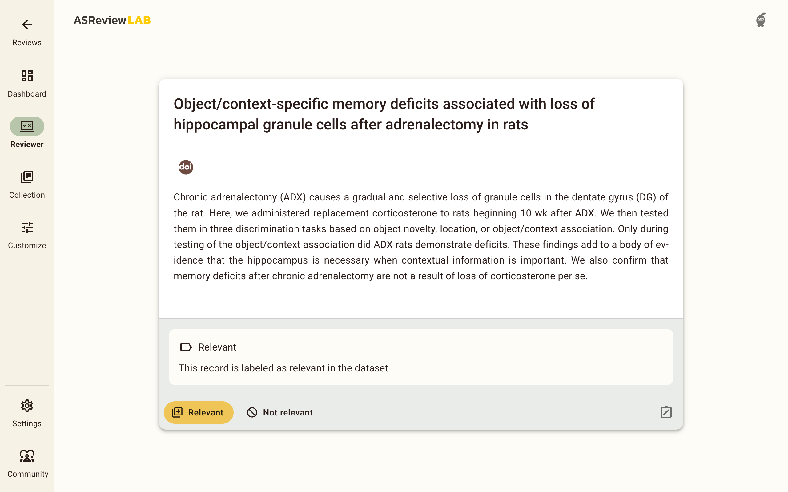

Validation reviews
==================

Validation reviews are tailored for scenarios where it's necessary to validate
existing labels or engage in a review process without being an oracle. This mode
is especially beneficial for validating labels made by a first screener or an AI
(i.e., Large Language Models). It is also used for educational purposes.

In a validation review, records are presented along with an indication of their
existing label: relevant or irrelevant. This status is displayed via an
information box above the labeling buttons in the record. If a record was
labeled by another screener or an AI model, you have the opportunity to validate
or challenge these labels, helping to refine the dataset by correcting any
potential misclassifications. This is useful for quality evaluation.

   The review screen of ASReview LAB with the title and abstract of a record to
   review. The box above the labeling buttons indicates the label of the record
   according to the dataset. This label can be validated or challenged.

Validation reviews for education
--------------------------------

The validation review is useful for educational purposes. Instructors and
trainers can utilize this feature to mimic the screening process without being
the expert decision-maker. This setup is particularly advantageous in workshop
settings, where participants can engage with the screening process using the
labeled `SYNERGY datasets <https://github.com/asreview/synergy-dataset>`_. This
hands-on experience offers valuable insights into the software's functionality
and the systematic review process without the need to be a content expert.

.. tip::

   For comprehensive online teaching materials and tutorials on using ASReview
   LAB effectively, please visit the `ASReview Academy
   <https://asreview.github.io/asreview-academy/ASReviewLAB.html>`_.
