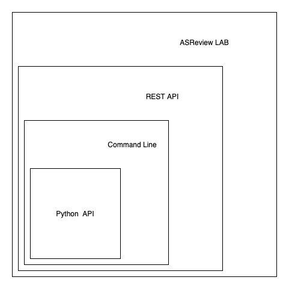

Overview
========

ASReview provides users an API to interact directly with the underlying
ASReview machinery. This provides researchers an interface to study the
behavior of algorithms and develop custom workflows. The following figure
shows the available interfaces for interacting with the ASReview software:

- The REST API is used a Flask REST API to provide a method to let the React
  front-end communicate with the backend and algorithms. The REST API is not
  documented at the moment and should be considered 'internal use only'.
- The :doc:`cli` is an interface to open ASReview LAB, to run
  :ref:`simulations <cli:Simulate>`, and more. See :doc:`sim_overview` for
  example usage.
- The :doc:`reference` is a low level Python interface for ASReview. This
  interface requires detailed knowledge about the workings of the software.
  There is extensive documentation available on the functions, classes,
  modules. An outline for usage can be found in :doc:`api`.
