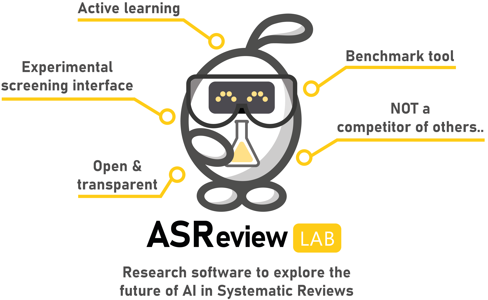

Overview
========

The free and ready-to-use software ASReview Lab implements an ‘oracle’, a ‘simulation’ and an ‘exploration’ mode. The oracle mode is used to perform a systematic review with interaction by the user (:doc:`quicktour`). The simulation mode [REF NAAR SIMULATIE BINNEN API EN LATER NAAR APARTE QUICK TOUR] is used for simulation of the ASReview performance on existing systematic reviews. The :doc:`user_testing_algorithms` can be used for teaching purposes and includes several pre-loaded labelled datasets.

Multiple file formats are supported [https://asreview.readthedocs.io/en/latest/datasets.html] and we offer many unique features [REF NEEDED].

