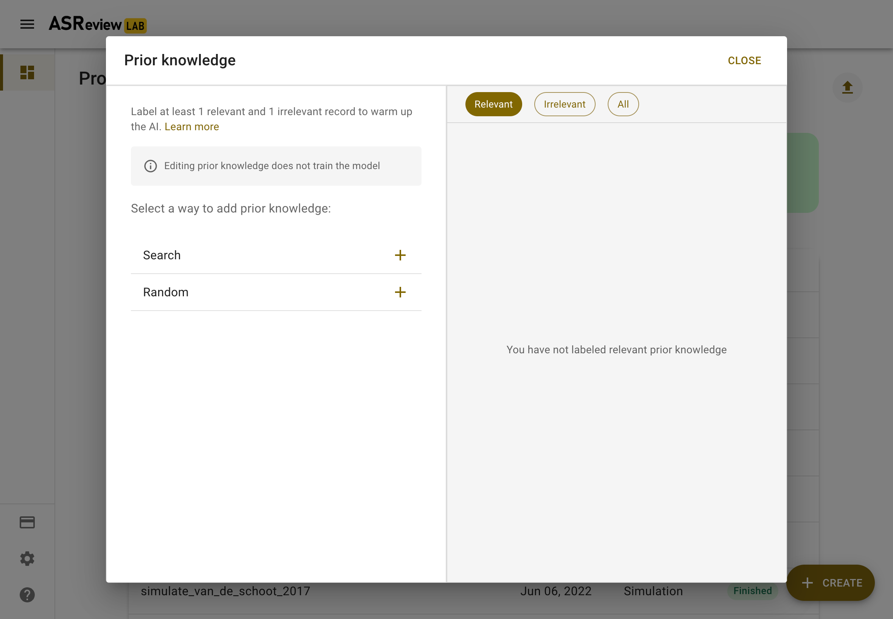
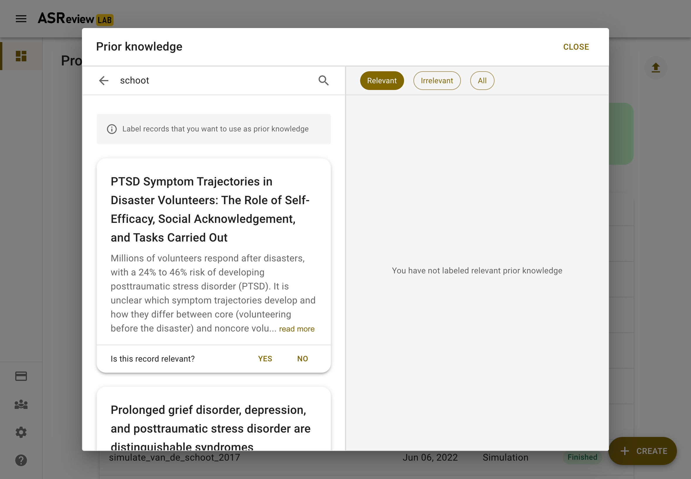
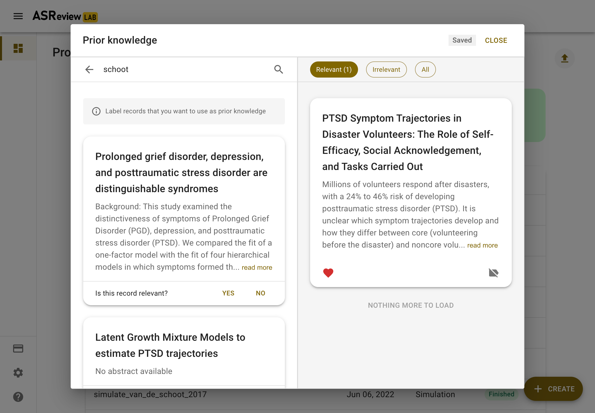
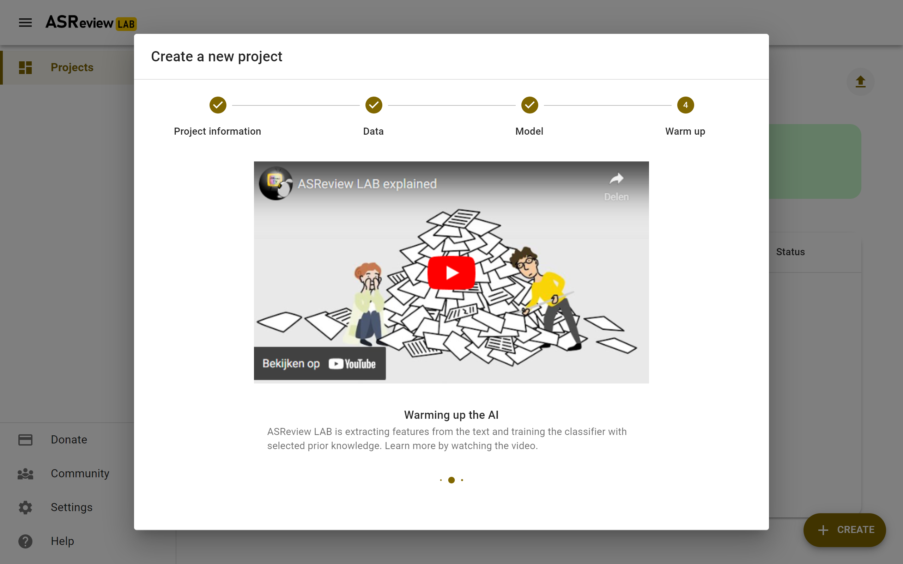

****************
Create a project
****************

To start reviewing a dataset with ASReview LAB, you first need to create a
project. The project will contain your dataset, settings, labeling decisions,
and machine learning models. You can choose from three different project
types: Oracle, Exploration, and Simulation. The project setup consists of
4 steps: Project information, Data, Model, and Warm up. The sections below
explain each of the steps of the setup.

To create a project:

1. :doc:`start`.
2. Go to the *Projects dashboard* if you are not already there (http://localhost:5000/projects)
3. Click on the *Create* button on the bottom left

Project information
===================

In Step 1, you provide all relevant information about your project as
well as the type of project you want (the mode). The sections below provide
more information on the input fields. After you complete this step, click
*next*.

Project modes
-------------

In this step, you have to select a mode. The default is **Oracle**. Oracle mode
is used to screen an unlabeled dataset with the help of AI (it's fine if you
already have labels, these will used as prior knowledge). The other
two modes, Simulation and Exploration, require fully labeled datasets. They
are useful for teaching purposes or studying the performance of active
learning in a simulation study.

In short:

- You have an Unlabeled, or :ref:`data_labeled:Partially labeled data` -> Oracle
- You have a :ref:`data_labeled:Fully labeled data` -> Simulation or Exploration.

.. figure:: ../images/setup_project_modes.png
   :alt: Project modes

Project details
---------------

Provide project details like name of the project (required), author(s) (for
example, the name of the screener), and a description. You can edit these
values later in the *Details* page.

Data
====

In Step 2, you import a dataset and select prior knowledge.

Add Dataset
-----------

Click on *Add* to select a dataset. The data needs to adhere to a
:doc:`specific format <data>`.

Depending on the :ref:`Project mode <project_create:Project modes>`, you are
offered the following options for adding a dataset. Keep in mind that in Oracle
mode, your dataset is unlabeled or :ref:`data_labeled:Partially labeled data`. For Exploration and Simulation mode, you need :ref:`data_labeled:Fully labeled
data`.

.. tip::

    You will benefit most from what active learning has to offer with :ref:`data:High quality data`.

From File
~~~~~~~~~

Drag and drop your file or select your file. Click on *Save* on the top right.

From URL
~~~~~~~~

Use a link to a dataset on the Internet. For example, a link from this
`dataset repository
<https://github.com/asreview/systematic-review-datasets>`__. Click on *Save* on
the top right.

From Extension
~~~~~~~~~~~~~~

Oracle and Exploration only. Select a file available via an extension. Click
on *Save* on the top right.

Benchmark Datasets
~~~~~~~~~~~~~~~~~~

For Simulation and Exploration only. Select one of the
:ref:`data_labeled:benchmark datasets`. Click
on *Save* on the top right.

Select Prior Knowledge
----------------------

.. note::
  If you use :ref:`data_labeled:Partially labeled data` you can skip this step. 

The first iteration of the active learning cycle requires training data,
referred to as prior knowledge. This knowledge is used by the classifier to
create an initial ranking of the unseen records. In this step, you need to
provide a minimum training data set of size two, with **at least** one
relevant and one irrelevant labeled record.

To facilitate prior selection, it is possible to search within your dataset.
This is especially useful for finding records that are relevant based on
previous studies or expert consensus. 

You can also let ASReview LAB present you with random documents. This can be
useful for finding irrelevant records.

The interface works as follows; on the left, you will see methods to find
records to use as prior knowledge, on the right, you will see your selected
prior knowledge. If you have **at least** one relevant and one irrelevant
record, you can click *Close* and go to the next step. 

Search
~~~~~~

Let's start with finding a prior relevant document. The most efficient way
to do this is by searching for a specific document that you already know is
relevant. Click on Search and search your dataset by authors,
keywords or title, or a combination thereof. Make sure to be precise
with the search terms, as only the first 10 results are shown to you.
After entering your search terms, press enter to start searching.

Click the document you had in mind and answer, "Is this record relevant?".
Note, don't label all items here. Only the one you are looking for and want to
use as training data.

The prior knowledge will now show up on the right. There are no restrictions
on the number of records and the software already works with 2 labels (1
relevant and 1 irrelevant). 

If you are done searching prior knowledge, click *Close*.

Random
~~~~~~

.. warning::
  Do not use the random option to search for the sparse relevant records!

You also need to provide at least one prior irrelevant document. One way to
find an irrelevant document is by labeling a set of random records from the
dataset. Given that the majority of records in the dataset are irrelevant
(extremely imbalanced data problem), the records presented here are likely to
be irrelevant for your study. Click on *random* to show a few random records.
Indicate for each record you want to use as training data whether it is
irrelevant (or relevant).

.. figure:: ../images/setup_prior_random_1rel.png
   :alt: ASReview prior knowledge random

The prior knowledge will now show up on the right. Use the buttons to see all
prior knowledge or irrelevant items. There are no restrictions on the number
of records you provide, and the software already works with 2 labeled
records (1 relevant and 1 irrelevant). 

After labeling five randomly selected records, ASReview LAB will ask you
whether you want to stop searching prior knowledge. Click on *STOP* and
click *Next*.

If you are done, click *Close*.

Model
=====

In the next step of the setup, you can select the active learning model. The
default settings (Naïve Bayes, TF-IDF, Max) have fast and excellent
performance. Most users can skip this step and click *Next*. More information
about the active learning process can be found in the blog post `Active learning explained <https://asreview.nl/blog/active-learning-explained/>`_, 

Select model
------------

It is possible to change the settings of the Active learning model. There are
four settings that can be changed in the software: 

Feature extraction
~~~~~~~~~~~~~~~~~~

The feature extraction technique determines the method how text is translated
into a vector that can be used by the classifier. The default is TF-IDF (Term
Frequency-Inverse Document Frequency) from `SKLearn <https://scikit-learn.org/stable/modules/generated/sklearn.feature_extraction.text.TfidfVectorizer.html>`_.
It works well in combination with Naive Bayes and other fast training models.

Another recommended option is Doc2Vec provided by the `gensim <https://radimrehurek.com/gensim/>`_
package. Before starting ASReview LAB, first, install *gensim*:

.. code:: bash

    pip install gensim

.. note::

  It takes relatively long to create a feature matrix with Doc2Vec, but this
  only has to be done once. The upside of this method is that it takes context
  into account. Also, a benefit is the dimension-reduction that generally
  takes place, which makes the modeling quicker.

Several other feature extractors are available in the software (sentence Bert,
embedding IDF/LSTM) and more classifiers can be selected via the :doc:`API
<reference>`, or added via an :ref:`extensions_dev:model extensions`. 

Classifier
~~~~~~~~~~

The classifier is the machine learning model used to compute the relevance
scores. The default is Naive Bayes. Though relatively simplistic, it seems to
work quite well on a wide range of datasets. Several other classifiers are
available in the software (logistic regression, random forest, SVM, LSTM,
neural net) and more classifiers can be selected via the :doc:`API
<reference>` or added via an :ref:`extensions_dev:model extensions`. 

The neural nets require `tensorflow <https://www.tensorflow.org/>`_, use

.. code:: bash

    pip install tensorflow

.. note::

  Neural nets (and LSTM) require a much larger training set (i.e., more prior knowledge) compared to the other classifiers.

Balancing Strategy
~~~~~~~~~~~~~~~~~~

To decrease the class imbalance in the training data, the default is to
rebalance the training set by a technique called dynamic resampling (DR)
(`Ferdinands et al., 2020 <https://doi.org/10.31219/osf.io/w6qbg>`_). DR
undersamples the number of irrelevant records in the training data, whereas
the number of relevant records are oversampled such that the size of the
training data remains the same. The ratio between relevant and irrelevant
records in the rebalanced training data is not fixed, but dynamically updated
and depends on the number of records in the available training data, the total
number of records in the dataset, and the ratio between relevant and
irrelevant records in the available training data. No balancing or
undersampling are the other options. Other strategies can be selected via the
:doc:`API <reference>` or added via an :ref:`extensions_dev:model extensions`.

Query Strategy
~~~~~~~~~~~~~~

The query strategy determines which document is shown after the model has
computed the relevance scores. The options are: maximum (certainty-based),
uncertainty, random, and clustering. When certainty-based is selected, the
documents are shown in the order of relevance score. The document most likely
to be relevant is shown first. When mixed is selected, the next document will
be selected certainty-based 95% of the time, and uncertainty based or randomly
chosen otherwise. When random is selected, documents are shown in a random
order (ignoring the model output completely). Other strategies can be selected
via the :doc:`API <reference>` or added via an :ref:`extensions_dev:model
extensions`.

.. warning::
  Selecting *random* means your review will not be accelerated by using ASReview.

Model switching 
~~~~~~~~~~~~~~~

During the screening phase, it is not possible to change the model. However,
it is possible to select a first model, screen part of the data, and export
the dataset with the labeling decisions of the first model. This
partly-labeled dataset can be imported into a new project and the labels based
on the first model will be recognized as prior knowledge. Then, a second model
can be trained on the partly-labeled data, and the new predictions will be
based on the second model.

.. tip::

  It is suggested to screen with a simple active learning model (e.g.,
  the defaults) first until you reach your stopping criteria, then switch to a
  different model (e.g., doc2vec plus a neural net) and screen again until
  you reach your stopping criteria.

Warm up
=======

In the last step of the setup, step 4, ASReview LAB runs the feature extractor
and trains a model, and ranks the records in your dataset. Depending on the
model and the size of your dataset, this can take a couple of minutes (or even
longer; you can enjoy the `animation video <https://www.youtube.com/watch?v=k-a2SCq-LtA>`_). After the project is successfully
initialized, you can start reviewing.

.. note::

  In Simulation mode, this step starts the simulation. As simulations usually
  take longer to complete, the simulation will run in the background. After a
  couple of seconds, you will see a message and a button "Got it". You will
  navigate to the :ref:`progress:Analytics` page, where you can follow the
  progress (see *Refresh* button on the top right)

