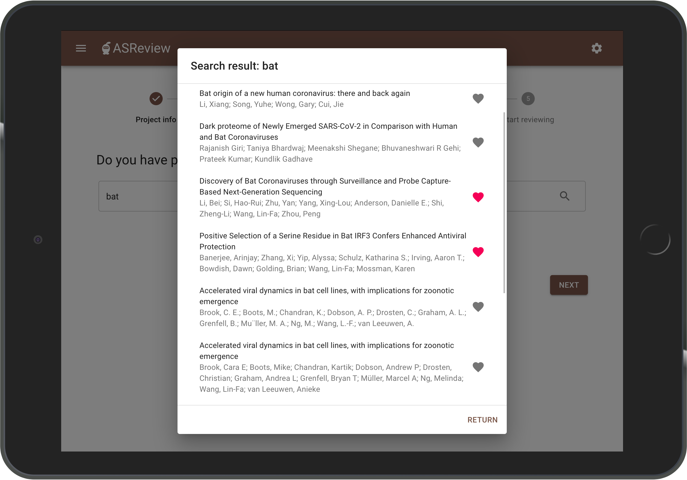
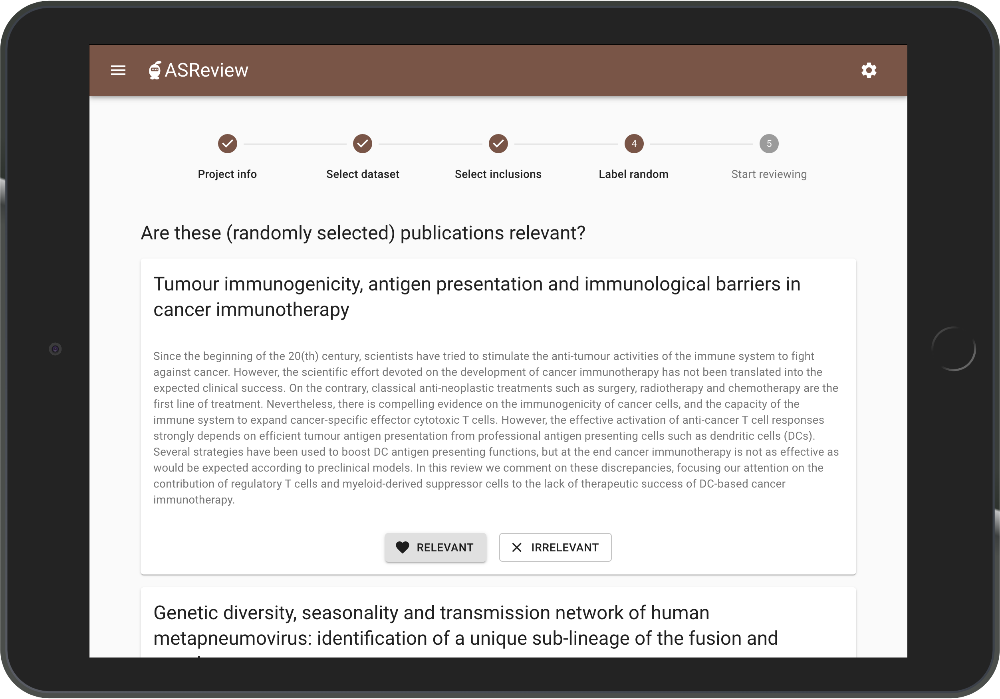
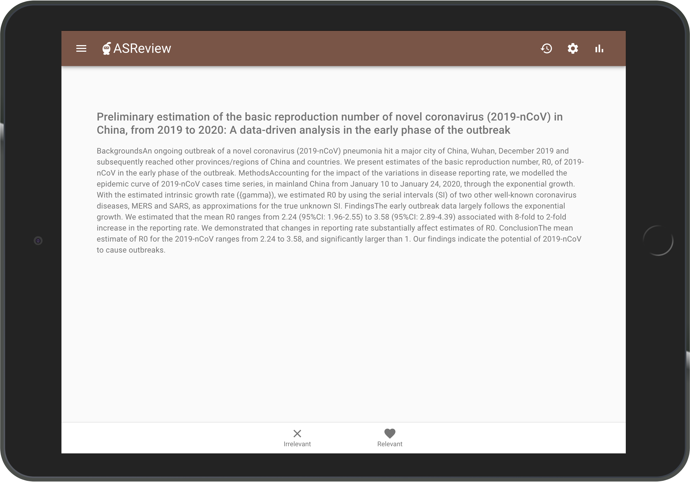
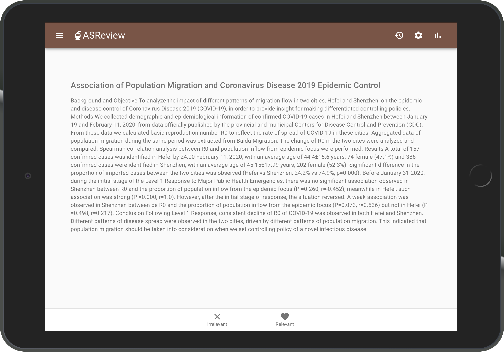
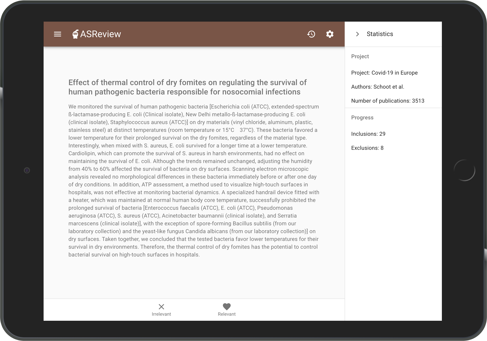
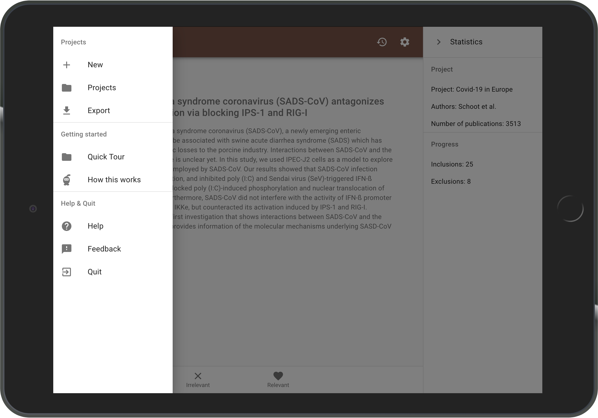

# Quick Tour

## 1. Launching ASReview

This tutorial assumes you have already installed Python and ASReview. If this is not the case, please check out the [installation](installation.html) page.

Now, to launch the ASReview user interface, run the following in your shell:

    asreview oracle

## 2. Creating a New Project

Upon launching ASReview you arrive at the project page. Continue with an already existing systematic review project by clicking on it, or start a new project by clicking the red + sign in the bottom right corner:

---

Creating a new project consists of five steps.
First, provide information on your systematic review project:

---

Second, select the data set you want to review. Your data set should contain the titles and abstracts of all publications you want to screen. You can either upload [your own data set](https://asreview.readthedocs.io/en/latest/datasets.html#using-your-own-data)  or choose one of the built-in data sets:

---

At step 3 you are asked to select prior inclusions: the publications of which you already know they are relevant for your systematic review. You can search your data set by authors, keywords and title, or a combination thereof.  

Providing the software with prior information gives the software a head start. Note that there are no restrictions on the number of publications you need to provide, ASReview also works with 0 prior inclusions. However, providing more than 10 prior inclusions is not necessary, preferably provide 1-5 prior inclusions. Enter your search terms (for example "bat") and confirm by clicking the magnifying glass icon.

From the obtained search result, select the publication(s) you had in mind by clicking the heart icon. Press return to go back to the search engine.

Repeat this step until you've selected your 1-5 prior inclusions. Your prior inclusion(s) will be displayed below the search field.

---

Fourth, you will be presented with five publications randomly sampled from the data set. Indicate for each publication whether it is relevant or irrelevant to your systematic review.

Given that the majority of publications in the data set is irrelevant to your systematic review, the publications presented here will most probable be excluded from your systematic review. This provides the software with additional information on what kind of publications should be excluded from your systematic review.

---

Based on the information you have provided, the software is now building a machine learning model that predicts the next abstract most likely to be relevant.

## 3. Reviewing

The software presents you with the publication of which ASReview is most confident that it should be included in your systematic review.
You are asked to provide a label: should the publication be included or excluded from your systematic review?

While you review the publications that the software presents you with, the software continuously improves its understanding of your decisions, constantly updating the underlying model.

---

To view your progress, click the bolt symbol in the upper right corner. The Statistics panel will open, showing information on the current project and labelling progress.

The software keeps presenting you with the most relevant publication still unreviewed until there are no publications left to review, or until you decide to stop reviewing.

### When to stop reviewing
As you keep reviewing publications, your set of inclusions will increase while the number of unlabelled inclusions left in the data set will decline.

Now, in a 'traditional' systematic review, you would continue reviewing until you have seen all publications in the data set. However, ASReview orders the publications in such a way that you see the most relevant publications first. In other words, there is a point where you are confident that you have seen (almost) all publications you need, and you can stop reviewing. When to stop is left to the user. A stopping criterium could be stopping after the last X presented abstracts were labelled irrelevant.

---

## 4. Wrapping up
Open the projects panel by clicking the 3-striped icon in the upper left corner. You can..

