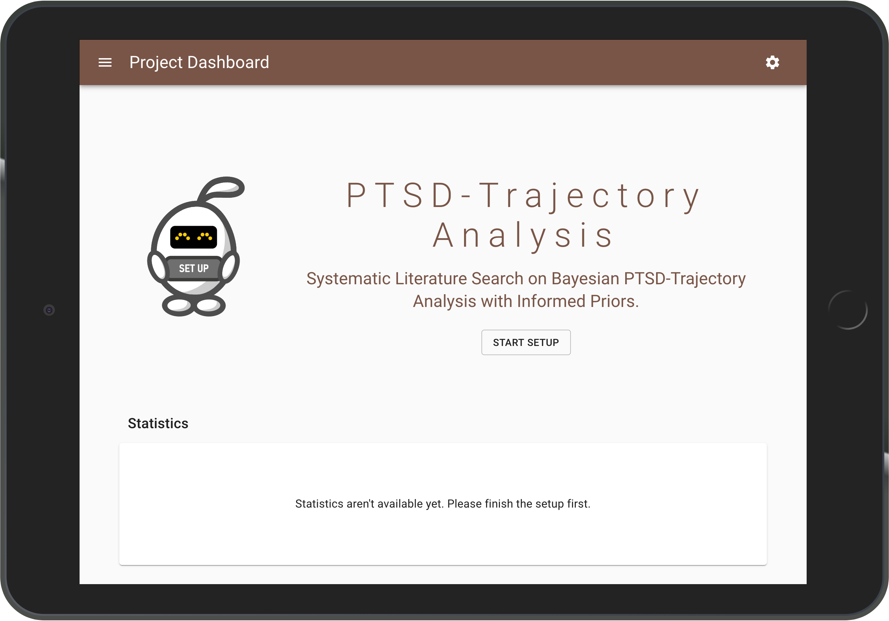
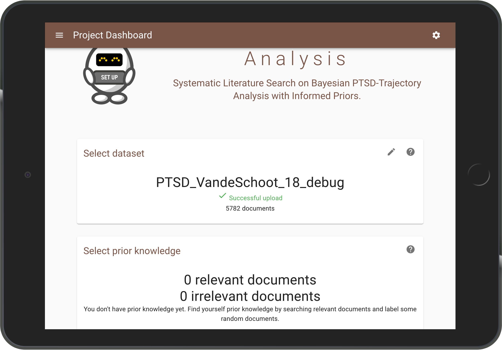
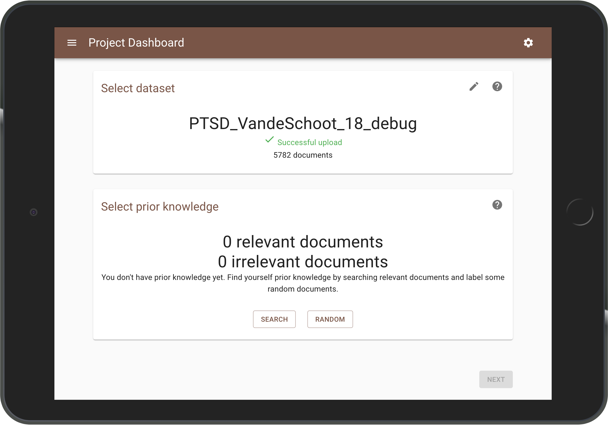
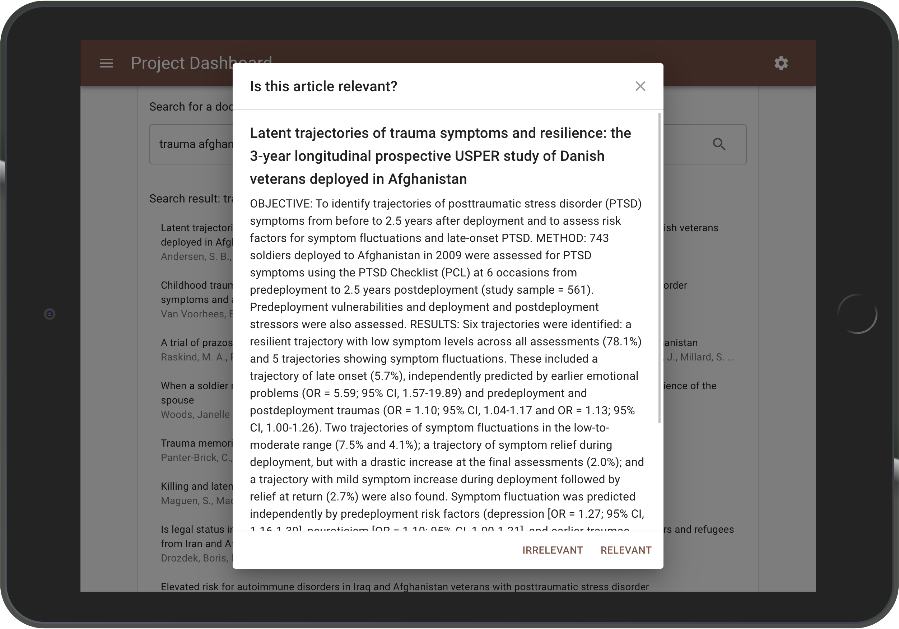
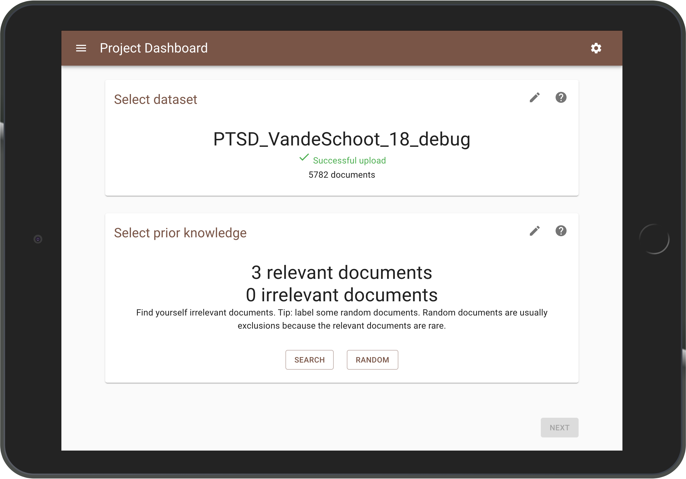
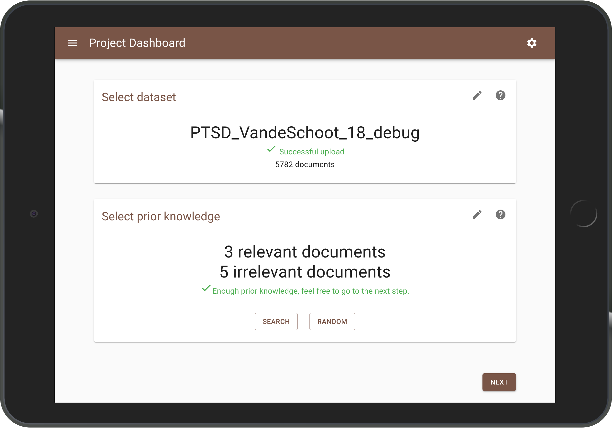
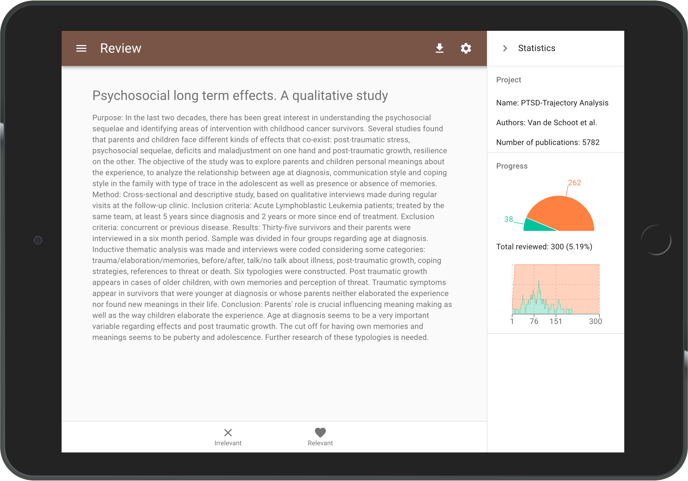

ASReview LAB Quick Tour
=======================

.. contents:: Table of Contents

Launching ASReview
------------------

This tutorial assumes you have already installed Python and ASReview. If
this is not the case, please check out the
`installation <installation.html>`__ page.

Launch ASReview LAB by running the following command in the command line (`CMD.exe` for Windows or `Terminal` for MacOS/Linux):

::

    asreview oracle

Create a new project
--------------------

To start screening, a project file needs to be made. The following steps show
how to create a project.

Provide project info
~~~~~~~~~~~~~~~~~~~~

Start a new project by clicking the red button in the bottom right corner.

Next, provide a project name, your name and a short description
on your systematic review project.

.. figure:: ../images/1_create_project.png
   :alt: Create a new project

After a successful project initialization, a project dashboard will be shown.
Click on the Start Setup button to add a dataset and prior knowledge.

Select Dataset
~~~~~~~~~~~~~~

Select the dataset you want to review, which should contain at least the
titles and/or abstracts of all documents or publications you want to screen.

There are four ways to select a dataset:

- upload your own dataset. Read more about the format on our `datasets page <https://asreview.readthedocs.io/en/latest/datasets.html>`__.
- import a dataset with an URL
- select a dataset from an extension (for example our COVID-19 extension)
- choose one of the built-in test datasets. Read more about testing on our `user testing page <https://asreview.readthedocs.io/en/latest/user_testing_algorithms.html>`__.

.. figure:: ../images/2_select_dataset.png
   :alt:

After a successfull upload of the data, move to the next step.

Select Prior Knowledge
~~~~~~~~~~~~~~~~~~~~~~

Our active learning models require prior knowledge to work. This knowledge is
used to train the first algorithms. In this step you need to provide at least
one relevant and one irrelevant document. To facilitate this, it is possible
to search within your dataset or ask the software to present a couple of
random documents.

Let's start with finding a relevant document. Probabily the most efficient way
to do this is by searching for a document or publication you know is relevant.
Click the search button and search your dataset by authors, keywords and
title, or a combination thereof. Enter your search terms (Use 'enter' to start
searching).

.. figure:: ../images/3_include_publications.png
   :alt:

|

Click the publication you had in
mind and click Relevant (Clicking Irrevant results in an irrelevant document).

|

The Prior Knowledge step will know show 1 relevant document. Repeat this step
until you've selected your 1-5 relevant documents. Note that there are no
restrictions on the number of publications you need to provide, but preferably
provide 1-5 relevant documents.

You also need to provide some irrelevant documents. Given that the majority of
publications in the dataset is probably irrelevant (spare problem), the
publications presented here will most probable be irrelevant for your
study. Click on random to present a couple of random documents.

Indicate for each publication whether it is relevant
or irrelevant to your systematic review.

.. figure:: ../images/4_label_random_2.png
   :alt:

After labeling a couple of randomly selected documents, ASReview LAB will
asked you whether you want to stop. Click on Stop and go to the next step.

Select Active Learning Model
~~~~~~~~~~~~~~~~~~~~~~~~~~~~

In the final step of the setup, you can pick a machine learning model. The
default model is Naive Bayes, but you can opt for a different model. After
choosing your model, click on `Finish`. You will return to the project page
and the model is trained for the first time.

.. figure:: ../images/5_start_reviewing_2.png
   :alt:

Select an Active Learning Model
~~~~~~~~~~~~~~~~~~~~~~~~~~~~~~~

In the final step, you can pick a machine learning model. The default model is
Naive Bayes, but you can opt for a different model. After choosing your model,
click on `Finish`. You will return to the project page and see the model being
trained.

.. figure:: ../images/5_start_reviewing_2.png
   :alt:

Import a Project
----------------

Import an ``.asreview`` project file by clicking the red button in the bottom
right corner of the home page. Choose the project file from your computer and
click `Import`. After a successful project initialization, a project dashboard
will be shown.

.. figure:: ../images/5.0_import_project.png
   :alt:

Start Reviewing
---------------

As soon as the active learning model is ready, a button appear with Start
Review. Click the button to start screening. ASReview LAB presents you a
document that the software is most confident about in terms of relevancy for
your systematic review.

You are asked to make a decision: relevant or irrelevant for your systematic
search?

.. figure:: ../images/5.1_start_reviewing.png
   :alt:

|

While you review the documents that the software presents you with,
the software continuously improves its understanding of your decisions,
constantly updating the underlying model.

The Statistics panel shows information on the current project and labeling
progress. The panel can be opened and closed during labeling as you like. To
hide your progress, click the arrow in the upper right corner.

The software keeps presenting you with the most relevant publication until
there are no more publications left to review, or until you decide to stop
reviewing.

Stop Reviewing
--------------

As you keep reviewing abstracts, your set of relevant documents will increase
while the number of unlabeled abstracts left in the dataset will decline.

|

Now, in a 'traditional' systematic review, you would continue reviewing
until you have seen all abstracts in the dataset. However, ASReview
orders the publications in such a way that you see the most relevant
publications first. In other words, there is a point where you can be
confident that you have seen (almost) all publications you need, and you
can stop reviewing.

When to stop is left to the user. A stopping criterium could be stopping after
the last X presented abstracts were labeled irrelevant, or if your time is
up. You can use the chart in the statistics panel to follow your progress.

Download Results
~~~~~~~~~~~~~~~~

Open the project dashboard by clicking the menu icon in the upper left corner.
Click the download button next to Start Review. A dialog will show the
download options.

.. figure:: ../images/7_exporting.png
   :alt:

|

Choose from the menu whether you would like to download your results as a CSV or
an Excel file and click `Download`. A file is downloaded with the results of
your review.

Export project
~~~~~~~~~~~~~~

Export the project as an ``.asreview`` file by clicking `Export this project` in the publication zone. A project file is downloaded which can be imported later on, or shared  with others.

.. figure:: ../images/7.1_exporting.png
   :alt:

