ASReview Quick Tour
===================

.. contents:: Table of Contents

Launching ASReview
------------------

This tutorial assumes you have already installed Python and ASReview. If
this is not the case, please check out the
`installation <installation.html>`__ page.

Now, to launch the ASReview user interface, run the following in your
shell (open the CMD):

::

    asreview oracle

Create a Project
----------------

In five steps you can start screening for relevant papers:

Step 1. Creating a New Project
~~~~~~~~~~~~~~~~~~~~~~~~~~~~~~

In Step 1, you need to create (or open) a project.
Upon launching ASReview you arrive at the Projects page. Start a new project by clicking the red + sign in the bottom right corner, or continue with an already exisiting project by clicking the Open button:

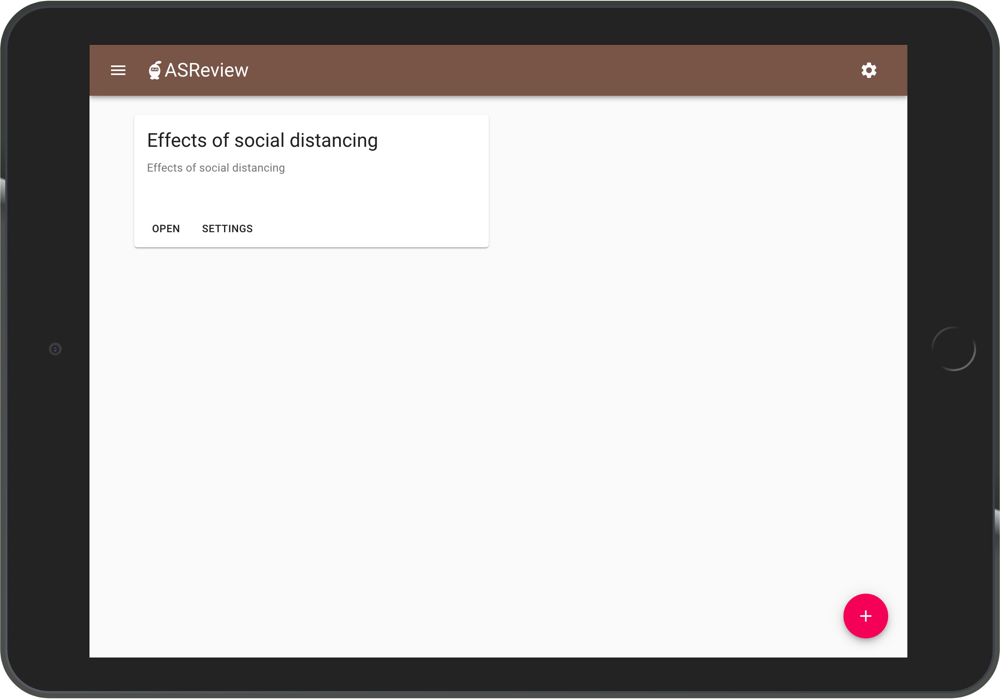

|
|

Next, provide information on your systematic review project:

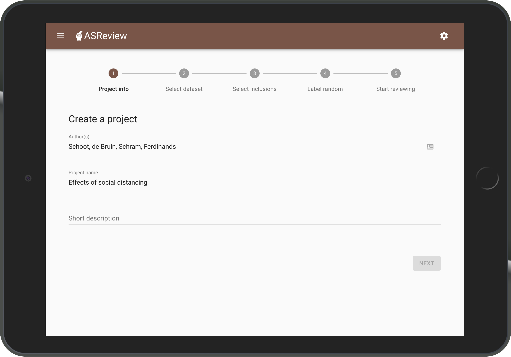

Step 2. Select a Data Set
~~~~~~~~~~~~~~~~~~~~~~~~~

In step 2, select the data set you want to review, which should
contain at least the titles and abstracts of all publications you want to screen.

There are four ways to select a data set: 1) upload `your own data
set <https://asreview.readthedocs.io/en/latest/datasets.html#using-your-own-data>`__, 2) import a data set from an URL, 3) select a plugged-in dataset (up until now offering the CORD-19 data), and 4) choose one of the built-in example data sets:

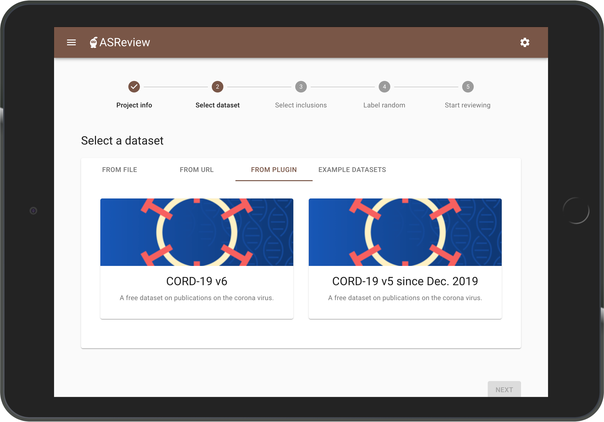

Step 3. Provide Prior Relevant Papers
~~~~~~~~~~~~~~~~~~~~~~~~~~~~~~~~~~~~~

At step 3 you are asked to select some relevant papers: the publications of
which you already know they are relevant for your systematic review. You
can search your data set by authors, keywords and title, or a
combination thereof.

Providing the software with prior information gives the software a head
start. Note that there are no restrictions on the number of publications
you need to provide, but preferably provide 1-5 prior inclusions.

Enter your search terms (for
example "social") and confirm by clicking the magnifying glass icon.

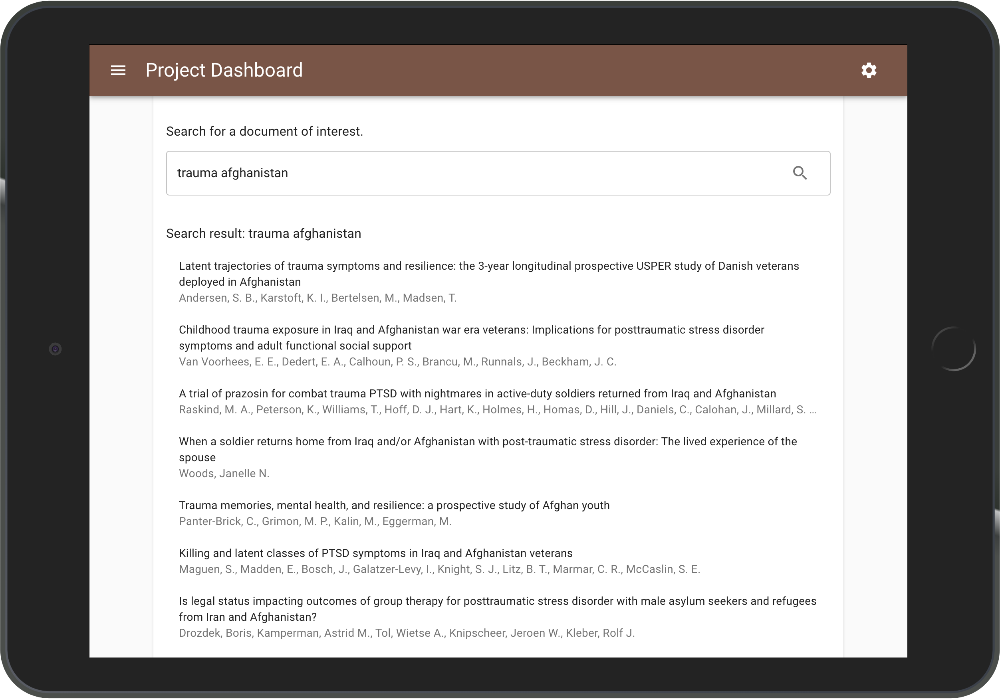

|
|

From the obtained search result, select the publication(s) you had in
mind by clicking the heart icon. Click return to go back to the search
engine.

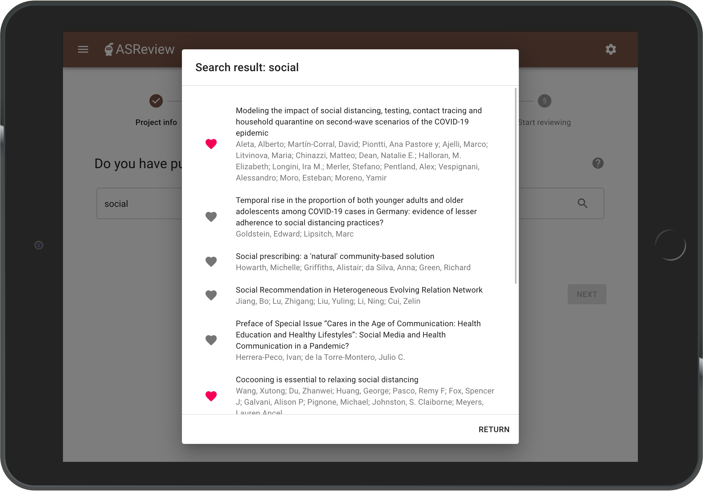

|
|

Repeat this step until you've selected your 1-5 prior inclusions. Your
prior inclusion(s) will be displayed below the search field and click the Next button.

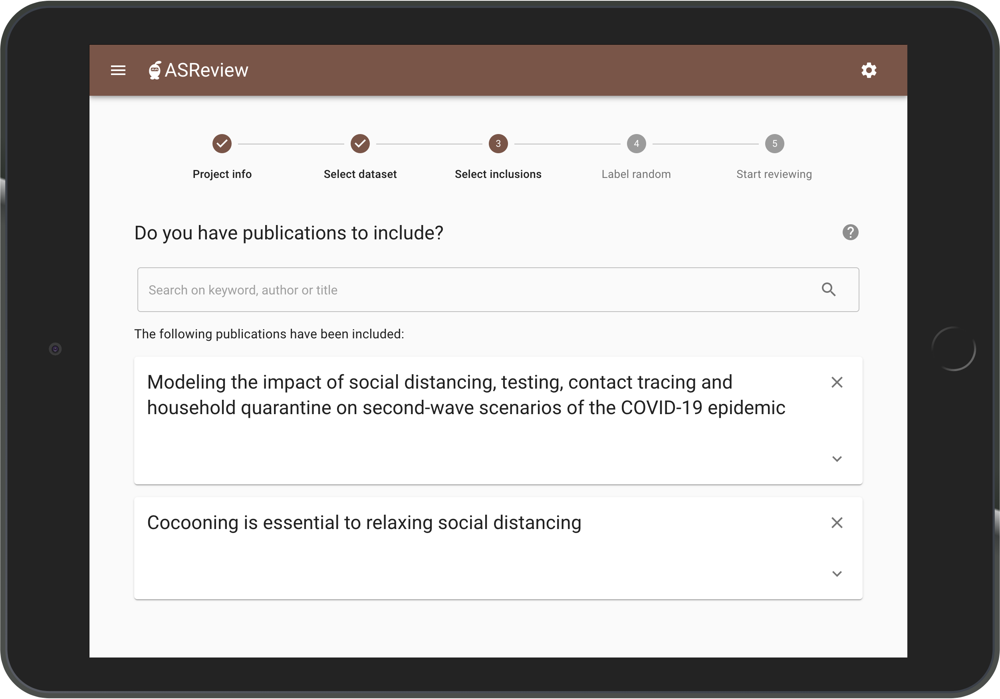

Step 4. Provide Prior Irrelevant Papers
~~~~~~~~~~~~~~~~~~~~~~~~~~~~~~~~~~~~~~~

Fourth, to train the machine learning model you also need to provide some irrelevant papers.
This provides the
software with additional information on what kind of publications should
be excluded from your systematic review.

Given that the majority of publications in the data set is irrelevant, the publications presented here will most
probable be irrelevant for your systematic review.

Indicate for each publication whether it is relevant
or irrelevant to your systematic review and click the Next button.

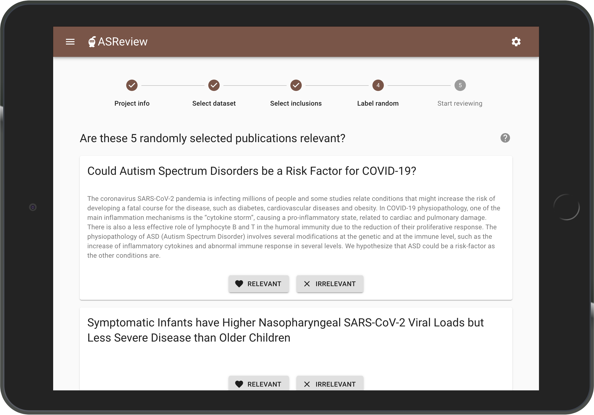

Step 5. Select a Machine Learning Model
~~~~~~~~~~~~~~~~~~~~~~~~~~~~~~~~~~~~~~~

In the final step you are allowed to choose a machine learning model.
The default model is Naive Bayes, but you can opt for a different model if you would like to. 
After choosing your model, click `Start Reviewing`.
Based on the information you have provided in Steps 3 and 4, the software is now building
a machine learning model that predicts the next abstract most likely to
be relevant.

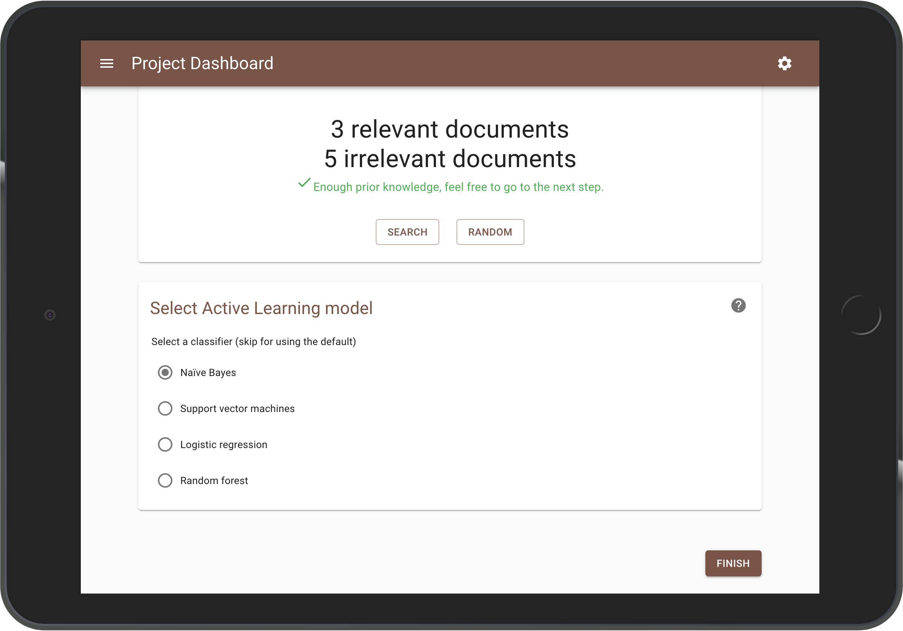

Import a Project
----------------

If you have ``.asreview`` project files, you can add them by clicking the red + sign in the bottom right corner.
Choose the project file from your computer and click `Import`. 
Close the dialog and open the project to continue reviewing.

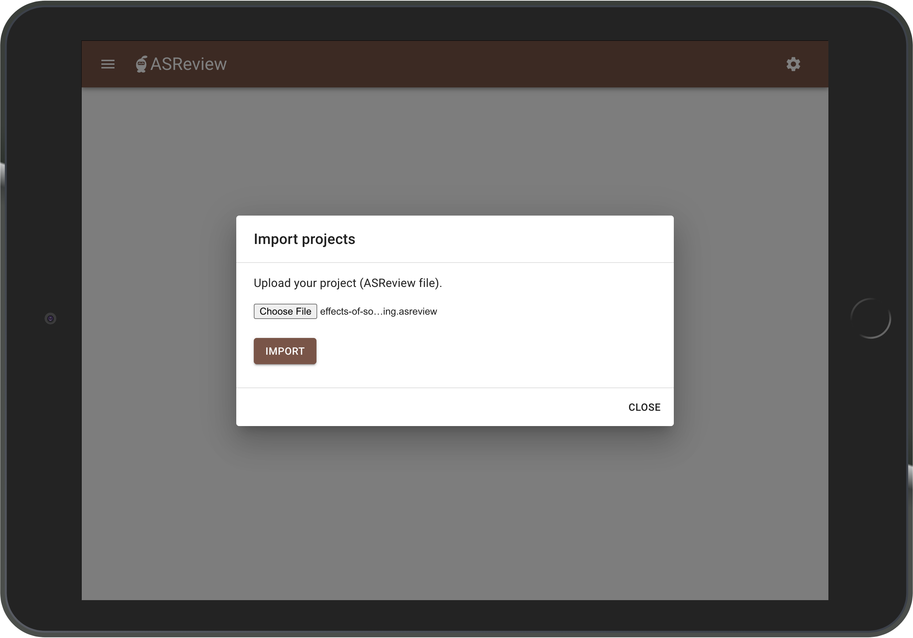

Start Reviewing
---------------
As soon as the machine learning model has converged, the software presents you with the publication of which the machine learning model is most confident that it should be included in your systematic review. You are
asked to provide a label: relevant or irrelevant for your systematic search?

While you review the publications that the software presents you with,
the software continuously improves its understanding of your decisions,
constantly updating the underlying model.

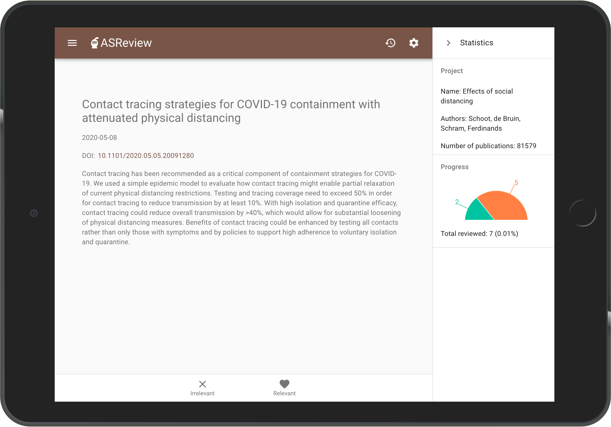

|
|

The Statistics panel shows information on the current project and labeling progress. 
The panel can be opened and closed during labeling as you like. 
To hide your progress, click the closing arrow in the upper right corner.

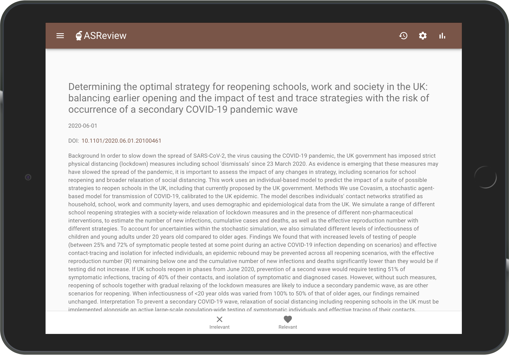

|
|

The software keeps presenting you with the most relevant publication
until there are no more publications left to review, or until you decide to stop reviewing.

Stop Reviewing
--------------

As you keep reviewing abstracts, your set of relevant papers will increase
while the number of unlabelled abstracts left in the data set will
decline.

Now, in a 'traditional' systematic review, you would continue reviewing
until you have seen all abstracts in the data set. However, ASReview
orders the publications in such a way that you see the most relevant
publications first. In other words, there is a point where you can be
confident that you have seen (almost) all publications you need, and you
can stop reviewing. When to stop is left to the user. A stopping
criterium could be stopping after the last X presented abstracts were
labelled irrelevant, or if your time is up.

Export Results/Projects
~~~~~~~~~~~~~~~~~~~~~~~

Open the projects panel by clicking the 3-striped icon in the upper left corner. Click the export button.

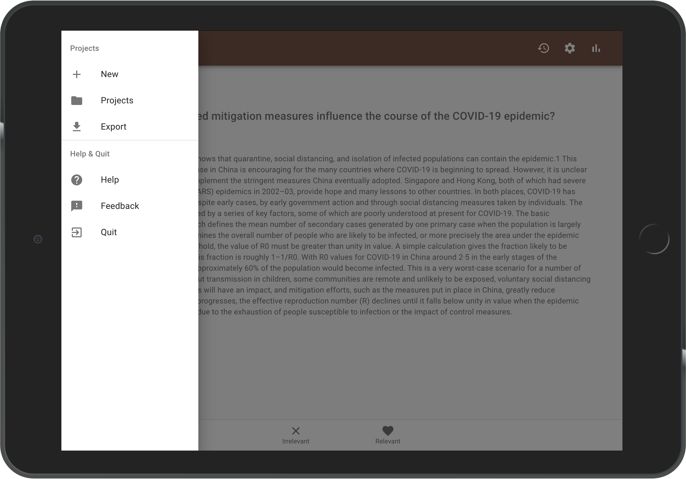

|
|

Choose from the menu whether you would like to export your results as a CSV or an Excel file and click `Export`.
A file is downloaded with the results of your review.

You can export your project as a ``.asreview`` file by clicking `Export` below `Download your project`.
A file is downloaded with your project.

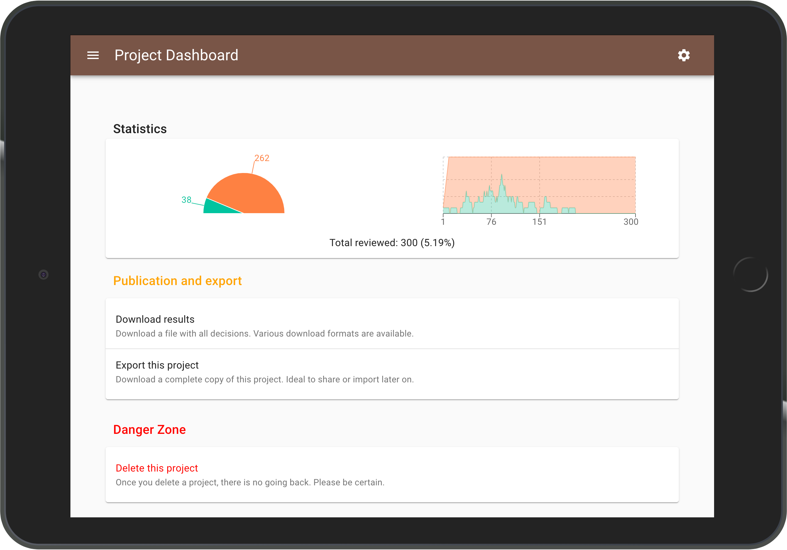

