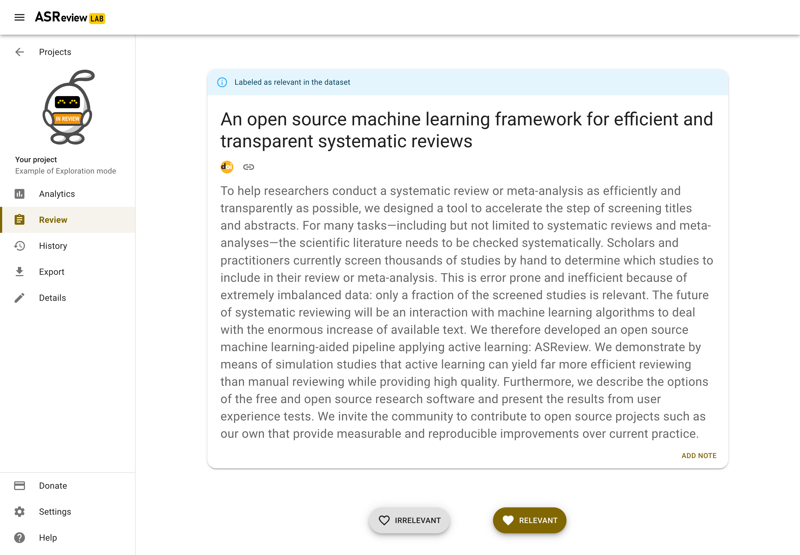

Screening
=========

.. note::

  Only for Oracle and Exploration projects. Read more about :ref:`project_create:Project modes`.

Introduction
------------

As soon as your project is initiated, you can start reviewing. Click on
*Review* in the left menu if your project is not on the review page yet.
ASReview LAB presents you a title and abstract to screen and label.

You are asked to make a decision: relevant or irrelevant?

.. figure:: ../images/project_screening.png
   :alt: ASReview Screening

Click on the decision of choice. A new record is presented to you. While you
review the records, ASReview LAB continuously improves its understanding of
your decisions, constantly updating the underlying ordering of the records.

As you keep reviewing documents and providing labels, you will probably see
fewer relevant records. When to stop screening is left to you. See
:doc:`progress` for more information on progress monitoring and information on
when to stop.

.. note::

  If you are in doubt about your decision, take your time as you are the
  oracle. Based on your input, a new model will be trained in the background.

Screening in Exploration mode
~~~~~~~~~~~~~~~~~~~~~~~~~~~~~

In Exploration mode, a blue bar is displayed on top of the record. The blue
bar indicates whether the record is relevant or irrelevant.

Autosave
--------

Your decisions are saved automatically into your ASReview project file. There
is no need to press any buttons to save your work anywhere in ASReview LAB.

Change decisions
----------------

In some cases, you might want to change your previous decision. The screening
interface of ASReview LAB offers two options to change your decision.

Undo last decision
~~~~~~~~~~~~~~~~~~

You can return to your previous decision during screening. You can disable
this option in the Settings menu.

1. :doc:`start`.
2. Open or :doc:`project_create`.
3. Label the record displayed in the screen as relevant or irrelevant.
4. Click on **Undo** (At the bottom right)
5. Click on **Keep (ir)relevant** or **Convert to (ir)relevant**
6. Continue screening.

Screening history
~~~~~~~~~~~~~~~~~

An overview of your decisions made during screening can be found on the
**History** page. You can change decisions on this page.

1. :doc:`start`.
2. Open or :doc:`project_create`.
3. Click on History in the menu on the left.

.. figure:: ../images/project_history.png
   :alt: Show project history

Changing decisions on the history page

4. To change a label of a record, click the heart icon. The next iteration of the model will take the new label into account.

Full Text
---------

If a column with Digital Object Identifiers (DOI) or URLs is available in the
metadata of your dataset, ASReview LAB will display the DOI and URL during
screening. Most of the time, DOIs point to the full-text of a publication. See
:doc:`datasets <data>` for more information on including DOI and URL values to
your datasets.

.. figure:: ../images/screening_full_text.png
   :alt: Digital Object Identifier (DOI)

Keyboard shortcuts
------------------

ASReview LAB supports the use of keyboard shortcuts during screening. The
table below lists the available keyboard shortcuts.

.. note::

  Keyboard shortcuts are only available when the **Undo** feature has been
  enabled in the Settings (bottom left).

You can press a key (or a combination of keys) to label a record as relevant
or irrelevant, or to return to the previous decision during screening.
By default, keyboard shortcuts are disabled.

+-----------------------------+------------------------+
| Action                      | Shortcut               |
+=============================+========================+
| Label record as relevant    | **r** or **Shift + r** |
+-----------------------------+------------------------+
| Label record as irrelevant  | **i** or **Shift + i** |
+-----------------------------+------------------------+
| Return to previous decision | **u** or **Shift + u** |
+-----------------------------+------------------------+

Display
-------

Dark mode
~~~~~~~~~

ASReview LAB offers the option to customize the screening appearance and functionality.

1. :doc:`start`.
2. Click on *Settings* (bottom left).
3. Go to *Display* and toggle the dark mode

.. note::
  Your preference is saved in the browser.

Font size
~~~~~~~~~

You can make the text on the review screen smaller or larger.

1. :doc:`start`.
2. Click on *Settings* (bottom left).
3. Go to *Display* and click on *Font size*.
4. Slide the slider to the desired font size.
