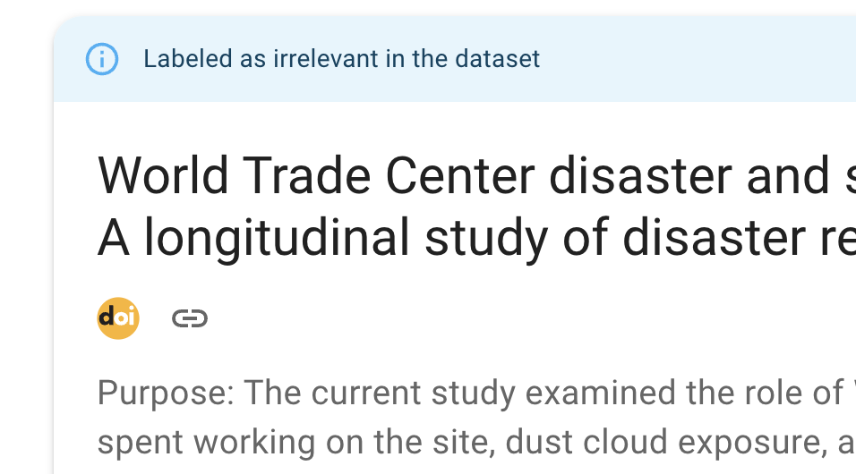

Screening
=========

The user interface in which you provide labels for records shown to you by the
software is kept as simple as possible. This is because ASReview wants you to
focus on the content of the text so that you can make your decision as a true
Oracle. You can access the following features during screening.

As soon as the model is ready, a button appears with **Start Review**. Click
the button to start screening. ASReview LAB presents you a document to screen
and label. If you have selected certainty-based sampling it will be the
document with the highest relevance score.

You are asked to make a decision: relevant or irrelevant?

.. figure:: ../images/asreview_screening_asreview_label.png
   :alt: ASReview Screening

While you review the documents, the software continuously improves its
understanding of your decisions, constantly updating the underlying model.

More specifically, each labeling decision of the user starts the training
of a new model given there is no model being trained at that time.
When this new model is trained, the unseen records' rank order is
updated. Training and labeling occur asynchronous. With fast models, a new
ranking will probably be available before the user finished reading the text. With
slower models, training continues until a new model is trained, and the user can
continue screening the next record in line (2nd, 3rd, etc.). Therefore, the
record shown to the user can be the one with the highest relevance score of
the second last model or the highest-ranked as resulted from the latest model until a new
model is trained.

As you keep reviewing documents and providing more labels, the number of
unlabeled documents left in the dataset will decline. When to stop is left to
the user. The `blogpost *ASReview Class 101* <https://asreview.ai/blog/asreview-class-101/>`_
and the `discussion board <https://github.com/asreview/asreview/discussions/557>`_
provide some tips on when to stop with screening.

.. warning::

  If you are in doubt, take your time to think on the decision, you
  are the oracle. Based on your input, a new model will be trained in the
  background. If you make decisions faster than the model needs for computing
  new relevance scores, you will simply be presented with the record next in
  line (etcetera) until the model is done training.

Autosave
--------

Your decisions are saved automatically into your ASReview project file. There
is no need to press any buttons to save your work anywhere in ASReview LAB.

Change decisions
----------------

In some cases, you might want to change your previous decision. The screening
interface of ASReview LAB offers two options to change your decision.

Undo last decision
~~~~~~~~~~~~~~~~~~

You can return to your previous decision during screening. You can disable
this option in the Settings menu.

1. :doc:`start`.
2. Open or :doc:`project_create`.
3. Label the record displayed in the screen as relevant or irrelevant.
4. Click on **Undo** (At the bottom right)
5. Click on **Keep (ir)relevant** or **Convert to (ir)relevant**
6. Continue screening.

Screening history
~~~~~~~~~~~~~~~~~

An overview of your decisions made during screening can be found on the
**History** page. You can change decisions on this page.

1. :doc:`start`.
2. Open or :doc:`project_create`.
3. Click on History in the menu on the left.

.. figure:: ../images/project_history.png
   :alt: Show project history

Changing decisions on the history page

4. To change a label of a record, click the heart icon. The next iteration of the model will take the new label into account.

Full Text
---------

If a column with Digital Object Identifiers (DOI) or URLs is available in the
metadata of your dataset, ASReview LAB will display the DOI and URL during
screening. Most of the time, DOIs point to the full-text of a publication. See
:doc:`datasets <data>` for more information on including DOI and URL values to
your datasets.

Keyboard shortcuts
------------------

ASReview LAB supports the use of keyboard shortcuts during screening. The
table below lists the available keyboard shortcuts.

.. note::

  Keyboard shortcuts are only available when the **Undo** feature has been
  enabled in the Settings (bottom left).

You can press a key (or a combination of keys) to label a record as relevant
or irrelevant, or to return to the previous decision during screening.
By default, keyboard shortcuts are disabled.

+-----------------------------+------------------------+
| Action                      | Shortcut               |
+=============================+========================+
| Label record as relevant    | **r** or **Shift + r** |
+-----------------------------+------------------------+
| Label record as irrelevant  | **i** or **Shift + i** |
+-----------------------------+------------------------+
| Return to previous decision | **u** or **Shift + u** |
+-----------------------------+------------------------+

Display
-------

Dark mode
~~~~~~~~~

ASReview LAB offers the option to customize the screening appearance and functionality.

1. :doc:`start`.
2. Click on *Settings* (bottom left).
3. Go to *Display* and toggle the dark mode

.. note::
  Your preference is saved in the browser.

Font size
~~~~~~~~~

You can make the text on the review screen smaller or larger.

1. :doc:`start`.
2. Click on *Settings* (bottom left).
3. Go to *Display* and click on *Font size*.
4. Slide the slider to the desired font size.
