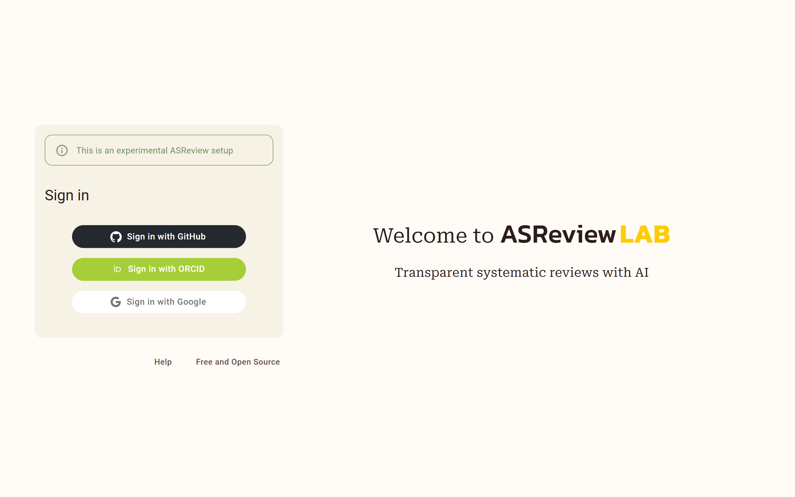

Authentication
==============

OAuth
-----

ASReview LAB Server provides an easy way to log in with your GitHub, ORCID, or
Google account. This allows users to authenticate themselves without the need to
create a separate account. More OAuth providers are supported but not documented
or extensively tested.

See the :doc:`configuration` details for more information on how to configure
your ASReview on your server to enable OAuth.

Basic authentication
--------------------

ASReview LAB Server provides an easy way to create an account with your email.
This is eanbled by default when authentication is enabled. You can let users
make an account themselves or create accounts for them with :doc:`auth_tool`.

Authentication with remote user
-------------------------------

ASReview LAB Server provides the option to outsource authentication completely
to a web server or middleware application that is placed in front of ASReview.
This is a common pattern in web hosting: we use a web server like Nginx to
implement authentication (for example, using its built-in modules for things
like LDAP authentication), and let it *reverse proxy* to the web application we
want to serve (ASReview). The web server then only needs to pass on the
information about the user (such as username, full name, email address) to
ASReview in the HTTP headers.

Although this is a powerful feature that allows one to leverage a myriad of
authentication options, **it should be used with caution**. If the web server is
not properly configured, ASReview will be improperly secured.

Note that if the user specified by the remote user header does not yet exist, it
will be created *regardless of the value of the ALLOW_ACCOUNT_CREATION option*.

Use the `REMOTE_USER` option to enable this form of authentication handling.
This is a `dict` in which you can configure which headers ASReview will attempt
to read user information from.

The default is simply:

.. code-block::  toml

  [REMOTE_USER]
  USER_IDENTIFIER_HEADER = 'REMOTE_USER' # The primary header identifying the user. Can be use a username or email.

However, you can set some additional options. **It is imperative that any of the headers you
configure here are set by your middleware.** Otherwise, any user will be able to pass arbitrary values.

Example with optional values:

.. code-block::  toml

  [REMOTE_USER]
  USER_EMAIL_HEADER = 'REMOTE_USER_EMAIL' # Header containing user's email. If not set, will default to 1. USER_IDENTIFIER_HEADER (if it is an email) 2. <username>@<DEFAULT_EMAIL_DOMAIN>.
  USER_NAME_HEADER = 'REMOTE_USER_FULLNAME' # Header containing user's full name. If not set, user's name will be set to the username inferred from the identifier.
  USER_AFFILIATION_HEADER = 'REMOTE_USER_AFFILIATION' # Header containing user's affiliation.
  DEFAULT_AFFILIATION = '' # Default affiliation if no header is set.
  DEFAULT_EMAIL_DOMAIN = 'localhost' # If no email header is set and USER_IDENTIFIER_HEADER is not an email, use this as a default domain. The user's email will be set to: <username>@<default_email_domain>
  REMOTE_AUTH_SECRET = 'secret' # If set, authentication will fail unless the request contains a 'REMOTE_AUTH_SECRET' header with the same value as this. This adds some additional security, so that users with direct access to the webapp (on localhost, say) cannot easily authenticate without this secret.
