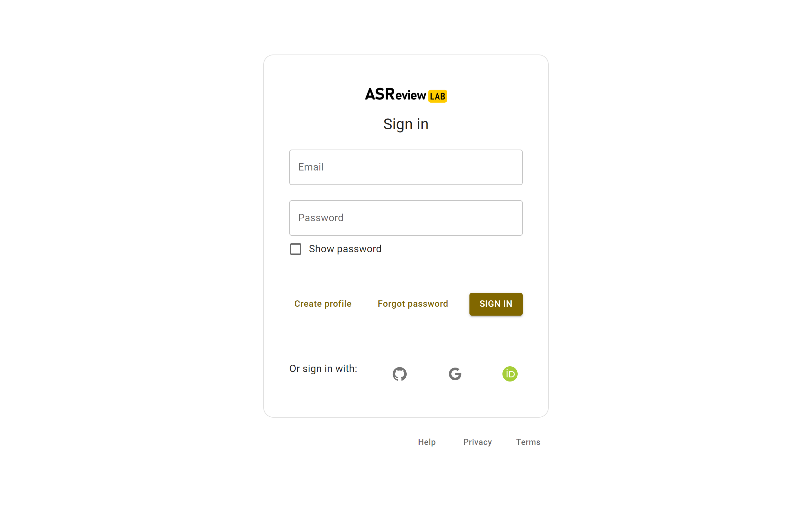
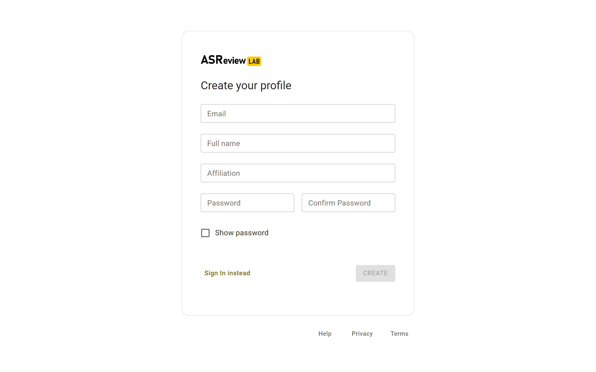

ASReview LAB Server
===================

ASReview LAB Server is a self-hosted, secure version of ASReview LAB. It is
designed for facilitate users who want to use ASReview LAB but without the need
to install it on their own computer. The web application that can be accessed
from any device with a web browser and can be used on desktops, laptops,
tablets, and mobile devices. ASReview LAB Server enables users to create an
account or connect via their GitHub, ORCID, or Google accounts.

See the :doc:`configuration` details for more
information on how to configure your ASReview LAB on your server.

Features
--------

ASReview LAB provides two options for creating an account: by connecting with
your GitHub, ORCID, or Google account, or by creating an account. All
information is stored securely on the ASReview LAB server and fully self-hosted.

Log in with GitHub, ORCID, or Google
~~~~~~~~~~~~~~~~~~~~~~~~~~~~~~~~~~~~

ASReview LAB Server provides a easy way to log in with your GitHub, ORCID, or
Google account.

See the :doc:`configuration` details for more
information on how to configure your ASReview on your server to enable this
feature.

Create account
~~~~~~~~~~~~~~

ASReview LAB Server provides a easy way to create an account with your email.

Installation
------------

ASReview LAB server is installed in the same way as ASReview LAB. See the
:doc:`../lab/installation` instructions for more information. See
:doc:`configuration` for more information on
how to configure authentication on your ASReview LAB server.

Optional: If you want to make use of the PostgreSQL database, you need to
install the `psycopg2` package. This can be done by running the following
command:

.. code-block:: bash

    pip install psycopg2
