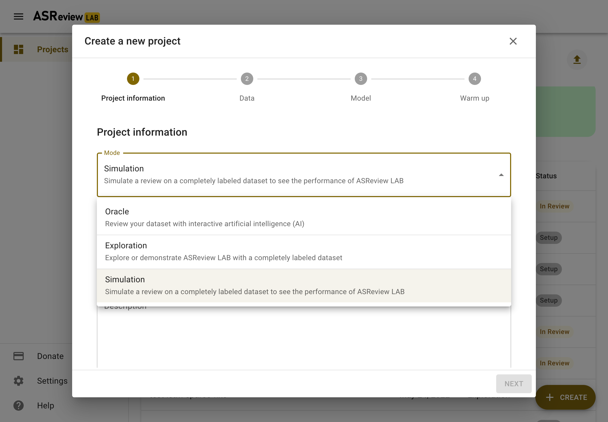

Overview
========

What is a simulation?
---------------------

A simulation involves mimicking the screening process with a certain model. As
it is already known which records are labeled as relevant, the software can
automatically reenact the screening process as if a human was labeling the
records in interaction with the Active Learning model.

Why run a simulation?
---------------------

Simulating with ASReview LAB has multiple purposes. First, the performance of
one or multiple models can be measured by different metrics (see :ref:`Analyzing results <simulation_overview:Analyzing results>`). A convenient one
is that you can investigate the amount of work you could have saved by using
active learning compared to your manual screening process.

Suppose you don't know which model to choose for a new (unlabeled) dataset. In
that case, you can experiment with the best performing combination of the
classifier, feature extraction, query strategy, and balancing and test the
performance on a labeled dataset with similar characteristics.

You could also use the simulation mode to benchmark your own model against
existing models for different available datasets. ASReview LAB allows for adding
new models `via a template
<https://github.com/asreview/template-extension-new-model>`_.

You can also find 'odd' relevant records in a 'classical' search. Such records
are typically found isolated from most other records and might be worth closer
inspection

Datasets for simulation
-----------------------

Simulations require :ref:`fully labeled datasets <data_labeled:fully labeled data>` (labels: ``0`` = irrelevant, ``1`` = relevant). Such a dataset can be the result of an earlier study. ASReview offers also fully labeled datasets via the `benchmark platform <https://github.com/asreview/systematic-review-datasets>`_. These datasets are available via the user interface in the *Data* step of the setup and in the command line with the prefix `benchmark:` (e.g. `benchmark:van_de_schoot_2017`).

.. tip::

    When you import your data, make sure to remove duplicates and to retrieve
    as many abstracts as possible (`See Importance-of-abstracts blog for help
    <https://asreview.ai/blog/the-importance-of-abstracts/>`_). With clean data you
    benefit most from what :doc:`active learning <about>`
    has to offer.

Simulating with ASReview LAB
----------------------------

ASReview LAB offers three different solutions to run simulations with the:

- :ref:`Webapp (the frontend) <simulation_overview:simulate with webapp>`
- :doc:`Command line <simulation_cli>`
- :doc:`Python API <simulation_api_example>`

Simulate with webapp
--------------------

To run a simulation in the ASReview webapp, create a project as described in
:doc:`project_create`. Most of the steps of the setup are identical or
straightworward. In this section, some of the differences are highlighted.

In the step on *Project Information*, select the "Simulation"
mode (see figure below).

In the step *Data*, import a :ref:`fully labeled dataset <data_labeled:fully labeled data>`
or use one of the benchmark datasets.

Selecting prior knowledge is relatively easy. In case you know relevant
records to start with, use the search function. In case you don't, use the
*Random* option. Toggle the button "Relevant" on top to see some random
irrelevant records. Label some relevant and some irrelevant records.

.. figure:: ../images/setup_prior_knowledge_random_simulate.png
   :alt: ASReview LAB Prior selection for simulation study

The step *Warm up* is differs slightly from the Oracle and Exploration mode.
This step starts the simulation, after some seconds, it will return "Got it".
This means, the simulation runs further in the background. You are returned to
the Analytics page.

.. figure:: ../images/setup_warmup_simulate_background.png
   :alt: ASReview LAB simulation runs in background

This page now has a refresh button on the top right. If the simulation is not
finished yet, you can refresh the page or use the refresh button to follow the
progress. After a while, the Elas mascotte on the left will hold a sign with
"finished". Your simulation is now finished and you can study the results in
the analytics page.

Analyzing results
-----------------

After a simulation, the results are stored in the ASReview project file
(extension `.asreview`). This file contains a large number of variables and
logs on the simulation. The data can be extracted from the project file via the API or with one of the available extensions. See :doc:`these examples on the Project API <example_api_asreview_file>` for more information about opening the project file. 

An easier solution would be to use the extension `ASReview Insights <https://github.com/asreview/asreview-insights>`_, which offers useful tools,
like plotting functions and metrics, to analyze results of a simulation.

Install ASReview Insights directly from PyPi:

.. code-block:: bash

	pip install asreview-insights

Detailed documention can found on the `ASReview Insights GitHub <https://github.com/asreview/asreview-insights>`_ page.

