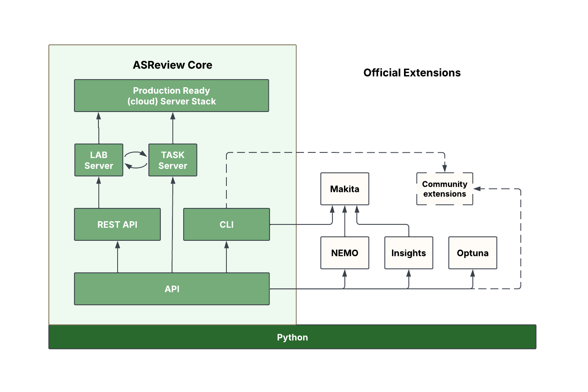

Architecture
============

ASReview provides developers and researchers (with a more technical skill set)
with several interfaces to interact directly with the underlying ASReview
machinery. This enables the development of custom algorithms, the integration of
ASReview into larger projects, and the creation of custom workflows. The
following overview shows the available interfaces for interacting with the
ASReview software:

Core Interfaces
---------------

API
~~~

ASReview LAB ships with a documented Application Programming Interface (API)
that provides models, data, and project management functionality. The rich set
of functions, classes, and modules allows researchers and developers to develop
custom workflows, integrate new algorithms, or embed ASReview functionality in
larger projects. It is also the foundation for the higher-level interfaces of
ASReview LAB. For detailed documentation, refer to the :doc:`API reference
<reference/asreview>`.

REST API
~~~~~~~~

A stateless REST API written in Flask provides an interface for web applications
built on ASReview. While integral to ASReview LAB, this REST API is still under
active development and is not yet fully documented.

CLI
~~~

The :doc:`Command Line Interface (CLI) <cli>` of ASReview provides an
interface for users of computer terminals to start ASReview LAB, run
simulations, list algorithms, and more. The command `asreview lab` will start
the user-friendly web app interface. It can also be extended with subcommands
provided by both official and community-built extensions (see
:doc:`extensions`).

Servers
-------

Task Server
~~~~~~~~~~~

ASReview LAB v2 introduces a task server for handling asynchronous tasks like
training agents and running simulations. The task server comes with a network
socket interface and makes use of the Transmission Control Protocol (TCP) for
communication. Via environment variables or :doc:`../server/configuration`, you can
set the port, the host, and the number of workers. The variables are:

.. envvar:: ASREVIEW_LAB_TASK_MANAGER_PORT

  The port for the task server.

.. envvar:: ASREVIEW_LAB_TASK_MANAGER_HOST

  The host for the task server.

.. envvar:: ASREVIEW_LAB_TASK_MANAGER_WORKERS

  The number of workers for the task server.

ASReview LAB Server
~~~~~~~~~~~~~~~~~~~

The LAB server runs on Flask and serves the RESTful API and the web application.
It is responsible for handling incoming requests and serving the ASReview LAB
web application. The LAB server is started with the command `asreview lab`.

Extensions
----------

ASReview LAB is designed to be extensible, allowing users to add new models,
subcommands, and datasets. The extension system is built on top of the core
ASReview API and Python's entry point system. More information on developing
extensions can be found under :doc:`extensions`.
