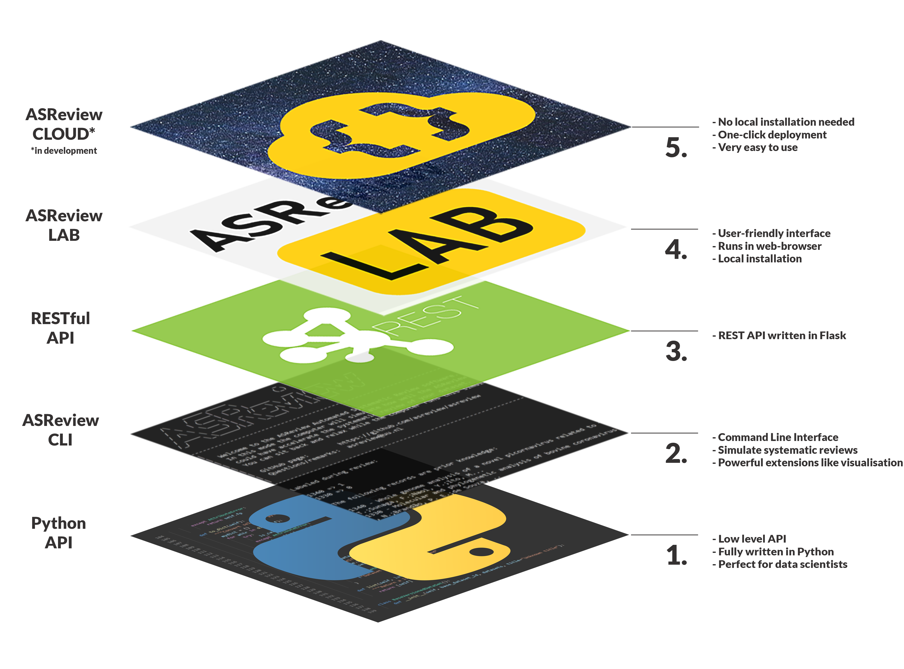

Overview
========

The development section is meant for users that need advanced functions of
ASReview LAB and for developers. It contains technical information on the
usage, instructions for developing extensions, and an extensive API reference.

ASReview architecture
---------------------

ASReview provides users an API to interact directly with the underlying ASReview
machinery. This provides researchers an interface to study the behavior of
algorithms and develop custom workflows. The following overview shows the
available interfaces for interacting with the ASReview software:

..
  Source file of image can be found at
  https://github.com/asreview/asreview-artwork/tree/master/LayerOverview

* Layer 5: ASReview CLOUD

    - ASReview is currently in development. For information on ASReview CLOUD,
      be sure visit our communication channels.

* Layer 4: :doc:`ASReview LAB <../lab/project_create>`

    - ASReview LAB is the user friendly webapp and all underlying
      interfaces. Documentation on LAB
      can be found in the :doc:`ASReview LAB section <../lab/project_create>`.

* Layer 3: REST API

    - The REST API uses a Flask REST API to provide a method to let the React
      webapp communicate with the backend and algorithms. The REST API is not
      documented and should be considered 'internal use only'.

* Layer 2: :doc:`cli`

    - The Command Line is an interface used to open ASReview LAB, run
      simulations, and run :doc:`Subcommand extensions <extensions_dev>` for ASReview. This development section documents all available
      command line options for both :doc:`ASReview LAB <../lab/start>` and :doc:`simulation mode <../lab/simulation_cli>`.

* Layer 1: :doc:`reference/asreview`

    - The ASReview API is a low level Python interface for ASReview. This
      interface requires detailed knowledge about the workings of the software.
      This reference contains extensive documentation on all functions, classes,
      and modules found in ASReview.

    - An outline for usage can be found in :doc:`../lab/simulation_api_example` and :doc:`example_api_asreview_file`.

Extensions
----------

:doc:`The Create an extension <extensions_dev>` section documents the creation
of model, subcommand, and dataset extensions for ASReview. More information on
extensions can be found in the extension
:doc:`extensions_dev`.
